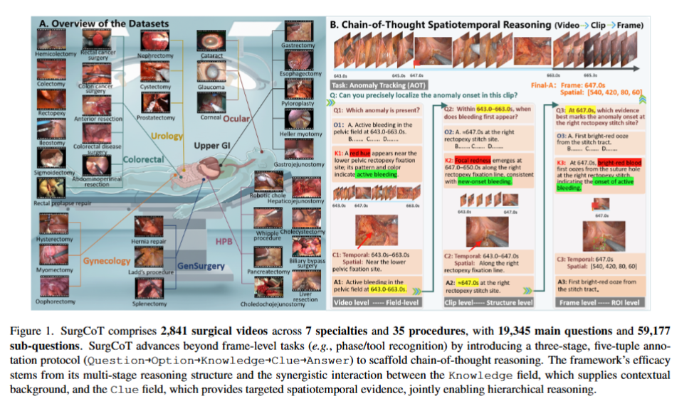

# SurgCoT: Advancing Spatiotemporal Reasoning in Surgical Videos through a Chain-of-Thought Benchmark

> Title: SurgCoT: Advancing Spatiotemporal Reasoning in Surgical Videos through a Chain-of-Thought Benchmark  
> KEYWORDS：手术视频理解；多模态大语言模型；链式思维；时空推理；视频问答；医学人工智能；手术基准  
> 作者：Gui Wang，YongSong Zhou，Kaijun Deng，Wooi Ping Cheah，Rong Qu，Jianfeng Ren，Linlin Shen  
> 机构：Shenzhen University；University of Nottingham  
> Google Scholar被引次数：暂无数据  
> 发表：2026年4月22日，arXiv预印本  
> Venue：arXiv  
> Year：2026  
> Link：[arXiv:2604.20319](https://arxiv.org/abs/2604.20319)  
> Code：[CVI-SZU/SurgCoT](https://github.com/CVI-SZU/SurgCoT)

## 个人演讲稿
本文主要提出了一个用于多模态大模型手术视频推理能力的数据集和测试基准SurgCoT
1.作者发现之前的手术视频领域数据集主要是单帧识别、短片段、阶段视频、器械识别。作者想通过以下步骤把手术视频推理设计成course-to-fine的过程：

完整视频
    ↓
Q1：现象是否出现？
    ↓
Q2：现象什么时候、在哪里出现？
    ↓
Q3：哪一帧、哪个局部区域开始出现？

三个阶段不是相互独立的。Q1的答案会作为Q2的条件，Q2的答案又会作为Q3的条件。比如，Q1先判断视频中存在活动性出血；Q2再确定出血大概在哪个时间段、哪个区域出现；Q3最后定位具体的起始帧和解剖位置。作者希望通过这种方式，让模型的推理范围逐渐缩小，并且检查模型是不是完成了连续的推理，而不是直接猜最终答案。

2.五元组标注方法
Question → Option → Knowledge → Clue → Answer
3.五类核心任务
第一类是CAO，也就是因果动作排序。它要求模型判断手术动作之间的先后关系，例如夹子放置和剪刀切断哪个先发生。

第二类是CAA，也就是线索和动作对齐。它要求模型找到动作真正开始时的视觉线索和时间位置。

第三类是AM，也就是工具和组织的作用关系。它要求模型理解器械正在牵拉、切割还是改善手术暴露，并找到器械和组织的接触位置。

第四类是MTL，也就是微阶段转换定位。它要求模型找到手术从一个微小阶段转到另一个阶段的具体时刻，比如从调整位置转到开始解剖。

第五类是AOT，也就是异常起始追踪。它要求模型定位异常从什么时候、什么位置开始，并追踪之后的发展过程，例如出血的起始和扩散。

4.SurgCoT数据集
论文最初收集了8,917个手术案例，最后保留了2,841个高质量手术视频。
数据覆盖7个手术专科和35种手术，包括结直肠外科、泌尿外科、上消化道外科、眼科、妇科、普通外科以及肝胆胰外科。
整个数据集包含：

- 2,841个视频；
- 19,345个主问题；
- 59,177个子问题。

作者使用ASR对视频进行时间对齐，并根据视觉场景、器械变化和组织变化对视频进行切分。
在标注方面，作者使用YOLOv10进行组织检测，使用SAM2进行器械分割，再使用ByteTrack进行跨帧跟踪，同时记录动作开始时间和异常区域。
最终，数据集中包含手术阶段、器械掩码、组织边界框、动作起始点和异常轨迹等信息。

5.结果
比较了商业模型、开源模型和医学专用模型，并设置了三种条件：

- BL：只给视频和问题；
- KE：增加临床知识；
- FC：同时增加知识和时空线索。

实验结果显示，商业模型整体表现更好。在FC设置下，GPT-5的平均准确率为87.58%，Claude-Sonnet-4.5为87.54%，Gemini-2.5-Pro为87.20%，Qwen3-VL-8B也达到了86.92%。
加入Knowledge和Clue之后，大多数模型的表现都有提升。这说明模型不仅需要医学背景知识，也需要视频中的具体时间和空间证据。
但是，这篇论文最重要的发现是：模型答对最终问题，不代表中间推理步骤一定正确。
例如，GPT-5在BL设置下主问题准确率是76.62%，但是Q3，也就是最细粒度定位问题的准确率只有47.60%。这说明模型有时可以得到正确答案，却不能准确解释现象什么时候发生、在哪里发生。

## 1. 背景与问题

### 1.1 研究背景

手术视频包含丰富的动态解剖、手术器械、组织变化和操作流程信息。近年来，多模态大语言模型已经被用于手术阶段识别、器械识别、组织检测和手术视频问答等任务。

但是，现有手术视频基准大多集中在以下类型的任务：

- 单帧或短片段视觉问答；
- 手术阶段识别；
- 手术器械识别；
- 组织检测；
- 简单的动作或场景分类。

这些任务通常只能回答“画面中有什么”，却难以评价模型能否理解更复杂的临床推理过程，例如：

- 哪个手术动作先发生；
- 一个动作的视觉线索是什么；
- 器械和组织之间发生了什么作用；
- 手术阶段何时发生微小转换；
- 出血等异常从哪一帧开始出现；
- 异常出现后如何沿时间和空间扩散。

### 1.2 研究问题

论文主要研究以下问题：

> 多模态大语言模型能否在不同手术专科的视频中，完成从视频级理解、片段级定位到帧级定位的渐进式时空推理？

具体而言，论文关注模型是否能够：

1. 识别视频中是否发生某个临床现象；
2. 定位该现象发生的时间段和空间区域；
3. 找到具体的起始帧和解剖位置；
4. 理解动作之间的因果顺序；
5. 保持前后推理步骤的一致性。

### 1.3 现有研究的主要不足

现有手术视频基准存在以下问题：

- 覆盖的手术专科和手术类型有限；
- 过度依赖单帧或短视频片段；
- 缺少长时间的跨帧关系建模；
- 缺少因果动作排序任务；
- 缺少微小动作转换和异常起始点定位；
- 不能充分评价模型的渐进式推理能力；
- 只评价最终答案，较少分析中间推理步骤是否正确。

## 2. 核心方法

### 2.1 SurgCoT基准概览

论文提出SurgCoT，一个用于评估多模态大语言模型手术视频链式推理能力的统一基准。

SurgCoT包含：

- 2,841个手术视频；
- 7个手术专科；
- 35种手术；
- 19,345个主问题；
- 59,177个子问题；
- 视频、片段和帧三个层级的标注；
- 5种临床相关的时空推理任务。

覆盖的7个手术专科包括：

- 结直肠外科；
- 泌尿外科；
- 上消化道外科；
- 眼科；
- 妇科；
- 普通外科；
- 肝胆胰外科。



*图1. SurgCoT的整体框架。原文Figure 1。*

### 2.2 数据来源与处理流程

论文最初收集了8,917个手术案例，经过筛选后保留2,841个高质量视频，约占原始数据的31.9%。

数据来源包括：

- YouTube；
- ASVIDE；
- 10个开放数据集；
- 私有临床档案。

数据筛选主要考虑：

- 手术过程是否完整；
- 是否具有临床有效性；
- 是否适合进行时间对齐；
- 是否完成患者信息去标识化；
- 是否能够支持后续的时空证据挖掘。

视频处理过程包括：

1. 根据视觉场景、器械变化、组织变化和ASR时间戳对视频进行层次化切分；
2. 使用ASR生成时间对齐的文本信息；
3. 通过医学本体对术语进行标准化；
4. 使用YOLOv10进行组织检测；
5. 使用SAM2进行手术器械分割；
6. 使用ByteTrack进行跨帧目标跟踪；
7. 根据视觉变化检测动作起始点；
8. 对异常出现时间和局部区域进行标注；
9. 将Procedure、Phase、Tool、Tissue、Action和Anomaly等信息统一对齐。

最终，数据同时包含：

- 手术过程和阶段信息；
- 手术器械掩码；
- 组织边界框；
- 动作起始时间；
- 异常轨迹；
- 时间戳；
- 空间感兴趣区域。

### 2.3 三阶段渐进式推理框架

SurgCoT将复杂的手术视频推理拆分为三个阶段：

#### Q1：视频级理解

在完整视频范围内判断某个现象是否出现。

例如：

> 视频中是否出现活动性出血？

Q1主要建立全局假设空间。

#### Q2：片段级分析

在Q1结果的基础上，进一步判断目标现象出现的时间段和空间区域。

例如：

> 活动性出血首次出现在哪个时间段、哪个解剖区域？

Q2将搜索范围从完整视频缩小到相关片段。

#### Q3：帧级定位

在Q2确定的时间范围和空间区域内，定位精确的起始帧和局部解剖位置。

例如：

> 出血具体从哪一帧开始？出现在组织的哪个位置？

Q3要求模型进行细粒度的帧级、区域级甚至边界框级定位。

三阶段推理过程可以概括为：

```text
完整视频
    ↓
Q1：现象是否出现？
    ↓
Q2：现象何时、何处出现？
    ↓
Q3：哪一帧、哪个局部区域开始出现？
```

前一阶段的答案会作为后一阶段的条件，使推理范围不断缩小。

### 2.4 五元组标注协议

每一个推理阶段都使用以下五元组：

```text
Question → Option → Knowledge → Clue → Answer
```

#### Question

提出一个与临床手术流程相关的问题。

#### Option

提供互斥的候选答案，用来区分容易混淆的现象。

例如，可以区分：

- 器械反光；
- 真实出血；
- 液体残留；
- 组织颜色变化。

#### Knowledge

提供与问题相关的临床背景知识，说明某种现象为什么在医学上合理。

Knowledge主要回答：

> 为什么这个答案符合临床知识？

#### Clue

提供视频中的具体时空证据，包括：

- 时间窗口；
- 关键帧；
- 空间ROI；
- 解剖标志；
- 器械与组织的交界位置；
- 动作起始线索。

Clue主要回答：

> 视频中的哪一个证据支持这个答案？

#### Answer

给出经过验证的目标答案。当前阶段的Answer会传递给下一阶段，作为后续推理的条件。

### 2.5 五种推理任务

#### 1. Causal Action Ordering，CAO：因果动作排序

判断手术动作之间的先后顺序和因果关系。

示例：

> 在胆囊切除术中，夹闭和剪切哪个动作先发生？

该任务不仅要求模型识别器械，还要求理解手术流程和动作之间的依赖关系。

#### 2. Cue–Action Alignment，CAA：线索—动作对齐

将动作发生前的视觉线索与实际动作起始点进行对应。

该任务要求模型识别：

- 动作意图；
- 动作真正执行的时刻；
- 动作发生的空间位置；
- 支持动作开始的局部视觉证据。

#### 3. Affordance Mapping，AM：工具—组织作用关系映射

分析手术器械与组织之间的交互关系。

例如：

- 哪个器械正在牵拉组织；
- 哪个动作改善了手术暴露；
- 器械接触组织的具体位置；
- 某个器械的操作功能是什么。

#### 4. Micro-Transition Localization，MTL：微阶段转换定位

定位手术微阶段之间的边界。

例如：

> 手术过程何时从“调整位置”转换为“开始解剖”？

该任务要求模型理解非常短暂的动作转换，而不是只识别粗粒度的手术阶段。

#### 5. Anomaly Onset Tracking，AOT：异常起始追踪

定位异常发生的起始时间、起始区域和后续轨迹。

例如：

- 出血从哪一秒开始；
- 出血最初出现在哪个解剖位置；
- 异常如何扩散；
- 何时完成止血。

这五种任务共同覆盖了正常手术流程推理和异常情况分析。

### 2.6 实验模型与评价设置

论文评估了10个多模态大语言模型。

#### 商业模型

- GPT-5；
- Gemini-2.5-Pro；
- Claude-Sonnet-4.5。

#### 开源模型

- Qwen2.5-VL-7B；
- Qwen3-VL-8B；
- InternVL-8B。

#### 医学专用模型

- MedGemma-27B-IT；
- Lingshu-7B；
- LLaVA-Med-7B；
- HuatuoGPT-Vision-7B。

论文设置了三种实验条件：

- **BL（Baseline）**：只提供手术视频和主问题；
- **KE（Knowledge-Enhanced）**：增加临床背景知识；
- **FC（Full-Context）**：同时提供视频、Knowledge和Clue。

主要评价指标为准确率。

## 3. 创新点

### 3.1 提出面向手术视频链式推理的统一基准

SurgCoT不是普通的视频问答数据集，而是针对手术视频中的因果关系、动作起始、微阶段转换和异常追踪设计的推理基准。

### 3.2 构建多专科、多手术类型的数据集

SurgCoT覆盖7个手术专科和35种手术，较好地扩展了单一专科手术数据集的应用范围。

### 3.3 引入视频—片段—帧三级推理结构

该结构使模型从全局判断逐步过渡到局部时空定位：

```text
视频级判断 → 片段级定位 → 帧级定位
```

### 3.4 提出五元组标注协议

Question、Option、Knowledge、Clue和Answer分别承担问题定义、候选约束、临床知识、视频证据和答案确认的作用。

### 3.5 评价中间推理步骤

论文不只统计最终主问题的准确率，还分别评价Q1、Q2和Q3，从而分析模型是否能够保持完整的推理链。

### 3.6 将时空证据纳入模型评价

通过时间戳、空间ROI、组织框、器械掩码和动作轨迹，SurgCoT能够评价模型是否真的使用了视频中的局部证据。

### 3.7 分析Knowledge和Clue的作用

BL、KE和FC三种设置可以分析：

- 模型本身的推理能力；
- 临床知识的帮助；
- 时空线索的帮助；
- 结构化推理支架对模型的影响。

## 4. 实验 & 结果

### 4.1 数据集规模

SurgCoT包含：

| 项目 | 数量 |
|---|---:|
| 手术视频 | 2,841 |
| 手术专科 | 7 |
| 手术类型 | 35 |
| 主问题 | 19,345 |
| 子问题 | 59,177 |
| 平均每个视频的主问题数 | 约7 |
| 平均每个视频的子问题数 | 约21 |

### 4.2 不同基准的比较

| Benchmark | 专科数 | 手术数 | 数据规模 | 单位 | 时空建模 | 渐进式协议 | 定位监督 | 临床标准 |
|---|---:|---:|---:|---|---|---|---|---|
| Surgical-VQA | 约3 | 约1 | 11.8K | Frame | 否 | 否 | 是 | 是 |
| EndoVis-VQLA | 约1 | 约1 | 9.5K | Frame | 否 | 否 | 是 | 是 |
| Endo-FM | 约2 | — | 33K+50K | Clip/Frame | 否 | 否 | 否 | 是 |
| SurgVLM-Bench | 4 | 16 | 7798.4K | Frame | 否 | 是 | 是 | 否 |
| SurgBench | 11 | 22 | 23K+5300K | Clip/Frame | 否 | 否 | 是 | 是 |
| SurgCoT | 7 | 35 | 2.8K+19K+19K | Video/Clip/Frame | 是 | 是 | 是 | 是 |

*表1. 手术视频基准比较。原文Table 1。*

### 4.3 不同模型在五种任务上的表现

下表列出三种实验设置下，各模型在五项任务上的平均准确率。

| 模型 | BL平均（%） | KE平均（%） | FC平均（%） |
|---|---:|---:|---:|
| GPT-5 | 76.62 | 80.54 | 87.58 |
| Gemini-2.5-Pro | 70.02 | 81.83 | 87.20 |
| Claude-Sonnet-4.5 | 74.10 | 78.87 | 87.54 |
| MedGemma-27B-IT | 70.96 | 76.37 | 86.37 |
| Lingshu-7B | 63.43 | 69.45 | 74.95 |
| LLaVA-Med-7B | 68.15 | 75.22 | 81.73 |
| HuatuoGPT-Vision-7B | 70.08 | 71.19 | 83.73 |
| InternVL-8B | 67.95 | 73.58 | 82.32 |
| Qwen2.5-VL-7B | 68.85 | 71.22 | 79.45 |
| Qwen3-VL-8B | 75.44 | 81.48 | 86.92 |

*表2. 10个多模态大模型在五种临床推理任务上的平均准确率。原文Table 2。*

主要结果：

1. 商业模型整体优于开源模型和医学专用模型；
2. GPT-5在FC设置下取得最高平均准确率87.58%；
3. Claude-Sonnet-4.5在FC设置下达到87.54%；
4. Gemini-2.5-Pro在FC设置下达到87.20%；
5. Qwen3-VL-8B在FC设置下达到86.92%，接近商业模型；
6. 从BL到KE再到FC，模型通常取得连续提升；
7. Knowledge和Clue对细粒度时空推理具有明显帮助。

### 4.4 主问题与子问题之间的推理差距

| 模型 | BL主问题Q（%） | BL Q1（%） | BL Q2（%） | BL Q3（%） | FC主问题Q（%） | FC Q1（%） | FC Q2（%） | FC Q3（%） |
|---|---:|---:|---:|---:|---:|---:|---:|---:|
| GPT-5 | 76.62 | 54.71 | 55.85 | 47.60 | 87.58 | 56.12 | 56.15 | 50.51 |
| Gemini-2.5-Pro | 70.02 | 34.15 | 44.04 | 43.06 | 87.20 | 35.85 | 34.02 | 52.32 |
| Claude-Sonnet-4.5 | 74.10 | 49.38 | 41.42 | 36.50 | 87.54 | 53.04 | 34.85 | 30.44 |
| MedGemma-27B-IT | 70.96 | 54.82 | 56.75 | 76.25 | 86.37 | 61.29 | 71.25 | 70.42 |
| Lingshu-7B | 63.43 | 36.06 | 47.93 | 43.53 | 74.95 | 48.36 | 58.58 | 56.52 |
| LLaVA-Med-7B | 68.15 | 31.71 | 36.65 | 36.46 | 81.73 | 34.40 | 39.75 | 37.57 |
| HuatuoGPT-Vision-7B | 70.08 | 69.97 | 67.69 | 55.62 | 83.73 | 72.13 | 70.31 | 69.00 |
| Qwen3-VL-8B | 75.44 | 72.90 | 51.00 | 73.04 | 86.92 | 74.75 | 67.49 | 70.98 |
| Qwen2.5-VL-7B | 68.85 | 31.85 | 27.02 | 25.33 | 79.45 | 38.14 | 29.87 | 36.80 |
| InternVL-8B | 67.95 | 67.80 | 65.79 | 48.86 | 82.32 | 64.89 | 55.28 | 51.63 |

*表3. 不同模型在主问题和Q1、Q2、Q3子问题上的准确率。原文Table 3。*

最重要的结果是：

- GPT-5在BL设置下主问题准确率为76.62%，但Q3准确率只有47.60%；
- Claude-Sonnet-4.5在BL设置下主问题准确率为74.10%，但Q3准确率只有36.50%；
- Qwen2.5-VL-7B在BL设置下主问题准确率为68.85%，但Q3准确率只有25.33%；
- 一些模型能够答对主问题，却不能正确完成中间步骤；
- 完整上下文通常能够提升主问题和部分子问题的表现，但不能完全消除推理链断裂。

### 4.5 主要实验结论

#### 商业模型整体表现更好

GPT-5、Gemini-2.5-Pro和Claude-Sonnet-4.5整体上优于开源模型和医学专用模型，特别是在需要融合视频、临床知识和时空证据的任务中。

#### 结构化知识能够提升模型表现

LLaVA-Med-7B从BL到KE后，平均准确率由68.15%提升至75.22%，说明明确提供临床知识可以弥补部分医学推理能力不足。

#### 时空线索对细粒度任务尤其重要

Qwen2.5-VL-7B从KE到FC后，平均准确率由71.22%提升至79.45%，说明时间和空间线索可以帮助模型完成更精确的视觉定位。

#### 模型存在推理链断裂

模型的最终答案准确率通常高于Q1、Q2和Q3。说明模型可能通过整体模式匹配或先验知识得到正确答案，但不能稳定地完成中间推理步骤。

#### 当前模型仍未达到可靠的临床级推理

即使是表现最好的模型，在细粒度动作定位、微阶段转换和异常起始追踪任务上仍然存在明显错误。

## 5. 个人思考

### 5.1 论文最重要的启发

这篇论文最重要的启发是：

> 最终答案正确不等于推理过程正确。

在临床任务中，模型不仅要判断“有没有异常”，还要说明：

- 异常什么时候开始；
- 异常发生在哪里；
- 哪些视频证据支持判断；
- 前后推理步骤是否一致。

因此，未来评价医学多模态模型时，不能只统计最终答案准确率，还需要评价推理链的完整性和证据的可验证性。

### 5.2 对方法设计的理解

SurgCoT的核心不是简单地把问题拆成三个子问题，而是让三个阶段之间存在条件依赖：

```text
A1 → Q2
A2 → Q3
```

Q1首先确定全局现象，Q2再缩小时间和空间范围，Q3最后进行精细定位。这个过程符合临床分析中从整体观察到局部诊断的基本逻辑。

### 5.3 对实验设计的评价

论文通过BL、KE和FC三种设置，能够区分：

- 模型自身的基础能力；
- 临床知识的作用；
- 时空线索的作用。

但是，论文仍然可以进一步改进：

1. 增加医生专家基线；
2. 报告医生之间的一致性；
3. 增加患者级、手术案例级和医院级数据划分；
4. 增加时间定位误差；
5. 增加空间区域IoU；
6. 分析Q1错误对Q2和Q3的影响；
7. 分析自动检测、分割和跟踪误差；
8. 增加跨医院和跨设备的外部测试；
9. 对Knowledge和Clue分别进行更细致的消融实验。

### 5.4 如果重新设计实验

如果由我重新设计实验，我会增加以下实验：

- 只提供Knowledge；
- 只提供Clue；
- 只提供时间线索；
- 只提供空间线索；
- 不传递前一阶段Answer；
- 允许模型回溯修改前一阶段答案；
- 比较模型预测位置与专家标注位置的时间误差；
- 测量错误是否沿Q1→Q2→Q3逐步放大；
- 增加不同经验水平医生与模型的对照；
- 在不同医院、设备和手术医生之间进行外部验证。

### 5.5 论文的局限性

1. 论文主要使用accuracy，不能充分体现时间和空间定位的误差程度。
2. 论文没有充分报告医生专家基线和专家间一致性。
3. 自动检测、分割和跟踪工具可能会给数据标注带来误差。
4. Q1、Q2和Q3之间的错误传播仍缺少深入分析。
5. 不同模型在参数规模、训练语料和提示适配方面存在差异，模型间比较未必完全公平。
6. 模型输出的文字推理过程不一定等同于模型内部真正的推理过程。
7. 正文中关于评估模型数量存在表述不一致：引言中提到12个MLLM，而表2和实验设置中实际列出10个模型。

