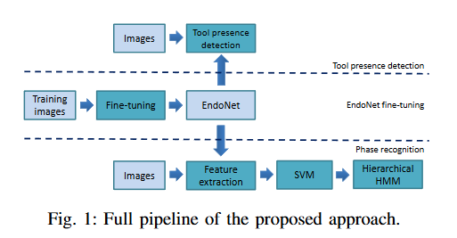
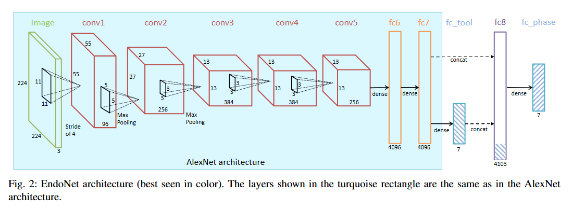
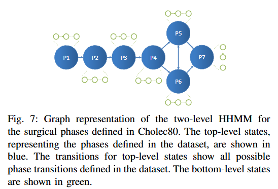
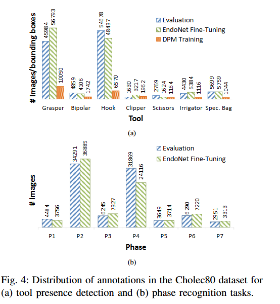
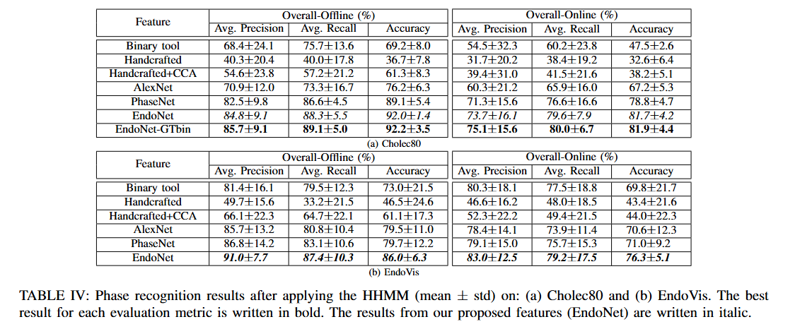
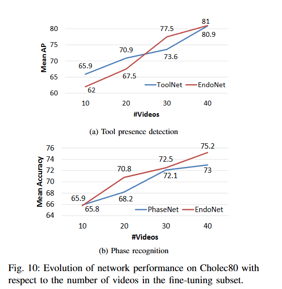

# EndoNet：用于腹腔镜视频识别任务的深度架构

> Title: EndoNet: A Deep Architecture for Recognition Tasks on Laparoscopic Videos  
> Authors: Andru P. Twinanda, Sherif Shehata, Didier Mutter, Jacques Marescaux, Michel de Mathelin, Nicolas Padoy  
> Year: 2016  
> Type: 原创性算法研究  
> Link: [arXiv](https://arxiv.org/abs/1602.03012)  
> Keywords: 腹腔镜视频、手术流程识别、手术阶段识别、器械出现检测、卷积神经网络、多任务学习、迁移学习、SVM、HHMM、Cholec80

## 1. 背景与问题

手术流程识别是计算机辅助手术中的重要研究方向，可以用于：

- 自动建立手术视频索引；
- 监控手术流程；
- 优化手术室和医护人员调度；
- 为术中辅助系统提供上下文信息；
- 识别潜在的手术异常或并发症。

传统的手术阶段识别方法主要依赖两类信息：

1. 视觉特征，例如像素、颜色、纹理、形状、梯度、SIFT 和 HOG 等；
2. 器械使用信号，例如人工标注、RFID 或其他额外设备获得的器械信息。

这些方法存在以下问题：

- 手工设计的视觉特征难以适应腹腔镜视频中的复杂变化；
- 腹腔镜摄像机不断移动，容易产生运动模糊；
- 镜头可能受到血液、烟雾等因素遮挡；
- 手术器械的外观和位置变化较大；
- 器械使用信息通常需要人工标注或额外设备。

因此，本文主要研究以下问题：

> 能否仅利用腹腔镜视频图像，通过卷积神经网络自动学习有效的视觉特征，并同时完成手术阶段识别和手术器械出现检测？

## 2. 论文摘要总结

论文提出了一个名为 EndoNet 的多任务卷积神经网络，用于同时完成两个任务：

- 手术阶段识别；
- 手术器械出现检测。

EndoNet 以 AlexNet 为基础，通过迁移学习对腹腔镜手术视频进行微调。网络一方面判断图像中是否出现七种手术器械，另一方面预测当前图像属于七个手术阶段中的哪一个。

作者构建了 Cholec80 数据集，其中包含 80 个胆囊切除手术视频，并在 Cholec80 和 EndoVis 两个数据集上验证方法。

完整识别流程如下：

1. EndoNet 从图像中提取视觉特征；
2. EndoNet 预测图像中是否出现某些手术器械；
3. 将视觉特征和器械置信度进行拼接；
4. 使用多分类 SVM 输出各手术阶段的置信度；
5. 使用 Hierarchical HMM 利用手术流程的时间关系；
6. 输出连续的手术阶段序列。

## 3. 论文结构

论文主要包括以下部分：

1. 引言；
2. 相关工作；
3. 方法；
4. 实验设置；
5. 实验结果；
6. 医学应用；
7. 讨论与结论；
8. 致谢和参考文献。

## 4. 核心方法

### 4.1 整体处理流程

EndoNet 的处理流程可以概括为：

腹腔镜视频帧  
→ EndoNet  
→ 器械出现检测和视觉特征提取  
→ SVM 阶段分类  
→ HHMM 时间建模  
→ 最终手术阶段序列

论文原文的整体流程图如下：



> 图 1：EndoNet 的整体处理流程。EndoNet 用于特征提取和器械出现检测，SVM 输出阶段置信度，Hierarchical HMM 进一步利用手术流程的时间约束。  
> 图片来源：原论文 Figure 1。

### 4.2 EndoNet 网络结构

EndoNet 是 AlexNet 的扩展，主要包括：

- 五个卷积层：`conv1` 到 `conv5`；
- 两个全连接层：`fc6` 和 `fc7`；
- 器械检测层：`fc_tool`；
- 特征融合层：`fc8`；
- 阶段识别层：`fc_phase`。

EndoNet 的网络结构如下：



> 图 2：EndoNet 网络结构。`fc_tool` 输出七类器械的出现置信度，并与 `fc7` 的视觉特征拼接后形成 `fc8`，用于阶段识别。  
> 图片来源：原论文 Figure 2。

网络的信息流为：

```text
输入图像
  ↓
AlexNet 卷积层
  ↓
fc6
  ↓
fc7
  ├── fc_tool：预测七类器械是否出现
  └── 与 fc_tool 输出拼接形成 fc8
          ↓
       fc_phase：预测七个手术阶段
```

`fc_tool` 输出七个器械的出现置信度：

- Bipolar；
- Clipper；
- Grasper；
- Hook；
- Irrigator；
- Scissors；
- Specimen bag。

`fc8` 由两部分组成：

- `fc7` 的 4096 维视觉特征；
- `fc_tool` 的 7 维器械置信度。

因此最终特征维度约为：

$$
4096+7=4103
$$

### 4.3 多任务学习

EndoNet 同时优化两个任务：

1. 器械出现检测；
2. 手术阶段识别。

器械检测被建模为七个二分类任务，使用 sigmoid 和二元交叉熵损失：

$$
L_T
=
-\frac{1}{N_iN_t}
\sum_{t=1}^{N_t}
\sum_{i=1}^{N_i}
\left[
k_i^t\log\sigma(v_i^t)
+
(1-k_i^t)\log(1-\sigma(v_i^t))
\right]
$$

阶段识别被建模为多分类任务，使用 softmax 交叉熵损失：

$$
L_P
=
-\frac{1}{N_i}
\sum_{i=1}^{N_i}
\sum_{p=1}^{N_p}
l_i^p\log\phi(w_i^p)
$$

最终损失函数为：

$$
L=aL_T+bL_P
$$

论文中设置：

$$
a=b=1
$$

也就是说，器械检测任务和阶段识别任务使用相同的损失权重。

多任务学习的核心思想是：

> 器械出现信息和手术阶段之间存在联系。通过学习器械检测任务，网络可以获得更有辨识力的阶段识别特征。

### 4.4 迁移学习

由于医学视频标注成本高，直接从随机参数开始训练 CNN 比较困难。因此作者采用迁移学习。

具体过程如下：

1. 使用在 ImageNet 上预训练的 AlexNet；
2. 保留 AlexNet 的卷积层、`fc6` 和 `fc7`；
3. 增加 `fc_tool` 器械检测分支；
4. 增加 `fc_phase` 阶段识别分支；
5. 对新增层进行随机初始化；
6. 使用 Cholec80 数据对网络进行微调。

迁移过程可以表示为：

```text
ImageNet预训练AlexNet
  ↓
增加器械检测分支和阶段识别分支
  ↓
使用Cholec80进行fine-tuning
  ↓
得到EndoNet
```

ImageNet 预训练模型已经学习了边缘、纹理、颜色和形状等通用视觉特征。通过微调，模型进一步学习腹腔镜图像中的器械和手术阶段特征。

论文使用 50K 次迭代、batch size 为 50 进行训练，并使用 Caffe 框架和 NVIDIA Titan X GPU。

### 4.5 多分类 SVM

SVM 是 Support Vector Machine 的缩写，中文为支持向量机。

在 EndoNet 中，SVM 的输入是每帧图像的 `fc8` 特征，输出是该帧属于不同手术阶段的分类分数。

由于 Cholec80 有七个手术阶段，因此采用 one-vs-all 方法，将七分类问题拆成七个二分类问题：

| SVM | 正类 | 负类 |
|---|---|---|
| SVM 1 | Preparation | 其他六个阶段 |
| SVM 2 | Calot triangle dissection | 其他六个阶段 |
| SVM 3 | Clipping and cutting | 其他六个阶段 |
| SVM 4 | Gallbladder dissection | 其他六个阶段 |
| SVM 5 | Gallbladder packaging | 其他六个阶段 |
| SVM 6 | Cleaning and coagulation | 其他六个阶段 |
| SVM 7 | Gallbladder retraction | 其他六个阶段 |

每个 SVM 都回答一个问题：

> 当前图像是不是我负责的那个阶段？

对于输入特征 $\mathbf{x}$，第 $p$ 个 SVM 的输出为：

$$
s_p=\mathbf{w}_p^\top\mathbf{x}+b_p
$$

最终得到七个阶段分数：

$$
\mathbf{s}=[s_1,s_2,\ldots,s_7]
$$

如果只使用 SVM 进行单帧分类，可以选择得分最高的阶段：

$$
\hat{y}=\arg\max_p s_p
$$

通俗来说，七个 SVM 就像七个评委，分别判断：

```text
评委1：这张图像像不像 Preparation？
评委2：这张图像像不像 Calot triangle dissection？
评委3：这张图像像不像 Clipping and cutting？
……
评委7：这张图像像不像 Gallbladder retraction？
```

### 4.6 HHMM 时间建模

HHMM 是 Hierarchical Hidden Markov Model 的缩写，中文为层级隐马尔可夫模型。

SVM 主要根据当前帧判断阶段，但是手术视频具有明显的时间顺序。单帧预测可能出现不合理的阶段跳转，例如：

```text
P1 → P3 → P2 → P3
```

因此作者使用 HHMM 进一步利用手术流程信息。

在本文中：

| HMM 概念 | 对应内容 |
|---|---|
| 隐藏状态 | 真实手术阶段 |
| 观测值 | SVM 输出的阶段分数 |
| 状态转移 | 手术阶段之间的转换 |
| 观测概率 | 某阶段产生某种 SVM 分数的概率 |

HHMM 包含两层：

- 顶层状态：表示宏观手术阶段；
- 底层状态：表示某个阶段内部的不同变化。

论文中 HHMM 的结构如下：



> 图 3：Cholec80 手术阶段的两层 HHMM 结构。顶层状态表示宏观手术阶段，底层状态表示阶段内部的变化。  
> 图片来源：原论文 Figure 7。

顶层状态为七个手术阶段：

1. P1：Preparation；
2. P2：Calot triangle dissection；
3. P3：Clipping and cutting；
4. P4：Gallbladder dissection；
5. P5：Gallbladder packaging；
6. P6：Cleaning and coagulation；
7. P7：Gallbladder retraction。

底层状态表示同一个阶段内部的视觉或操作变化。

例如，P3 阶段内部可能经历：

```text
寻找操作位置 → 放置夹子 → 剪切 → 检查
```

这些底层状态不一定对应人工标注的医学子阶段，而是用于描述一个宏观阶段内部的视觉变化。

HHMM 主要考虑三类概率。

#### 初始概率

表示视频开始时处于某个阶段的概率：

$$
\pi_i=P(z_1=i)
$$

例如，手术通常从 Preparation 开始，因此：

$$
P(z_1=\text{Preparation})
$$

会比较大。

#### 状态转移概率

表示从一个阶段转移到另一个阶段的概率：

$$
A_{ij}=P(z_t=j\mid z_{t-1}=i)
$$

例如，从 P1 转移到 P2 的概率通常较高，而从 P1 直接跳到 P6 的概率通常较低。

#### 观测概率

表示某个阶段产生当前 SVM 分数的概率：

$$
P(\mathbf{s}_t\mid z_t=i)
$$

论文使用高斯混合模型描述观测分布。

HHMM 最终寻找一条最合理的手术阶段序列：

$$
\hat{z}_{1:T}
=
\arg\max_{z_{1:T}}
P(z_{1:T}\mid\mathbf{s}_{1:T})
$$

### 4.7 HMM 的通俗例子

可以用“根据朋友是否带伞判断天气”来理解 HMM。

- 隐藏状态：晴天或雨天；
- 观测结果：朋友带伞或不带伞；
- 状态转移：今天的天气与昨天的天气有关；
- 目标：根据连续几天是否带伞，推断天气序列。

例如观察到：

```text
带伞 → 带伞 → 不带伞
```

HMM 可能推断出：

```text
雨天 → 雨天 → 晴天
```

它不仅观察某一天是否带伞，还会考虑：

- 带伞是否符合当天的天气；
- 天气从前一天转变到今天是否合理；
- 整个天气序列是否合理。

在 EndoNet 中：

- “天气”对应隐藏的手术阶段；
- “带不带伞”对应 SVM 的阶段分数；
- “天气变化规律”对应手术阶段转移规律；
- “天气序列”对应最终的手术阶段序列。

### 4.8 离线识别和在线识别

#### 离线识别

离线识别时，可以看到完整的手术视频，包括当前帧之后的内容。

论文使用 Viterbi 算法寻找整个视频中概率最大的阶段路径。

优点：

- 可以使用未来帧；
- 可以修正前面的错误预测；
- 阶段边界更加稳定；
- 适合自动视频索引。

#### 在线识别

在线识别时，只能看到当前帧和过去的帧，不能看到未来信息。

论文使用 forward algorithm 计算当前时刻各阶段的概率。

优点：

- 可以实时运行；
- 适合术中实时辅助。

缺点：

- 无法使用未来信息；
- 更容易出现暂时性的错误预测；
- 通常低于离线识别准确率。

## 5. 实验设置

### 5.1 Cholec80 数据集

作者构建了 Cholec80 数据集：

- 80 个胆囊切除手术视频；
- 由 13 位外科医生完成；
- 原始视频帧率为 25 fps；
- 实验中下采样到 1 fps；
- 每帧具有手术阶段和器械出现标注；
- 40 个视频用于 fine-tuning；
- 40 个视频用于测试。

Cholec80 数据的分布如下：



> 图 4：Cholec80 数据集中器械出现标注和手术阶段标注的分布。不同器械和不同阶段的样本数量存在差异。  
> 图片来源：原论文 Figure 4。

Cholec80 包含七个手术阶段：

1. Preparation；
2. Calot triangle dissection；
3. Clipping and cutting；
4. Gallbladder dissection；
5. Gallbladder packaging；
6. Cleaning and coagulation；
7. Gallbladder retraction。

### 5.2 EndoVis 数据集

作者还使用了 EndoVis workflow challenge 数据集：

- 包含七个胆囊切除手术视频；
- 视频来自另一家医院；
- 阶段定义与 Cholec80 不完全相同；
- 主要用于测试跨数据集泛化能力。

由于 EndoVis 中的器械类别和外观与 Cholec80 不同，作者只进行了阶段识别实验，没有进行器械检测实验。

### 5.3 对比方法

器械检测任务比较：

- DPM；
- ToolNet；
- EndoNet。

阶段识别任务比较：

- Binary tool；
- Handcrafted；
- Handcrafted + CCA；
- AlexNet；
- PhaseNet；
- EndoNet；
- EndoNet-GTbin。

### 5.4 评价指标

- 器械出现检测：Average Precision，AP；
- 阶段识别：precision、recall 和 accuracy；
- 比较 HHMM 处理前后的结果；
- 使用交叉验证和多次实验的平均结果。

## 6. 实验结果

### 6.1 器械出现检测

在 Cholec80 的 40 个测试视频上，结果如下：

| 方法 | 平均 AP |
|---|---:|
| DPM | 58.4% |
| ToolNet | 80.9% |
| EndoNet | 81.0% |

EndoNet 的平均 AP 达到 81.0%，明显优于传统 DPM，也略优于只进行器械检测的 ToolNet。

这说明：

- CNN 特征比传统 DPM 更有效；
- 多任务学习没有损害器械检测性能；
- 不需要器械边界框，也可以完成器械出现检测；
- 只使用二值器械标注也可以训练出有效模型。

### 6.2 阶段识别：HHMM 之前

在不使用 HHMM 的情况下，Cholec80 上的结果如下：

| 方法 | 平均精度 | 平均召回率 | 准确率 |
|---|---:|---:|---:|
| Binary tool | 42.8% | 41.1% | 48.2% |
| Handcrafted | 22.7% | 17.9% | 44.0% |
| Handcrafted + CCA | 21.9% | 18.7% | 39.0% |
| AlexNet | 50.4% | 44.0% | 59.2% |
| PhaseNet | 67.0% | 63.4% | 73.0% |
| EndoNet | 70.0% | 66.0% | 75.2% |
| EndoNet + GTBin | 70.1% | 66.7% | 75.3% |

结果说明：

1. CNN 特征优于传统手工特征；
2. ImageNet 预训练特征经过手术数据微调后性能明显提高；
3. PhaseNet 优于未 fine-tune 的 AlexNet；
4. EndoNet 优于单任务的 PhaseNet；
5. 多任务学习能够改善阶段识别；
6. EndoNet-GTbin 只比 EndoNet 高约 0.1%，说明自动学习的器械信息已经比较有效。

### 6.3 HHMM 对阶段识别的影响

加入 HHMM 后，Cholec80 上的结果如下：

| 方法 | 离线准确率 | 在线准确率 |
|---|---:|---:|
| Binary tool | 69.2% | 47.5% |
| Handcrafted | 36.7% | 32.6% |
| AlexNet | 76.2% | 67.2% |
| PhaseNet | 89.1% | 78.8% |
| EndoNet | 92.0% | 81.7% |

原论文结果表如下：



> 表 1：加入 HHMM 后的阶段识别结果。EndoNet 在 Cholec80 上取得 92.0% 的离线准确率和 81.7% 的在线准确率。  
> 图片来源：原论文 Table IV。

EndoNet 的阶段识别准确率为：

- HHMM 前：75.2%；
- HHMM 后离线：92.0%；
- HHMM 后在线：81.7%。

这说明手术流程的时间结构非常重要。

### 6.4 不同阶段的识别结果

EndoNet 对 P2 和 P4 等阶段的识别效果较好，而 P5 和 P6 的表现相对较差。

可能原因包括：

- P5 和 P6 之间存在非线性转移；
- 两个阶段之间的边界不够清晰；
- 某些图像中没有明显的手术活动；
- 单帧图像难以准确判断当前处于哪个阶段。

### 6.5 训练数据规模的影响

作者分别使用 10、20、30 和 40 个视频进行 fine-tuning。



> 图 5：训练视频数量对器械检测和阶段识别性能的影响。随着 fine-tuning 视频数量增加，模型性能总体提高。  
> 图片来源：原论文 Figure 10。

结果表明：

- 训练视频越多，器械检测性能总体越好；
- 阶段识别准确率也随训练数据增加而提高；
- EndoNet 比单任务网络更能从增加的数据中受益；
- 医学视频模型对训练数据规模比较敏感。

### 6.6 跨数据集泛化

在 EndoVis 数据集上，加入 HHMM 后的离线准确率如下：

| 方法 | 离线准确率 |
|---|---:|
| Binary tool | 73.0% |
| Handcrafted | 46.5% |
| AlexNet | 79.5% |
| PhaseNet | 79.7% |
| EndoNet | 86.0% |

EndoNet 在 EndoVis 上仍然优于 AlexNet 和 PhaseNet，说明多任务学习得到的特征具有一定的泛化能力。

但是，EndoVis 上的性能低于 Cholec80，说明不同医院、不同器械、不同医生和不同阶段定义会造成数据分布差异。

### 6.7 自动手术视频索引

作者使用离线阶段识别结果测试自动视频索引。

结果显示：

- 89% 的阶段边界可以在 30 秒内被检测到；
- 只有 6% 的阶段边界误差超过 2 分钟。

这说明 EndoNet 可以辅助建立手术视频索引，减少人工寻找阶段边界的工作量。

### 6.8 Bipolar 和 clipper 检测

作者进一步测试了 bipolar 和 clipper 两种器械。

结果显示：

- 超过 90% 的 bipolar 工具块可以在 5 秒内检测到；
- bipolar 的误报率为 3.8%；
- 80% 的 clipper 工具块可以在 5 秒内检测到；
- 97% 的 clipper 工具块可以在 30 秒内检测到；
- clipper 的误报率为 8.3%。

## 7. 创新点

1. 使用 CNN 自动学习腹腔镜视频的视觉特征；
2. 提出同时进行器械检测和阶段识别的多任务 CNN；
3. 仅根据腹腔镜视频进行器械出现检测；
4. 使用迁移学习解决医学视频标注数据不足的问题；
5. 将器械置信度与视觉特征进行融合；
6. 使用多分类 SVM 进行阶段分类；
7. 使用 HHMM 建模手术阶段的时间关系；
8. 构建包含 80 个手术视频的 Cholec80 数据集；
9. 对单任务、多任务、时间建模和跨数据集泛化进行了实验。

## 8. 局限性

1. EndoNet 本身没有建模时间信息；
2. CNN、SVM 和 HHMM 是分阶段训练的，不是端到端训练；
3. 数据主要来自同一家医院；
4. 跨医院泛化能力仍然有限；
5. 器械检测只判断器械是否出现，不进行定位；
6. P5 和 P6 等阶段边界不够清晰；
7. 使用的 AlexNet 结构相对较旧；
8. 离线识别性能明显高于在线识别，实时应用仍存在挑战。

## 9. 关键概念问答记录

### Q1：什么是迁移学习？

迁移学习是指先在大规模数据集上训练模型，再将模型学到的知识迁移到数据量较小的新任务上。

通俗来说，就像一个已经学过高中数学的学生，进入大学后学习物理。他不需要重新学习基本的数字和方程，而是利用已有数学知识解决新的物理问题。

在本文中：

```text
ImageNet预训练AlexNet
  ↓
学习腹腔镜图像特征
  ↓
使用Cholec80进行fine-tuning
  ↓
完成器械检测和阶段识别
```

### Q2：EndoNet 如何使用 AlexNet 进行迁移学习？

EndoNet 以 ImageNet 预训练的 AlexNet 为基础：

1. 保留 AlexNet 的卷积层、`fc6` 和 `fc7`；
2. 增加 `fc_tool` 器械检测分支；
3. 增加 `fc_phase` 阶段识别分支；
4. 对新增层进行随机初始化；
5. 使用 Cholec80 手术视频对整个网络进行 fine-tuning。

因此，EndoNet 不是直接使用 AlexNet 的原始分类结果，而是：

```text
预训练AlexNet
  ↓
增加手术相关任务层
  ↓
使用手术视频微调
  ↓
得到EndoNet
```

### Q3：什么是多分类 SVM？

SVM 是一种分类模型。论文需要识别七个手术阶段，但普通 SVM 通常用于二分类，因此采用 one-vs-all 方法。

七个阶段对应七个二分类 SVM：

```text
SVM 1：是不是 Preparation？
SVM 2：是不是 Calot triangle dissection？
SVM 3：是不是 Clipping and cutting？
SVM 4：是不是 Gallbladder dissection？
SVM 5：是不是 Gallbladder packaging？
SVM 6：是不是 Cleaning and coagulation？
SVM 7：是不是 Gallbladder retraction？
```

每一个 SVM 输出一个分类分数，最后比较七个分数。

可以把七个 SVM 想象成七个评委：

```text
评委1：像 Preparation，0.2
评委2：像 Calot triangle dissection，2.5
评委3：像 Clipping and cutting，0.8
……
```

由于评委 2 的分数最高，所以单帧分类结果是 Calot triangle dissection。

### Q4：为什么 EndoNet 还要使用 SVM？

EndoNet 自己已经有 `fc_phase` 分类层，但作者仍然使用 SVM，主要有两个原因：

1. 为了公平比较，因为其他视觉特征也需要经过 SVM；
2. 为了适应不同数据集的阶段定义，可以根据特征重新训练 SVM。

例如，Cholec80 和 EndoVis 的阶段定义并不完全相同。如果完全依赖固定的 `fc_phase`，换数据集时不够灵活。

### Q5：什么是 HMM？

HMM 是隐马尔可夫模型，用于根据可观察现象推测隐藏状态，同时利用状态之间的时间变化规律。

以“根据是否带伞判断天气”为例：

- 隐藏状态：晴天或雨天；
- 观测：带伞或不带伞；
- 状态转移：今天的天气与昨天的天气有关；
- 目标：根据连续几天是否带伞，推断天气序列。

如果连续观察到：

```text
带伞 → 带伞 → 不带伞
```

HMM 可能推断出：

```text
雨天 → 雨天 → 晴天
```

在 EndoNet 中：

- 隐藏状态是手术阶段；
- 观测值是 SVM 输出的阶段分数；
- 状态转移是手术阶段之间的流程关系。

### Q6：HHMM 和普通 HMM 有什么区别？

普通 HMM 只有一层隐藏状态，而 HHMM 有层级结构。

在本文中：

```text
顶层：宏观手术阶段
底层：阶段内部的视觉或操作状态
```

例如：

```text
顶层：Clipping and cutting
底层：寻找位置 → 放置夹子 → 剪切 → 检查
```

顶层描述不同手术阶段之间的转换，底层描述同一个阶段内部的变化。

### Q7：HHMM 在 EndoNet 中是怎么使用的？

处理过程为：

```text
视频帧
  ↓
EndoNet提取fc8特征
  ↓
SVM输出七个阶段分数
  ↓
HHMM结合阶段转移规律
  ↓
输出最终阶段序列
```

如果 SVM 逐帧预测为：

```text
P1 → P3 → P2 → P3
```

HHMM 会考虑手术流程通常更可能是：

```text
P1 → P2 → P3
```

因此可以减少不合理的阶段跳转。

### Q8：SVM 和 HHMM 有什么区别？

| 模型 | 主要依据 | 作用 |
|---|---|---|
| SVM | 当前单帧图像 | 判断这一帧像哪个阶段 |
| HHMM | 连续视频帧和流程规律 | 判断整个阶段序列是否合理 |

可以简单记忆为：

> SVM 看当前帧，HHMM 看完整流程。

### Q9：什么是端到端训练？

端到端训练是指从原始输入到最终输出的所有模块一起训练。

原论文采用的是分阶段流程：

```text
先训练EndoNet
  ↓
提取特征
  ↓
单独训练SVM
  ↓
单独训练HHMM
```

最终阶段识别错误不能直接反向传播回 CNN，因此不是完整的端到端训练。

理想的端到端方法可以是：

```text
连续视频帧
  ↓
CNN或Vision Transformer
  ↓
LSTM或Temporal Transformer
  ↓
阶段预测
  ↓
计算最终损失
  ↓
更新整个网络
```

### Q10：为什么论文没有直接使用 LSTM？

论文发表于 2016 年。作者已经意识到 EndoNet 本身不包含时间信息，而且 HHMM 与 CNN 是分开训练的。

因此，作者在结论中提出，未来可以使用 LSTM 将视觉特征和时间信息结合起来。

如果今天重新设计，可以考虑：

```text
CNN或Vision Transformer
  ↓
每帧视觉特征
  ↓
LSTM或Temporal Transformer
  ↓
手术阶段预测
```

也可以继续保留器械检测作为辅助任务。

## 10. 个人思考

这篇论文最大的启发是：手术视频理解不能只被看作普通图像分类问题。

手术阶段和器械之间存在明显关联：

```text
器械信息
  ↓
帮助理解当前操作
  ↓
帮助判断手术阶段
```

因此，多任务学习不仅是让一个模型同时输出多个结果，更重要的是利用辅助任务帮助主任务学习更好的视觉表示。

此外，EndoNet 加入 HHMM 后，Cholec80 上的离线准确率从 75.2% 提升到 92.0%，说明时间建模在手术视频理解中非常重要。

如果我重新开展这项研究，我会：

1. 使用 ResNet、EfficientNet 或 Vision Transformer 替代 AlexNet；
2. 使用 LSTM、Temporal Convolution 或 Transformer 建模时间信息；
3. 将 CNN、时序模型和阶段分类器进行端到端训练；
4. 进行跨医生、跨医院和跨设备测试；
5. 将器械出现检测扩展为器械定位和姿态估计；
6. 加入手术动作和解剖结构识别任务；
7. 研究模型在阶段边界模糊区域的不确定性。

## 11. 总结

EndoNet 研究的是腹腔镜手术视频中的两个任务：

- 手术器械出现检测；
- 手术阶段识别。

作者以 AlexNet 为基础，通过迁移学习和多任务学习构建 EndoNet。网络同时学习器械和阶段相关的视觉特征，并将器械置信度融合到阶段识别特征中。

之后，作者使用多分类 SVM 获得每帧的阶段置信度，再使用 HHMM 利用手术流程的时间结构，得到更加稳定的阶段序列。

主要结果如下：

- Cholec80 上器械检测平均 AP：81.0%；
- Cholec80 上阶段识别准确率：
  - HHMM 前：75.2%；
  - HHMM 后离线：92.0%；
  - HHMM 后在线：81.7%；
- EndoVis 上阶段识别离线准确率：86.0%；
- 89% 的阶段边界可以在 30 秒内检测到。

这篇论文的核心思想是：

> 使用迁移学习从有限医学数据中学习视觉特征，使用多任务学习融合器械和阶段信息，再使用 HHMM 利用手术流程的时间结构，从而提高腹腔镜视频的手术阶段识别效果。

## 12. 图片文件说明

本笔记引用了以下图片：

| 图片文件 | 对应内容 |
|---|---|
| `Fig1_pipeline.png` | EndoNet 整体处理流程 |
| `Fig2_architecture.png` | EndoNet 网络结构 |
| `Fig4_cholec80_distribution.png` | Cholec80 数据分布 |
| `Fig7_hhmm.png` | HHMM 模型结构 |
| `Fig10_data_size.png` | 训练数据规模对性能的影响 |
| `Table_IV_results.png` | HHMM 阶段识别结果 |

