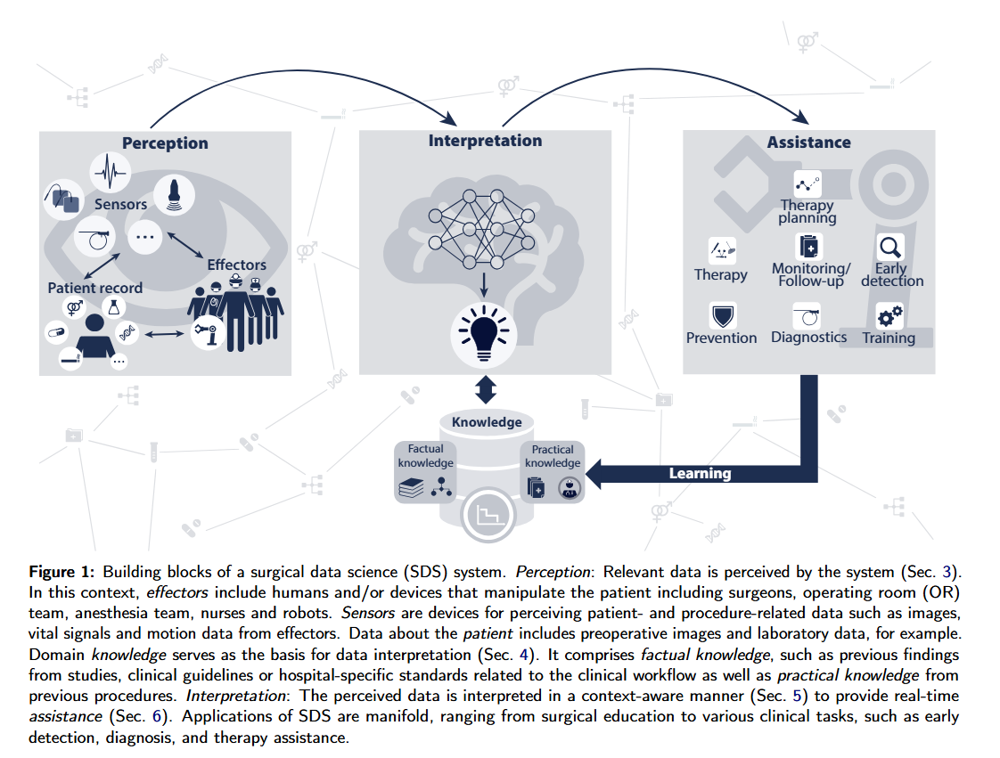

# Surgical Data Science – from Concepts toward Clinical Translation

> Title: Surgical Data Science – from Concepts toward Clinical Translation  
> KEYWORDS：Surgical Data Science；Artificial Intelligence；Deep Learning；Computer-Aided Surgery；Clinical Translation  
> 作者：Lena Maier-Hein；Matthias Eisenmann；Duygu Sarikaya；Keno März；Toby Collins；Anand Malpani；Johannes Fallert；Hubertus Feussner；Stamatia Giannarou；Pietro Mascagni；Hirenkumar Nakawala；Adrian Park；Carla Pugh；Danail Stoyanov；Swaroop S. Vedula；Kevin Cleary；Gabor Fichtinger；Germain Forestier；Bernard Gibaud；Teodor Grantcharov；Makoto Hashizume；Doreen Heckmann-Nötzel；Hannes G. Kenngott；Ron Kikinis；Lars Mündermann；Nassir Navab；Sinan Onogur；Raphael Sznitman；Russell H. Taylor；Minu D. Tizabi；Martin Wagner；Gregory D. Hager；Thomas Neumuth；Nicolas Padoy；Justin Collins；Ines Gockel；Jan Goedeke；Daniel A. Hashimoto；Luc Joyeux；Kyle Lam；Daniel R. Leff；Amin Madani；Hani J. Marcus；Ozanan Meireles；Alexander Seitel；Dogu Teber；Frank Ückert；Beat P. Müller-Stich；Pierre Jannin；Stefanie Speidel  
> 机构：German Cancer Research Center；Heidelberg University；Johns Hopkins University；University College London；Technical University of Munich；Imperial College London；Queen's University；Harvard Medical School；University of Strasbourg；University of Rennes 1；University of Bern；University of Toronto；Stanford University；Kyushu University；University of Leipzig；Monash University等  
> Google Scholar被引次数：未提供  
> 发表：2021年7月30日提交的预印本版本  
> Venue: Preprint submitted to Elsevier  
> Conference: 不适用  
> Year: 2021  
> Link: [arXiv:2011.02284](https://arxiv.org/abs/2011.02284)

## 1. 背景与问题

Surgical Data Science（SDS，手术数据科学）旨在通过对数据进行采集、组织、分析和建模，提升介入性医疗的质量与价值。数据可以来自患者、医护人员、手术设备以及整个医疗流程，既包括术前和术后的临床数据，也包括术中的视频、图像、生命体征、器械运动和手术团队交互数据。

论文指出，机器学习已经在放射学、皮肤科、胃肠病学和其他医疗领域产生了较为明确的成功案例，但手术领域仍然缺乏被广泛认可的临床成功故事。作者将这一现象与手术数据的复杂性联系起来：

- 手术过程具有较强的个体差异和时间动态；
- 数据来源多样，涉及视频、影像、传感器、电子病历和设备日志；
- 手术数据的采集、存储和共享受到隐私、伦理、法规和设备互操作性的限制；
- 高质量标注依赖外科专家，成本高且耗时；
- 算法必须与临床工作流结合，而不是停留在离线数据集上的性能比较；
- 临床研究中仍缺少大规模、多中心、前瞻性和随机对照验证。

作者回顾了2004年“Operating Room of the Future”研讨会提出的标准化、设备互操作性、电子病历访问和手术流程建模等问题，并指出这些问题在2019年前后仍未得到充分解决。

论文的核心目标不是提出一个新的神经网络，而是系统梳理SDS从数据采集、数据管理、数据分析到临床转化的完整链条，并通过国际研讨会和四轮Delphi过程提出未来发展路线图。

## 2. 核心方法

### 2.1 SDS系统的整体结构

论文将SDS系统抽象为三个核心环节：

1. **Perception：感知**

   系统通过传感器获取与患者和手术过程相关的数据，包括：

   - 内窥镜和显微镜视频；
   - CT、MRI和术中影像；
   - 生理信号和生命体征；
   - 手术器械及机器人运动数据；
   - 手术室中的人员、设备和环境信息；
   - 电子病历、实验室结果和术后结局。

2. **Interpretation：解释**

   系统结合领域知识对感知到的数据进行理解。领域知识包括：

   - 临床研究结果；
   - 临床指南；
   - 医院内部标准；
   - 既往手术经验；
   - 手术流程和解剖知识；
   - 患者偏好以及治疗目标。

3. **Assistance：辅助**

   系统根据对数据的解释向医护人员提供辅助，包括：

   - 术前和术中决策支持；
   - 手术流程识别；
   - 解剖结构和器械识别；
   - 风险预测和早期预警；
   - 手术技能评估；
   - 手术教育；
   - 术中导航；
   - 自动记录和手术报告生成；
   - 机器人控制和摄像机控制。

### 2.2 原文 Figure 1：SDS系统组成

图中展示的基本逻辑是：系统首先通过传感器感知患者、手术人员、设备和环境数据，再利用领域知识解释这些数据，最后输出实时辅助。执行者既可以是人，也可以是机器人或其他医疗设备；传感器既可以采集图像，也可以采集生命体征、运动数据和设备状态。

原文 Figure 1 的重要意义在于，它没有把SDS限定为单一的计算机视觉任务，而是将其定义为一个连接数据、知识、临床流程和医疗执行者的完整系统。

### 2.3 数据采集与基础设施

SDS的数据基础设施需要解决以下问题：

- 多种设备之间的数据互操作性；
- 不同数据类型之间的时间同步；
- 手术视频、图像、传感器和电子病历的联合存储；
- 受监管环境下的数据访问控制；
- 患者隐私保护和去标识化；
- 多中心数据共享；
- 数据标准和术语体系；
- 可追溯的数据管理流程。

论文特别强调，手术室不是一个单一数据源环境。术中数据通常来自多个设备和多个参与者，数据具有异构、连续、实时和上下文依赖等特征。因此，单独分析某一个视频片段或某一个传感器信号，往往不足以完整理解手术过程。

### 2.4 数据标注与共享

论文认为，数据标注是SDS发展的主要瓶颈之一。手术视频的标注通常需要外科医生或具有相关临床经验的专家参与，标注对象可以包括：

- 手术阶段；
- 手术步骤；
- 手术动作；
- 解剖结构；
- 手术器械；
- 器械与组织之间的交互；
- 手术风险事件；
- 手术技能水平；
- 关键临床事件和结局。

作者讨论了多种降低标注成本的方法：

- 众包标注；
- 专家与非专家协作；
- 主动学习；
- 半监督学习；
- 自监督学习；
- 迁移学习；
- 合成数据生成；
- 基于规则和知识库的辅助标注；
- 多中心数据集和公开挑战赛。

论文同时指出，数据共享不能只关注数据量，还必须关注数据质量、标注一致性、数据代表性和任务定义。不同研究使用不同的标注体系，会导致数据集之间难以直接比较。

### 2.5 数据分析任务

论文将SDS中的分析任务划分为多个层次：

- 感知和检测：识别器械、解剖结构、组织和关键事件；
- 分割：对器械、解剖区域和病变区域进行像素级分割；
- 分类：识别手术阶段、动作、病例类型或风险类别；
- 时序建模：理解手术过程的时间依赖关系；
- 预测：预测剩余手术时间、术中风险和术后结局；
- 技能评估：根据动作、轨迹和流程评价手术技能；
- 决策支持：结合当前上下文向医护人员提供建议；
- 机器人辅助：根据手术上下文控制摄像机或其他设备。

这些任务不应被孤立地看待。一个完整的SDS系统需要将低层视觉感知、手术流程建模、临床知识和决策辅助连接起来。

## 3. 创新点

- **提出面向临床转化的SDS整体框架**

  论文将手术数据科学从单纯的医学图像分析扩展为涵盖数据采集、数据管理、数据分析、临床工作流和患者结局的综合性研究领域。

- **强调术中数据的特殊性**

  与静态医学图像相比，手术数据具有连续性、时间依赖性、多模态和强上下文特征。手术过程不仅包含患者数据，还包含外科医生、护理团队、麻醉团队、机器人和手术室设备之间的交互。

- **将领域知识纳入数据分析流程**

  SDS系统不应只依靠数据驱动的模型，还需要结合临床指南、医院流程、外科知识、既往经验和患者偏好，从而形成上下文感知的分析和辅助系统。

- **系统总结临床转化障碍**

  论文没有把算法准确率作为唯一评价指标，而是进一步讨论了数据质量、临床需求、法规、工作流集成、可解释性、可复现性和临床试验设计等问题。

- **通过国际Delphi过程提出未来路线图**

  论文基于国际研讨会和四轮Delphi过程，汇总来自临床、工程、计算机科学和产业界的观点，尝试将SDS的发展从概念讨论推进到具体的研究和转化目标。

- **提出低风险、容易落地的应用方向**

  作者认为，早期临床转化不一定要直接实现自动手术。更容易落地的方向包括：

  - 手术报告和文档自动生成；
  - 手术时间预测；
  - 手术室物流优化；
  - 纱布、标本袋和缝针等物体的遗留检测；
  - 手术安全检查表自动化；
  - 术中摄像机自动控制；
  - 手术视频中的阶段和器械识别；
  - 手术技能教育与评估。

## 4. 实验 & 结果

### 4.1 论文的研究类型

这篇论文是一篇综述、领域分析和路线图研究，并不是提出新模型后进行标准基准测试的实验论文。因此，论文没有一个统一的训练集、测试集、网络结构、损失函数和单一性能指标。

论文的主要“结果”包括：

1. 总结SDS的概念、组成和研究范围；
2. 梳理数据采集、存储、标注、共享和分析中的关键问题；
3. 汇总已有的SDS临床研究；
4. 分析SDS从学术研究走向临床应用的障碍；
5. 基于国际专家讨论和Delphi过程提出未来发展路线；
6. 归纳适合优先进行临床转化的低风险应用。

### 4.2 原文 Table 6：SDS临床研究示例

下表根据原文 Table 6 整理。论文在2021年6月通过PubMed和Google检索相关临床研究，并人工筛选使用机器学习组件进行术中分析的研究。

| 研究 | 应用主题 | 研究类型 | 研究规模 |
| --- | --- | --- | --- |
| Fan et al. (2016) | 基于体感诱发电位测量的术中监测 | 横断面研究 | 10名患者 |
| Harangi et al. (2017) | 根据妇科手术视频识别子宫动脉和输尿管 | 横断面研究 | 35名患者 |
| Korndorffer et al. (2020) | 根据腹腔镜胆囊切除术视频检测术中事件和病例严重程度 | 横断面研究 | 1,051个视频 |
| Lundberg et al. (2018) | 根据电子病历中的逐分钟数据预测术中低氧血症 | 前瞻性队列研究 | 53,126例手术 |
| Madani et al. (2021) | 根据腹腔镜胆囊切除术视频分割安全区和危险区 | 横断面研究 | 290个视频 |
| Mascagni et al. (2020) | 根据腹腔镜胆囊切除术视频分割解剖结构并评估安全关键视野标准 | 横断面研究 | 201个视频 |
| Tokuyasu et al. (2021) | 检测腹腔镜胆囊切除术中的肝胆解剖标志 | 横断面研究 | 99个视频 |
| Wijnberge et al. (2020) | 基于连续有创血压监测预测术中低血压 | 随机对照试验 | 68名患者 |

### 4.3 临床研究现状

论文总结的临床研究显示，SDS已经覆盖多个方向，包括：

- 术中生理信号监测；
- 手术视频理解；
- 解剖结构检测和分割；
- 手术流程识别；
- 术中风险预测；
- 术后并发症预测；
- 手术时间预测；
- 手术技能评估；
- 机器人和摄像机辅助；
- 手术室管理和物流优化。

但这些研究总体上仍然存在明显限制：

- 单中心研究较多；
- 样本量较小；
- 研究任务和评价标准不统一；
- 外部验证不足；
- 缺少前瞻性研究；
- 随机对照试验数量有限；
- 人类对照组规模较小；
- 训练数据和测试数据可能存在分离不足；
- 对模型错误和临床风险的分析不充分；
- 研究结果难以直接推广到其他医院和其他手术类型。

### 4.4 论文认为最接近临床落地的方向

论文认为，SDS的早期成功故事可能来自低风险、低侵入性的辅助应用，而不是直接让机器人独立完成高风险手术任务。

其中包括：

- 自动记录重要手术步骤；
- 根据术中数据预测剩余手术时长；
- 优化手术室排程和资源配置；
- 检测术中进入腹腔但未取出的物体；
- 自动完成部分手术安全检查；
- 根据术中上下文自动调整内窥镜摄像机；
- 为外科医生提供信息增强，而不是替代外科医生完成关键决策。

### 4.5 临床转化的主要结论

论文认为，SDS最大的挑战不是缺少算法，而是如何把算法放入真实临床环境中。临床转化需要同时解决以下问题：

- 数据是否代表真实临床人群；
- 算法是否能够适应不同医院、设备和术者；
- 模型错误是否能够被及时发现；
- 模型输出是否能够解释；
- 系统是否干扰手术流程；
- 临床人员是否愿意使用；
- 是否有明确的监管和责任边界；
- 是否经过前瞻性临床验证；
- 是否真正改善患者结局、手术安全或医疗效率。

## 5. 个人思考

这篇论文最重要的价值在于，它把手术人工智能的问题从“模型能否在数据集上达到更高准确率”提升为“如何构建能够进入真实手术环境的数据和智能系统”。

手术数据科学的困难并不只是数据规模不足。手术数据通常同时具有以下特征：

- 多模态；
- 连续时序；
- 强上下文；
- 高度个体化；
- 标注成本高；
- 设备和医院差异大；
- 与临床决策和患者安全直接相关。

因此，单一的图像分类或目标检测模型很难独立解决完整的SDS问题。更加合理的研究路线应该是，将视觉感知、时序建模、临床知识、工作流分析、风险预测和人机交互结合起来。

论文还说明，临床转化需要从低风险任务开始。自动摄像机控制、手术时间预测、手术记录生成和遗留物检测等任务虽然不一定最具理论挑战性，但更容易嵌入现有工作流，也更容易进行临床评价。相比之下，直接实现自主缝合、组织切割或复杂手术决策，面临更高的安全、伦理和监管风险。

论文中反复出现的一个核心问题是：手术人工智能研究必须由临床需求驱动。算法研究者需要理解手术流程和医生真正需要的信息，临床医生也需要参与任务定义、数据标注、系统设计和临床评价。SDS的发展依赖外科、计算机视觉、机器学习、医学信息学、机器人学、数据工程和监管科学之间的长期合作。

总体而言，这篇综述的核心结论可以概括为：

> Surgical Data Science不是一个单独的模型或算法，而是一个围绕手术数据构建感知、理解、预测和辅助系统的跨学科研究领域。它的最终目标不是在离线数据集上获得更高分数，而是在保证安全、可解释和可验证的前提下改善真实临床中的手术质量、效率和患者结局。
