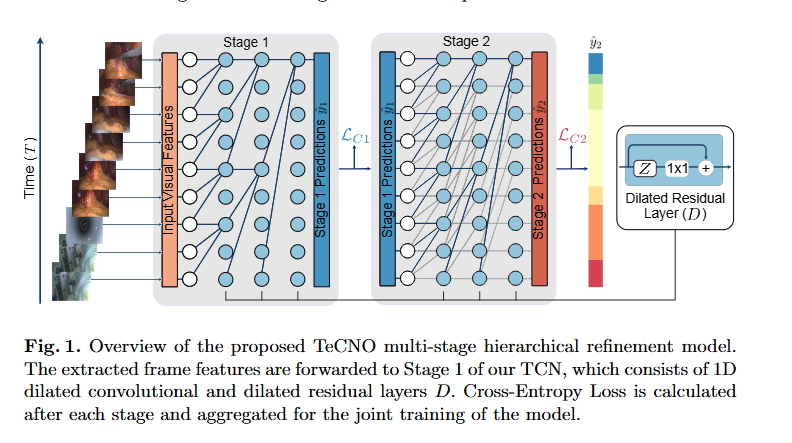
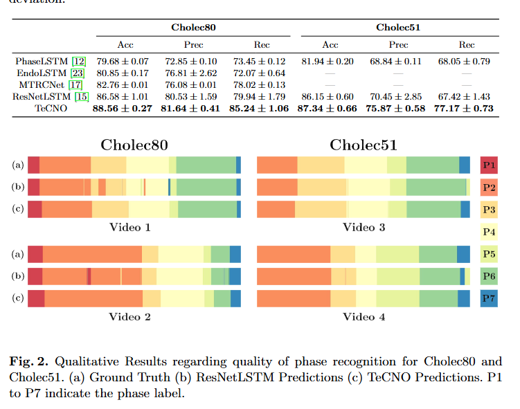

# TeCNO: Surgical Phase Recognition with Multi-Stage Temporal Convolutional Networks

> Title: TeCNO: Surgical Phase Recognition with Multi-Stage Temporal Convolutional Networks  
> KEYWORDS: Surgical Workflow, Surgical Phase Recognition, Temporal Convolutional Networks, Endoscopic Videos, Cholecystectomy  
> 作者: Tobias Czempiel, Magdalini Paschali, Matthias Keicher, Walter Simson, Hubertus Feussner, Seong Tae Kim, Nassir Navab  
> 机构: Technische Universität München；Klinikum Rechts der Isar, Technische Universität München；Johns Hopkins University  
> Google Scholar 被引次数: 论文未提供  
> 发表: 2020  
> Venue: arXiv preprint  
> Conference: 未明确标注  
> Year: 2020  
> Link: [arXiv:2003.10751](https://arxiv.org/abs/2003.10751)

## 1. 背景与问题

### 1.1 研究背景

手术流程分析是计算机辅助介入系统中的重要任务。通过识别手术视频中的阶段，可以为术中预警、异常检测、决策支持、手术记录归档、医学教学和术后监测提供基础信息。

腹腔镜手术视频中的手术阶段识别仍然存在以下困难：

- 病人解剖结构具有差异；
- 不同外科医生的操作风格不同；
- 手术视频数据量有限，标注成本较高；
- 不同手术阶段之间具有较强的视觉相似性；
- 阶段转换过程具有模糊性；
- 手术持续时间较长，模型需要理解较长时间范围内的上下文信息；
- 在线术中识别不能依赖未来视频帧。

### 1.2 现有方法的问题

早期手术流程识别方法主要使用隐马尔可夫模型、动态时间规整等方法。这些方法通常依赖完整视频序列，难以用于实时在线场景。

之后，研究者开始使用卷积神经网络和长短期记忆网络进行手术阶段识别。LSTM能够建模时间信息，但存在以下局限：

- LSTM按时间顺序递归计算，难以并行化；
- 长时间序列中的记忆能力有限；
- 滑动窗口方法难以捕获分钟甚至小时尺度的手术流程；
- 在线推理速度受到限制；
- 阶段边界附近容易出现预测抖动。

### 1.3 本文要解决的问题

本文希望解决以下问题：

1. 如何在不使用未来帧的情况下进行手术阶段在线识别？
2. 如何利用较长时间范围内的历史信息？
3. 如何减少阶段转换过程中的预测抖动？
4. 如何在不同视频特征提取器的基础上进一步提升识别性能？
5. 如何在手术阶段类别不均衡的情况下提高少数阶段的识别效果？

---

## 2. 核心方法

本文提出了 TeCNO，即 Temporal Convolutional Networks for the Operating room。TeCNO的核心是将因果扩张时间卷积网络和多阶段预测细化机制用于手术阶段识别。

整体流程为：

```text
手术视频帧
    ↓
ResNet50逐帧提取视觉特征
    ↓
Stage 1：因果扩张时间卷积网络
    ↓
Stage 2：对Stage 1预测结果进行细化
    ↓
当前时刻的手术阶段预测
```



图1对应论文中的TeCNO多阶段层级细化模型。模型首先提取每一帧的视觉特征，然后将特征输入第一阶段TCN，第一阶段的预测结果继续输入第二阶段进行细化。

### 2.1 特征提取模块

作者首先使用ResNet50作为视觉特征提取器。ResNet50逐帧处理手术视频，不直接使用时间上下文。

在Cholec80数据集中，模型可以进行多任务学习，同时预测：

- 当前手术阶段；
- 当前画面中是否存在某种手术器械。

对于手术阶段识别，模型采用带有类别权重的交叉熵损失，以缓解不同手术阶段之间的类别不平衡问题。

对于器械识别，模型采用多标签二元交叉熵损失，因为同一帧中可能同时出现多个器械。

本文采用两阶段训练思路：

1. 训练视觉特征提取器；
2. 使用提取的视觉特征训练时间细化模型。

这种设计使TeCNO的时间建模部分不依赖特征提取器的具体结构，也不强制要求所有数据集都必须提供器械标注。

### 2.2 因果时间卷积

TeCNO使用因果卷积，而不是普通的非因果卷积。

非因果卷积在预测当前时间点时可能使用过去帧和未来帧：

$$
\hat{y}_t = f(x_{t-n}, \ldots, x_t, \ldots, x_{t+n})
$$

因果卷积只使用当前帧和过去帧：

$$
\hat{y}_t = f(x_{t-n}, \ldots, x_t)
$$

因此，TeCNO在时间点 $t$ 的预测不依赖未来信息，适合术中实时识别。

### 2.3 扩张卷积

为了在不显著增加网络层数的情况下扩大时间感受野，TeCNO在卷积层中使用扩张卷积。

扩张系数随着网络层数增加而增加。使用卷积核大小为3的扩张卷积时，第 $l$ 层的感受野为：

$$
RF(l) = 2^{l+1} - 1
$$

当连续堆叠3个扩张卷积层时，感受野可以覆盖8个时间步。

扩张卷积的主要作用是：

- 在较少参数下获得较大的时间感受野；
- 观察更长时间范围内的手术上下文；
- 避免使用池化层造成时间分辨率下降；
- 提高模型对长时间手术视频的处理能力。

### 2.4 残差时间卷积层

每个TCN阶段由多个扩张残差层组成。对于第 $l$ 个残差层，模型先通过扩张卷积和ReLU激活得到中间表示：

$$
Z^l = \operatorname{ReLU}(W_1^l * D^{l-1} + b_1^l)
$$

然后通过 $1 \times 1$ 卷积并与输入进行残差相加：

$$
D^l = D^{l-1} + W_2^l * Z^l + b_2^l
$$

残差结构有助于稳定深层网络训练，也能够保留前面层提取的时间信息。

### 2.5 多阶段预测细化

TeCNO的多阶段结构由多个预测阶段组成：

- Stage 1根据视觉特征生成初始手术阶段预测；
- Stage 2接收Stage 1的输出并进一步细化；
- 最终预测结果由最后一个阶段输出。

每个阶段都具有独立的损失函数，训练时将不同阶段的损失进行平均：

$$
L_C = \frac{1}{M}\sum_{m=1}^{M}L_{C_m}
$$

其中，$M$表示阶段数量。

这种设计可以逐步修正初始预测中的错误，使模型在阶段内部获得更平滑的结果，并减少阶段转换附近的预测抖动。

### 2.6 损失函数

由于手术阶段类别分布不均衡，作者使用带有类别权重的交叉熵损失：

$$
L_{C_m}
=
-\frac{1}{T}
\sum_{t=1}^{T}
w_c y_t^m \log(\hat{y}_t^m)
$$

其中：

- $T$是视频中的时间步数；
- $y_t^m$是真实阶段标签；
- $\hat{y}_t^m$是第 $m$个阶段的预测结果；
- $w_c$是类别权重；
- 类别权重通过中位数频率平衡方法计算。

---

## 3. 数据来源

### 3.1 Cholec80数据集

Cholec80是公开的腹腔镜胆囊切除术视频数据集，包含：

- 80段手术视频；
- 视频分辨率为1920×1080或854×480；
- 原始帧率为25 fps；
- 每一帧被标注为7个手术阶段之一；
- 提供7类手术器械的标注；
- 视频被下采样到5 fps；
- 总计约92,000帧。

数据集划分如下：

| 数据划分 | 视频数量 |
| --- | ---: |
| 训练集 | 40 |
| 验证集 | 8 |
| 测试集 | 32 |

### 3.2 Cholec51数据集

Cholec51是作者使用的腹腔镜胆囊切除术数据集，包含：

- 51段手术视频；
- 视频分辨率为1920×1080；
- 采样率为1 fps；
- 包含7个手术阶段；
- 由专业医生进行标注；
- 不提供手术器械标注。

数据集划分如下：

| 数据划分 | 视频数量 |
| --- | ---: |
| 训练集 | 25 |
| 验证集 | 8 |
| 测试集 | 18 |

两个数据集的手术阶段定义略有不同，因此作者分别进行训练和测试。

### 3.3 训练设置

模型训练设置如下：

| 项目 | 设置 |
| --- | --- |
| 优化器 | Adam |
| 初始学习率 | $5 \times 10^{-4}$ |
| 训练轮数 | 25 epochs |
| GPU | NVIDIA Titan V 12GB |
| 实现框架 | PyTorch |
| 实验重复次数 | 5次随机初始化 |
| 评价指标 | Accuracy、Precision、Recall |

---

## 4. 实验与结果

### 4.1 评价指标

作者使用三个指标评价手术阶段识别效果：

- Accuracy：整个视频中被正确分类的帧所占比例；
- Precision：每个手术阶段预测为该阶段的样本中，真正属于该阶段的比例；
- Recall：真实属于某个阶段的样本中，被模型正确识别的比例。

### 4.2 不同特征提取器和TCN阶段数量

在Cholec80数据集上，作者比较了AlexNet和ResNet50，并测试了不同数量的TCN阶段。

| 特征提取器 | TCN阶段 | Accuracy (%) | Precision (%) | Recall (%) |
| --- | --- | ---: | ---: | ---: |
| AlexNet | 无TCN | 74.40 ± 4.30 | 63.06 ± 0.32 | 70.75 ± 0.05 |
| AlexNet | Stage I | 84.04 ± 0.98 | 79.82 ± 0.31 | 79.03 ± 0.99 |
| AlexNet | Stage II | 85.31 ± 1.02 | 81.54 ± 0.49 | 79.92 ± 1.16 |
| AlexNet | Stage III | 84.41 ± 0.85 | 77.68 ± 0.90 | 79.64 ± 1.60 |
| ResNet50 | 无TCN | 82.22 ± 0.60 | 70.65 ± 0.08 | 75.88 ± 1.35 |
| ResNet50 | Stage I | 88.35 ± 0.30 | 82.44 ± 0.46 | 84.71 ± 0.71 |
| ResNet50 | Stage II | 88.56 ± 0.27 | 81.64 ± 0.41 | 85.24 ± 1.06 |
| ResNet50 | Stage III | 86.49 ± 1.66 | 78.87 ± 1.52 | 83.69 ± 1.03 |

主要结论：

- ResNet50整体优于AlexNet；
- 加入1个TCN阶段后，AlexNet的准确率提高约10个百分点；
- 加入1个TCN阶段后，ResNet50的准确率提高约6个百分点；
- ResNet50加上两个TCN阶段时取得最佳准确率；
- 第三个阶段没有继续提升性能，反而出现下降；
- 过多的细化阶段可能导致有限数据上的过拟合。

### 4.3 与LSTM方法的比较



| 方法 | Cholec80 Accuracy (%) | Cholec80 Precision (%) | Cholec80 Recall (%) | Cholec51 Accuracy (%) | Cholec51 Precision (%) | Cholec51 Recall (%) |
| --- | ---: | ---: | ---: | ---: | ---: | ---: |
| PhaseLSTM | 79.68 ± 0.07 | 72.85 ± 0.10 | 73.45 ± 0.12 | 81.94 ± 0.20 | 68.84 ± 0.11 | 68.05 ± 0.79 |
| EndoLSTM | 80.85 ± 0.17 | 76.81 ± 2.62 | 72.07 ± 0.64 | — | — | — |
| MTRCNet | 82.76 ± 0.01 | 76.08 ± 0.01 | 78.02 ± 0.13 | — | — | — |
| ResNetLSTM | 86.58 ± 1.01 | 80.53 ± 1.59 | 79.94 ± 1.79 | 86.15 ± 0.60 | 70.45 ± 2.85 | 67.42 ± 1.43 |
| TeCNO | 88.56 ± 0.27 | 81.64 ± 0.41 | 85.24 ± 1.06 | 87.34 ± 0.66 | 75.87 ± 0.58 | 77.17 ± 0.73 |

TeCNO在两个数据集上的结果如下：

- Cholec80准确率为88.56%；
- Cholec80精确率为81.64%；
- Cholec80召回率为85.24%；
- Cholec51准确率为87.34%；
- Cholec51精确率为75.87%；
- Cholec51召回率为77.17%。

与ResNetLSTM相比，TeCNO的准确率提高约1%至2%，而精确率和召回率提升更加明显。作者认为，这主要得益于TeCNO具有更大的时间感受野和更高的时间分辨率。

### 4.4 预测一致性


作者对Cholec80和Cholec51中的4段视频进行可视化比较。结果表明：

- TeCNO在同一手术阶段内部的预测更加平滑；
- TeCNO能够减少阶段转换处的预测抖动；
- 对持续时间较短的阶段，如P5和P7，TeCNO具有更好的识别效果；
- 即使某些视频缺少P1阶段，模型性能也没有明显下降；
- 多阶段细化机制提高了预测的时间一致性。

### 4.5 主要实验结论

本文实验支持以下结论：

1. 时间建模对于手术阶段识别非常重要；
2. TCN能够显著改善不同CNN特征提取器的识别性能；
3. ResNet50比AlexNet更适合作为视觉特征提取器；
4. 两阶段TCN在本文实验中优于一阶段和三阶段TCN；
5. TeCNO整体优于多种LSTM-based手术阶段识别方法；
6. 因果卷积使模型可以使用历史帧进行在线预测；
7. 扩张卷积使模型能够利用更大的时间范围；
8. 多阶段预测细化能够改善阶段内部的平滑性和阶段边界处的一致性。

---

## 5. 创新点

- 将因果扩张多阶段TCN应用于手术阶段在线识别；
- 不依赖未来视频帧，适合术中实时场景；
- 使用扩张卷积扩大时间感受野；
- 使用多阶段结构逐步细化预测结果；
- 保持时间分辨率，不使用池化层压缩时间维度；
- 将视觉特征提取与时间预测模块分离，提高方法灵活性；
- 在Cholec80和Cholec51两个数据集上均优于多种LSTM方法；
- 对短时阶段和模糊阶段转换具有更好的预测一致性。

---

## 6. 论文不足

- 实验主要集中在腹腔镜胆囊切除术，手术类型较单一；
- 数据集规模仍然有限；
- Cholec51是内部数据集，公开性和可复现性相对有限；
- 论文没有充分讨论跨医院、跨设备和跨医生泛化；
- 主要使用Accuracy、Precision和Recall，缺少更细粒度的阶段边界评价；
- 没有系统分析不同实时推理延迟下的模型表现；
- 三阶段模型性能下降，说明模型容量与数据规模之间存在不匹配；
- 时间卷积只能利用历史帧，可能无法充分利用完整视频中的全局信息；
- 对阶段标签噪声和医生标注差异讨论不足；
- 模型对手术阶段定义变化的适应能力仍需验证。

---

## 7. 个人思考

这篇论文最重要的贡献不是单纯把LSTM替换成卷积，而是将手术阶段识别重新组织成“逐帧视觉特征提取”和“时间序列预测细化”两个阶段。

这种解耦设计有较强的工程意义。视觉模块可以负责理解当前画面，TCN模块负责理解当前手术处于怎样的时间进程中。这样既降低了系统设计的复杂度，也便于替换不同的特征提取器。

论文的实验结果说明，单帧视觉信息不足以准确判断手术阶段。即使使用较强的ResNet50，加入时间建模后性能仍然明显提升。这说明手术阶段识别不仅取决于当前画面，还取决于此前发生了什么以及手术流程如何发展。

另一方面，本文的性能提升仍然建立在相对有限的数据集上。未来如果数据规模更大，三阶段或更多阶段的细化是否仍然会过拟合，需要进一步研究。更复杂的模型也不一定能够直接带来更好的效果，时间建模能力、标注质量和跨场景泛化能力同样重要。

---

## 8. 总结

TeCNO通过ResNet50提取逐帧视觉特征，再使用因果扩张多阶段TCN进行时间建模和预测细化，实现了面向在线场景的手术阶段识别。

这篇论文的核心逻辑是：

```text
单帧视觉特征
    ↓
因果卷积利用历史信息
    ↓
扩张卷积获得较大时间感受野
    ↓
多阶段结构细化阶段预测
    ↓
更准确、更平滑的在线手术阶段识别
```

实验结果表明，时间建模对于手术阶段识别非常重要。TeCNO不仅提高了整体准确率，也改善了短阶段和模糊阶段转换处的识别稳定性。
