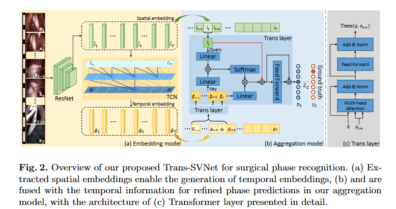

# Trans-SVNet: Accurate Phase Recognition from Surgical Videos via Hybrid Embedding Aggregation Transformer

> Title: Trans-SVNet: Accurate Phase Recognition from Surgical Videos via Hybrid Embedding Aggregation Transformer  
> KEYWORDS: Surgical Phase Recognition, Transformer, Hybrid Embedding Aggregation, Endoscopic Videos  
> 作者: Xiaojie Gao, Yueming Jin, Yonghao Long, Qi Dou, Pheng-Ann Heng  
> 机构: Department of Computer Science and Engineering, The Chinese University of Hong Kong；T Stone Robotics Institute, CUHK  
> Google Scholar 被引次数: 未提供  
> 发表: 2021  
> Venue: MICCAI 2021  
> Link: [arXiv:2103.09712](https://arxiv.org/abs/2103.09712)  
> Code: [Trans-SVNet GitHub](https://github.com/xjgaocs/Trans-SVNet)

## 1. 背景与问题

### 1.1 研究背景

手术阶段识别是手术视频分析中的基础任务。模型需要根据当前视频帧判断手术处于哪个阶段，例如穿刺、分离、切割、缝合或取出标本等。准确的手术阶段识别可以用于：

- 手术过程监控；
- 手术流程提取；
- 手术决策支持；
- 智能手术室中的上下文感知系统；
- 手术视频的自动分析与术后总结。

手术视频具有明显的时空特征。一方面，单帧图像包含器械、组织、操作区域和场景外观等空间信息；另一方面，连续帧之间的变化又包含手术动作和流程顺序等时间信息。

### 1.2 现有方法的问题

早期方法主要采用条件随机场、隐马尔可夫模型等统计模型，但这些方法通常需要预先设定时间依赖关系，难以表达复杂的手术流程。

之后，研究者将 ResNet、LSTM、TCN 等深度神经网络用于手术阶段识别。这些方法能够更好地建模视频中的空间信息和时间信息，但普遍存在一个问题：空间特征和时间特征通常按照先后顺序处理。

典型流程是：

1. 使用 CNN 或 ResNet 提取每一帧的空间特征；
2. 将空间特征输入 LSTM 或 TCN；
3. 通过时序网络获得时间特征；
4. 根据最终的时空特征进行阶段分类。

这种处理方式可能导致空间信息损失。时间特征提取器通常会将高维空间特征压缩为较低维的时间表示。在压缩过程中，一些对识别当前阶段有帮助的外观细节可能被忽略。

此外，手术阶段识别通常要求在线预测，模型不能使用当前时刻之后的未来帧。因此，模型不仅要识别当前帧，还要利用当前帧以前的历史信息，同时保证较高的推理速度。

### 1.3 论文要解决的问题

本文主要解决以下问题：

1. 如何重新利用已经提取出的空间特征，减少时间特征提取过程中的信息损失？
2. 如何有效融合单帧空间信息和连续帧时间信息？
3. 如何在不显著增加参数量和计算成本的情况下，提高在线手术阶段识别的准确率？
4. 如何在模型精度和实时推理速度之间取得平衡？

作者提出 Trans-SVNet，通过 Transformer 让当前时刻的空间嵌入主动查询一段历史时间嵌入，从而恢复时间特征中可能被忽略的关键视觉信息。

## 2. 核心方法

### 2.1 方法总体思路

Trans-SVNet 由两个主要部分组成：

1. 视频嵌入提取模型；
2. 混合嵌入聚合模型。

模型首先使用 ResNet50 从每一帧图像中提取空间嵌入，再使用 TCN 根据空间嵌入序列提取时间嵌入。之后，Transformer 将当前时刻的空间嵌入作为查询，将一段历史时间嵌入作为键和值，主动寻找与当前空间信息相关的时间上下文。

模型的核心逻辑可以概括为：

空间嵌入提供当前画面的外观信息，时间嵌入提供手术过程的历史信息，Transformer 负责根据当前空间内容从时间序列中检索有用信息。

### 2.2 视频嵌入提取

#### 空间嵌入

给定第 $t$ 帧视频图像 $x_t$，作者使用 ResNet50 提取空间特征。ResNet50 通过帧级别的交叉熵分类任务进行训练，输出平均池化层的特征作为空间嵌入：

$$
l_t \in \mathbb{R}^{2048}
$$

空间嵌入主要包含当前帧的视觉信息，例如：

- 手术器械的外观；
- 组织区域的形态；
- 当前画面中的场景；
- 图像亮度、反光和遮挡等视觉特征。

作者只使用手术阶段标签训练空间特征提取器，没有使用工具存在标签。这样可以避免模型依赖额外的工具标注，也使方法更适合实际应用。

#### 时间嵌入

为了降低计算和内存开销，作者不直接从原始视频帧中提取时间特征，而是从固定的空间嵌入中提取时间信息。

首先使用 $1 \times 1$ 卷积将空间嵌入从 2048 维降低到 32 维：

$$
l'_t \in \mathbb{R}^{32}
$$

然后将整个视频的空间嵌入序列输入 TCN。作者采用 TeCNO 中的两阶段 TCN 结构生成时间嵌入。由于 TCN 使用多层卷积和扩张卷积，它可以获得数分钟范围内的时间感受野，同时不需要使用未来信息。

时间嵌入表示为：

$$
g_t \in \mathbb{R}^{N}
$$

其中 $N$ 是手术阶段类别数。

### 2.3 Transformer 聚合层

Transformer 层由多头注意力、前馈网络、残差连接和层归一化组成。

在标准注意力计算中，查询向量 $q$ 会与键和值序列 $s_{1:n}$ 进行交互：

$$
\operatorname{Attn}(q,s_{1:n})
=
\operatorname{softmax}
\left(
\frac{W^q q(W^k s_{1:n})^T}{\sqrt{d_k}}
\right)
W^v s_{1:n}
$$

与普通的时序建模方法不同，本文并不是简单地将空间特征和时间特征拼接起来，而是让空间嵌入主动从时间嵌入序列中查询信息。

### 2.4 混合嵌入聚合

在第 $t$ 个时间点，模型使用当前空间嵌入 $l_t$ 和长度为 $n$ 的历史时间嵌入序列：

$$
g_{t-n+1:t}
=
[g_{t-n+1},\ldots,g_t]
$$

首先，将空间嵌入降维到类别维度：

$$
\tilde{l}_t=\tanh(W^l l_t)
$$

随后，第一层 Transformer 对时间嵌入序列进行自注意力建模，使每个时间嵌入能够感知序列中的其他时间位置：

$$
\tilde{g}_i
=
\operatorname{Trans}
(g_i,g_{t-n+1:t})
$$

最后，第二层 Transformer 使用当前空间嵌入 $\tilde{l}_t$ 作为查询，使用经过自注意力处理的时间嵌入序列 $\tilde{g}_{t-n+1:t}$ 作为键和值：

$$
p_t
=
\operatorname{Softmax}
\left(
\operatorname{Trans}
(\tilde{l}_t,\tilde{g}_{t-n+1:t})
\right)
$$

输出 $p_t$ 是当前帧属于各个手术阶段的概率分布。

### 2.5 原文 Fig. 2：模型结构整理

下表根据原文 Fig. 2 对 Trans-SVNet 的结构进行整理。

| 模块 | 输入 | 主要操作 | 输出 | 作用 |
| --- | --- | --- | --- | --- |
| 空间特征提取器 | 视频帧 $x_t$ | ResNet50 + 帧级分类训练 | 空间嵌入 $l_t \in \mathbb{R}^{2048}$ | 保留当前帧的视觉外观信息 |
| 时间特征提取器 | 空间嵌入序列 $l'_{1:T}$ | $1 \times 1$ 卷积降维 + 两阶段 TCN | 时间嵌入 $g_t \in \mathbb{R}^{N}$ | 建模手术流程中的历史时间关系 |
| 时间序列内部聚合 | $g_{t-n+1:t}$ | Transformer 自注意力 | $\tilde{g}_{t-n+1:t}$ | 使历史时间嵌入相互交流 |
| 空间嵌入降维 | $l_t$ | 线性层 + tanh | $\tilde{l}_t \in \mathbb{R}^{N}$ | 将空间特征映射到与类别相关的维度 |
| 混合嵌入聚合 | $\tilde{l}_t$ 和 $\tilde{g}_{t-n+1:t}$ | 空间查询时间的交叉注意力 | 融合后的表示 | 从时间序列中找回与当前空间内容相关的信息 |
| 阶段分类器 | 融合后的表示 | Softmax | 阶段概率 $p_t$ | 预测当前视频帧所属的手术阶段 |

### 2.6 为什么让空间嵌入查询时间嵌入

作者对不同的查询和键组合进行了消融实验。结果显示：

- 使用空间嵌入查询空间嵌入，效果较差；
- 使用时间嵌入查询时间嵌入，效果有所提升；
- 使用时间嵌入查询空间嵌入，也可以取得较好的结果；
- 使用当前空间嵌入查询历史时间嵌入，获得了最好的结果。

原因是空间嵌入主要描述当前画面中的外观内容，但缺乏明确的时间顺序信息。因此，空间嵌入适合作为当前时刻的查询，用来寻找时间序列中与当前画面相关的历史信息。

时间嵌入包含一定的时序信息，但在提取过程中可能丢失部分关键视觉细节。通过空间查询时间，模型可以根据当前画面的具体内容选择性地恢复这些信息。

## 3. 创新点

- 首次将 Transformer 用于手术工作流分析中的空间—时间混合嵌入聚合。
- 不仅使用时间特征，还重新利用已经提取过的空间特征，减少空间信息在时间特征提取过程中的损失。
- 设计了空间嵌入查询时间嵌入的交叉注意力结构，而不是简单拼接空间特征和时间特征。
- 通过两个 Transformer 层分别完成时间序列内部聚合和空间—时间混合聚合。
- 使用固定的 ResNet50 空间嵌入生成时间嵌入，减少重复计算并降低训练成本。
- 模型只需要手术阶段标签，不需要额外的器械存在标签。
- 在保持约 24.7M 参数量的同时，实现了 91 fps 的推理速度。
- 通过时间序列长度消融和查询—键组合消融，验证了模型结构设计的有效性。

## 4. 数据来源

### 4.1 Cholec80 数据集

Cholec80 是腹腔镜胆囊切除手术视频数据集，包含 80 个视频，并标注了 7 个手术阶段。

实验按照已有研究中的划分方式进行：

- 前 40 个视频用于训练；
- 后 40 个视频用于测试；
- 视频原始帧率为 25 fps；
- 实验中按照 1 fps 对视频进行下采样；
- 视频帧被调整为 $250 \times 250$；
- 该数据集还包含器械存在标签，但本文的 Trans-SVNet 不使用这些额外标签。

### 4.2 M2CAI16 数据集

M2CAI16 Challenge 数据集包含 41 个手术视频，并标注了 8 个手术阶段。

实验划分方式如下：

- 27 个视频用于训练；
- 14 个视频用于测试；
- 视频原始分辨率为 $1920 \times 1080$；
- 实验中同样按照 1 fps 对视频进行下采样；
- 视频帧被调整为 $250 \times 250$。

### 4.3 原文数据设置整理

| 数据集 | 视频数量 | 手术阶段数量 | 训练/测试划分 | 视频处理 |
| --- | ---: | ---: | --- | --- |
| Cholec80 | 80 | 7 | 40 / 40 | 1 fps 下采样，调整为 $250 \times 250$ |
| M2CAI16 | 41 | 8 | 27 / 14 | 1 fps 下采样，调整为 $250 \times 250$ |

## 5. 实验设置与评价指标

### 5.1 对比方法

作者将 Trans-SVNet 与多种手术阶段识别方法进行比较，包括：

- EndoNet；
- EndoNet+LSTM；
- MTRCNet-CL；
- PhaseNet；
- SV-RCNet；
- OHFM；
- TeCNO。

其中，EndoNet、EndoNet+LSTM 和 MTRCNet-CL 等多任务方法使用了额外的器械存在标签，而 Trans-SVNet 只使用阶段标签。

### 5.2 评价指标

实验采用四个指标：

- Accuracy：所有视频帧中被正确识别的比例；
- Precision：各个阶段精确率的平均值；
- Recall：各个阶段召回率的平均值；
- Jaccard：各个阶段 Jaccard 指数的平均值。

由于不同手术阶段的样本数量不均衡，Precision、Recall 和 Jaccard 都是先分别计算每个阶段的结果，再对各阶段求平均。

### 5.3 训练设置

- 空间特征提取器：ResNet50；
- ResNet50 使用 ImageNet 预训练参数初始化；
- ResNet50 使用 SGD 优化器；
- SGD 动量为 0.9；
- 普通层学习率为 $5 \times 10^{-4}$；
- 全连接层学习率为 $5 \times 10^{-5}$；
- ResNet50 批量大小为 100；
- 数据增强包括随机裁剪、随机水平翻转和颜色抖动；
- 聚合模型使用 Adam 优化器；
- 聚合模型学习率为 $10^{-3}$；
- 注意力头数为 8；
- 时间序列长度 $n=30$；
- 实验使用 NVIDIA GeForce RTX 2080 Ti GPU。

## 6. 实验结果

### 6.1 原文 Table 1：与现有方法比较

下表整理原文 Table 1 中的主要结果。所有数值均为百分比。

| 方法 | Cholec80 Accuracy | Cholec80 Precision | Cholec80 Recall | Cholec80 Jaccard | M2CAI16 Accuracy | M2CAI16 Precision | M2CAI16 Recall | M2CAI16 Jaccard | 参数量 |
| --- | ---: | ---: | ---: | ---: | ---: | ---: | ---: | ---: | ---: |
| EndoNet | 81.7 ± 4.2 | 73.7 ± 16.1 | 79.6 ± 7.9 | 58.3 | 未报告 | 未报告 | 未报告 | 未报告 | 58.3M |
| EndoNet+LSTM | 88.6 ± 9.6 | 84.4 ± 7.9 | 84.7 ± 7.9 | 未报告 | 未报告 | 未报告 | 未报告 | 未报告 | 68.8M |
| MTRCNet-CL | 89.2 ± 7.6 | 86.9 ± 4.3 | 88.0 ± 6.9 | 未报告 | 未报告 | 未报告 | 未报告 | 未报告 | 29.0M |
| PhaseNet | 78.8 ± 4.7 | 71.3 ± 15.6 | 76.6 ± 16.6 | 79.5 ± 12.1 | 64.1 ± 10.3 | 未报告 | 未报告 | 未报告 | 58.3M |
| SV-RCNet | 85.3 ± 7.3 | 80.7 ± 7.0 | 83.5 ± 7.5 | 未报告 | 81.0 ± 8.3 | 81.6 ± 7.2 | 65.4 ± 8.9 | 未报告 | 28.8M |
| OHFM | 87.3 ± 5.7 | 67.0 ± 13.3 | 85.2 ± 7.5 | 68.8 ± 10.5 | 未报告 | 未报告 | 未报告 | 未报告 | 47.1M |
| TeCNO | 88.6 ± 7.8 | 86.5 ± 7.0 | 87.6 ± 6.7 | 75.1 ± 6.9 | 86.1 ± 10.0 | 85.7 ± 7.7 | 88.9 ± 4.5 | 74.4 ± 7.2 | 24.7M |
| Trans-SVNet | 90.3 ± 7.1 | 90.7 ± 5.0 | 88.8 ± 7.4 | 79.3 ± 6.6 | 87.2 ± 9.3 | 88.0 ± 6.7 | 87.5 ± 5.5 | 74.7 ± 7.7 | 24.7M |

### 6.2 主要实验结论

在 Cholec80 数据集上，Trans-SVNet 的结果为：

- Accuracy：90.3%；
- Precision：90.7%；
- Recall：88.8%；
- Jaccard：79.3%。

与使用相同主干结构的 TeCNO 相比，Trans-SVNet 在 Cholec80 上取得了更高的 Precision 和 Jaccard，同时参数量基本没有增加。作者指出，模型只增加了约 30K 参数。

在 M2CAI16 数据集上，Trans-SVNet 的结果为：

- Accuracy：87.2%；
- Precision：88.0%；
- Recall：87.5%；
- Jaccard：74.7%。

总体而言，Trans-SVNet 在两个数据集上都取得了较好的效果，尤其是在视频更多、场景更复杂的 Cholec80 数据集上改进更加明显。

### 6.3 推理速度

Trans-SVNet 使用一块 GPU 可以达到 91 fps 的预测速度，显著高于视频数据的 25 fps 记录速度，因此具备实时或在线手术阶段识别的潜力。

作者认为，较高的推理速度主要来自以下设计：

- 使用低维度视频嵌入；
- 不重复处理原始高分辨率视频帧；
- TCN 和 Transformer 都具有并行计算特点；
- 聚合模型只处理空间嵌入和时间嵌入，而不是直接处理原始图像。

### 6.4 定性结果

作者通过完整手术视频的彩色阶段序列图比较 ResNet、TeCNO、Trans-SVNet 和真实标签。

结果显示：

- ResNet 缺乏时间关系建模，预测结果容易出现频繁跳变；
- TeCNO 可以利用长期时间信息，因此预测更加平滑；
- TeCNO 在某些阶段仍然容易受到反光等视觉因素影响；
- Trans-SVNet 能够重新利用空间嵌入中的视觉信息，因此预测结果更加稳定；
- Trans-SVNet 对部分容易混淆的阶段具有更好的识别能力。

## 7. 消融实验

### 7.1 时间序列长度消融

作者在 Cholec80 数据集上测试了时间序列长度 $n$ 对模型性能的影响。

| 时间序列长度 $n$ | Accuracy | Precision | Recall | Jaccard |
| ---: | ---: | ---: | ---: | ---: |
| 0 | 82.1 ± 7.8 | 78.0 ± 6.4 | 78.5 ± 10.8 | 61.7 ± 11.3 |
| 10 | 89.9 ± 7.2 | 89.6 ± 5.2 | 88.4 ± 7.9 | 78.4 ± 6.6 |
| 20 | 90.2 ± 7.1 | 90.2 ± 5.1 | 88.8 ± 7.7 | 79.1 ± 6.6 |
| 30 | 90.3 ± 7.1 | 90.7 ± 5.0 | 88.8 ± 7.4 | 79.3 ± 6.6 |
| 40 | 90.3 ± 7.0 | 90.8 ± 4.9 | 88.5 ± 7.2 | 79.0 ± 6.8 |

实验说明：

- 当 $n=0$ 时，模型没有使用时间嵌入，性能明显下降；
- 只加入长度为 10 的时间序列，Jaccard 就从 61.7% 提升到 78.4%；
- 当 $n$ 从 10 增加到 30 时，模型性能持续提升；
- 当 $n$ 大于 30 后，性能基本趋于稳定；
- 过长的时间序列可能引入噪声，因此作者最终选择 $n=30$。

### 7.2 查询和键的组合消融

原文 Table 3 比较了不同查询和键组合：

| 查询 Query | 键和值 Key/Value | Accuracy | Precision | Recall | Jaccard |
| --- | --- | ---: | ---: | ---: | ---: |
| $l_t$ | $l_{t-n+1:t}$ | 81.9 ± 9.2 | 78.0 ± 12.5 | 78.3 ± 12.8 | 60.8 ± 12.4 |
| $g_t$ | $g_{t-n+1:t}$ | 89.1 ± 7.8 | 87.6 ± 6.3 | 87.7 ± 6.9 | 76.2 ± 6.6 |
| $g_t$ | $l_{t-n+1:t}$ | 89.2 ± 7.5 | 87.7 ± 6.7 | 87.7 ± 7.0 | 76.1 ± 7.0 |
| $l_t$ | $g_{t-n+1:t}$ | 90.3 ± 7.1 | 90.7 ± 5.0 | 88.8 ± 7.4 | 79.3 ± 6.6 |

最佳结构是使用当前空间嵌入 $l_t$ 查询历史时间嵌入 $g_{t-n+1:t}$。

这说明当前空间信息可以帮助模型确定“应该从历史时间信息中寻找什么”，而时间嵌入则提供了与手术流程相关的上下文。

## 8. 论文主要解决了什么问题

这篇论文解决的不是单纯的“如何使用 Transformer”，而是手术阶段识别中的空间信息丢失问题。

已有方法通常先提取空间特征，再将其压缩为时间特征。压缩后的时间表示有利于建模长时间范围内的手术流程，但可能丢失当前帧中的局部外观细节。

Trans-SVNet 的解决方案是：

1. 使用 ResNet50 保留当前帧的空间信息；
2. 使用 TCN 建模手术流程中的历史时间关系；
3. 使用 Transformer 让当前空间嵌入主动查询时间嵌入；
4. 将当前画面的外观信息与历史时序信息重新融合；
5. 通过交叉注意力恢复可能在时间特征提取中丢失的关键视觉信息。

## 9. 如果由我来设计这个方法

如果由我来设计类似方法，我会保留论文的总体思想，但进一步考虑以下方向。

### 9.1 使用多尺度时间窗口

本文主要使用长度为 30 的时间嵌入序列。不同手术阶段的持续时间可能差异很大，因此可以同时使用：

- 短时间窗口：识别快速动作变化；
- 中时间窗口：识别局部手术步骤；
- 长时间窗口：识别整体手术流程。

之后使用多尺度注意力或门控机制自动选择不同时间范围的信息。

### 9.2 改进在线预测机制

论文使用当前时刻及其之前的时间嵌入，符合在线识别要求。但实际应用中可以进一步研究：

- 模型延迟；
- 帧缓存长度；
- 不同采样率对结果的影响；
- 面向实时系统的显存占用；
- 预测结果的稳定性和响应速度。

### 9.3 增加不确定性估计

手术阶段之间往往存在边界模糊问题。例如，一个阶段结束和下一个阶段开始时，单帧画面可能无法明确判断。模型可以同时输出：

- 当前阶段概率；
- 阶段边界概率；
- 预测置信度；
- 是否需要人工确认。

这样更适合医疗辅助系统，而不仅仅是离线分类评测。

### 9.4 处理域偏移问题

不同医院、不同手术医生、不同摄像设备和不同光照条件会导致明显的域偏移。后续可以加入：

- 跨医院训练和测试；
- 无监督域适应；
- 风格归一化；
- 不同设备下的鲁棒性测试；
- 小样本医院适配实验。

### 9.5 更严格的实验设计

如果进一步开展实验，我会增加：

- 跨数据集测试；
- 不同手术类型的迁移实验；
- 不同视频帧率下的性能比较；
- 计算量、显存和延迟的详细统计；
- 多次独立实验的置信区间；
- 阶段边界识别结果；
- 长视频上的错误累积分析。

## 10. 个人思考

这篇论文最重要的启发是：当一个模型已经提取了某种特征之后，不一定应该完全丢弃原始特征。时间特征虽然具有更强的流程建模能力，但在压缩过程中可能会损失空间细节。因此，模型可以保留不同阶段的中间表示，并在后续任务中重新利用它们。

本文的 Transformer 结构并不复杂，核心价值主要来自信息流设计。作者没有简单地把 ResNet 特征和 TCN 特征拼接，而是进一步思考两种嵌入在注意力机制中的角色：

- 空间嵌入适合代表当前画面；
- 时间嵌入适合代表历史流程；
- 当前空间嵌入可以作为查询；
- 历史时间嵌入可以作为键和值。

这种设计比简单拼接更具有解释性，也通过消融实验验证了不同角色分配之间的差异。

从实验结果看，Trans-SVNet 在 Cholec80 上相较 TeCNO 的提升并不是来自大量增加参数，而是来自对已有空间特征的重新使用。模型参数量仍为约 24.7M，但 Precision 和 Jaccard 得到了提升，说明结构设计比盲目增加模型规模更加重要。

不过，论文仍然存在一些可以进一步研究的问题：

- 实验主要集中在两个手术视频数据集上；
- 数据集规模相对有限；
- 没有充分讨论不同医院和设备之间的域偏移；
- 91 fps 的速度是在特定 GPU 和实验设置下获得的；
- 对阶段边界和预测延迟的分析还不够充分；
- 模型是否能够迁移到其他手术类型，论文中没有展开验证；
- Transformer 注意力关注了哪些具体视频片段，缺少更细致的可解释性分析。

总体来看，Trans-SVNet 的贡献可以概括为：使用 Transformer 重新连接空间嵌入与时间嵌入，让当前视觉内容主动从历史时间信息中寻找支持，从而减少时序特征提取中的信息损失，并在手术阶段识别任务上同时提高准确率和实时推理能力。

## 11. 参考文献与相关工作

论文中涉及的主要相关方法包括：

- ResNet：用于提取单帧空间视觉特征；
- LSTM：用于建模手术视频中的时间依赖；
- TCN：使用时间卷积和扩张卷积建模较长时间范围内的流程关系；
- TeCNO：采用多阶段 TCN 进行在线手术阶段识别；
- EndoNet：用于腹腔镜视频识别的深度网络；
- MTRCNet-CL：结合工具识别和阶段识别的多任务模型；
- Transformer：通过注意力机制建模序列中不同位置之间的关系。

