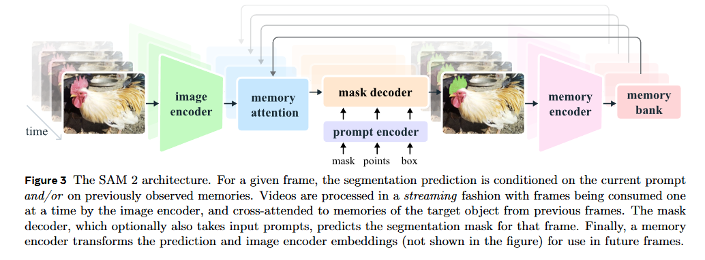

# SAM 2: Segment Anything in Images and Videos

> **Title:** SAM 2: Segment Anything in Images and Videos  
> **KEYWORDS：** Segment Anything Model 2，SAM 2，视觉基础模型，提示式视觉分割，视频目标分割，交互式视频分割，流式记忆，Transformer  
> **作者：** [Nikhila Ravi](https://www.alphaxiv.org/@nikhila-ravi)，[Valentin Gabeur](https://www.alphaxiv.org/@valentin-gabeur)，[Yuan-Ting Hu](https://www.alphaxiv.org/@yuan-ting-hu)，[Ronghang Hu](https://www.alphaxiv.org/@ronghang-hu)，[Chaitanya Ryali](https://www.alphaxiv.org/@chaitanya-k-ryali)，[Tengyu Ma](https://www.alphaxiv.org/@tengyu-ma)，[Haitham Khedr](https://www.alphaxiv.org/@haitham-khedr)，[Roman Rädle](https://www.alphaxiv.org/@roman-radle)，[Chloe Rolland](https://www.alphaxiv.org/@chloe-rolland)，[Laura Gustafson](https://www.alphaxiv.org/@laura-gustafson)，Eric Mintun，[Junting Pan](https://www.alphaxiv.org/@junting-pan-pan-jun-ting)，[Kalyan Vasudev Alwala](https://www.alphaxiv.org/@kalyan-vasudev-alwala)，[Nicolas Carion](https://www.alphaxiv.org/@nicolas-carion)，[Chao-Yuan Wu](https://www.alphaxiv.org/@chao-yuan-wu)，[Ross Girshick](https://www.alphaxiv.org/@ross-girshick)，[Piotr Dollár](https://www.alphaxiv.org/@piotr-dollar)，[Christoph Feichtenhofer](https://www.alphaxiv.org/@christoph-feichtenhofer)  
> **机构：** Meta FAIR  
> **Google Scholar 被引次数：** —  
> **发表：** 2024  
> **文献类型：** 原创性算法与视觉基础模型论文  
> **文献来源：** arXiv  
> **Link：** [arXiv:2408.00714](https://arxiv.org/abs/2408.00714)  
> **代码：** [facebookresearch/sam2](https://github.com/facebookresearch/sam2)  
> **项目主页：** [SAM 2](https://ai.meta.com/sam2)

## 1. 背景与问题

### 1.1 研究背景

[Segment Anything](https://arxiv.org/abs/2304.02643) 将“给定点、框或掩码提示，分割任意图像中的目标”定义为提示式图像分割任务，并通过大规模数据集 SA-1B 训练视觉基础模型。

然而，真实世界中的目标通常处于连续变化的场景中。视频目标会发生运动、形变、遮挡、重新出现、光照变化、模糊以及分辨率变化。仅针对单幅图像进行分割，无法解决视频中的时空定位和目标持续跟踪问题。

论文试图解决的核心问题是：

> 如何构建一个可以接受点、框或掩码提示，并在视频的多个帧中持续、准确、交互式地分割任意目标的统一模型？

### 1.2 现有方法的主要不足

1. **SAM 主要面向静态图像。**  
   它能够根据提示生成图像分割掩码，但不具备原生的视频时序记忆机制。

2. **图像分割模型与视频跟踪模型通常是分离的。**  
   一种常见做法是先用 SAM 在某一帧生成掩码，再交给 XMem 或 Cutie 等视频跟踪器传播。这种组合方式可能在跟踪失败后需要重新从头标注和传播。

3. **现有视频分割数据集规模有限，覆盖范围不足。**  
   很多数据集只关注特定类别，例如人、动物或车辆，主要标注完整物体，而较少包含物体部件、子部件和开放世界目标。

4. **视频交互分割需要较高的人工成本。**  
   如果模型在某些帧出现错误，人工需要重新绘制掩码，而不是通过少量点击快速修正。

### 1.3 论文的总体思路

论文提出 SAM 2，将图像分割和视频分割统一到同一个提示式视觉分割任务中：

- 将图像视为只有一帧的视频；
- 为模型加入流式记忆机制；
- 使用记忆注意力融合历史帧、历史预测和历史提示；
- 通过数据引擎收集大规模视频掩码数据；
- 支持在视频任意帧中进行新的提示和纠错；
- 通过 SA-V 数据集训练和评估“分割任意视频目标”的能力。

## 2. 核心方法

### 2.1 Promptable Visual Segmentation

论文将任务定义为 Promptable Visual Segmentation，简称 PVS。

给定视频中的某个目标，用户可以在任意帧提供：

- 正点击；
- 负点击；
- 边界框；
- 掩码。

模型首先在被提示的帧上生成目标掩码，然后将目标掩码传播到整个视频，形成一个时空掩码序列，即 `masklet`。

用户还可以在后续帧中继续提供提示，对模型预测进行修正。新的提示不仅作用于当前帧，还可以通过记忆机制影响后续帧的预测。

### 2.2 模型结构

SAM 2 的整体结构主要包括：

1. **Image Encoder**
2. **Memory Attention**
3. **Prompt Encoder**
4. **Mask Decoder**
5. **Memory Encoder**
6. **Memory Bank**

模型采用流式处理方式，每次处理一个视频帧。图像编码器提取每一帧的基础视觉特征，记忆注意力模块再将当前帧特征与历史记忆进行融合，最后由掩码解码器输出目标分割结果。

**图 1 原文 Figure 3：SAM 2 的模型结构**

#### 2.2.1 Image Encoder

图像编码器采用基于 MAE 预训练的 Hiera 层次化图像编码器。论文使用不同规模的 Hiera 编码器，包括 T、S、B+ 和 L。

图像编码器的作用是提取每一帧的基础视觉特征。为了支持实时处理任意长度的视频，图像编码器以流式方式处理视频帧，每一帧只需要编码一次。

论文还使用图像编码器中较高分辨率的特征，通过跳跃连接传递给掩码解码器，以帮助恢复目标边界和细粒度分割信息。

#### 2.2.2 Memory Attention

记忆注意力模块是 SAM 2 相较于 SAM 的关键扩展。

它主要完成以下工作：

- 将当前帧的视觉特征与历史帧特征进行融合；
- 读取过去被提示帧和未被提示帧的记忆；
- 读取目标指针中的高层语义信息；
- 使用 Transformer 自注意力和交叉注意力建模当前帧与历史信息之间的关系。

记忆注意力模块由多个 Transformer block 堆叠而成，每个 block 通常包含：

1. 当前帧特征的自注意力；
2. 对历史记忆和目标指针的交叉注意力；
3. 多层感知机。

#### 2.2.3 Prompt Encoder 和 Mask Decoder

Prompt Encoder 延续了 SAM 的设计，可以处理：

- 正、负点提示；
- 边界框提示；
- 掩码提示。

稀疏提示通过位置编码和不同提示类型的可学习嵌入表示。掩码提示则经过卷积嵌入后，与当前帧特征相加。

Mask Decoder 也基本继承 SAM 的两路 Transformer 结构，用于更新提示嵌入和图像嵌入，并输出分割掩码。

与 SAM 相比，SAM 2 增加了两个重要设计：

1. **目标是否存在的预测头**  
   某个目标可能在当前帧被遮挡或暂时消失，因此模型需要判断目标是否存在，而不是强行输出一个掩码。

2. **多掩码预测**  
   单个点击可能存在多种解释。例如点击自行车轮胎时，目标可能是轮胎，也可能是整辆自行车。SAM 2 可以生成多个候选掩码，并根据预测 IoU 选择用于后续传播的掩码。

#### 2.2.4 Memory Encoder 和 Memory Bank

Memory Encoder 将当前帧的预测掩码与图像特征结合，生成可以存储到记忆库中的特征。

Memory Bank 主要存储两类信息：

- 最近若干帧的空间记忆；
- 用户提示过的帧的记忆。

此外，模型还会保存目标指针。目标指针是由掩码解码器输出 token 产生的轻量级向量，用于表示目标的高层语义信息。

论文默认使用：

- 最近 6 个未提示帧的记忆；
- 最多 2 个提示帧的记忆；
- 64 维的记忆特征；
- 4 层 Memory Attention。

这种设计使模型能够同时利用短期运动信息和较长期的目标语义信息。

### 2.3 记忆机制解决的问题

SAM 2 的记忆机制主要用于解决以下问题：

- 目标在相邻帧之间发生外观变化；
- 目标受到短暂遮挡；
- 模型在某一帧出现错误；
- 用户需要在中间帧进行纠错；
- 视频长度较长，不能只依赖当前帧信息。

当模型在某一帧跟踪失败时，用户可以在该帧提供一个点击。模型可以结合之前积累的目标记忆重新识别目标，并继续向后传播。

### 2.4 训练方法

SAM 2 联合使用图像和视频数据进行训练。

训练过程中，论文模拟交互式分割过程：

- 从视频中采样连续的 8 帧；
- 随机选择最多 2 帧进行提示；
- 根据真实掩码和模型预测结果采样纠正点击；
- 让模型依次预测整个视频中的真实 masklet。

初始提示的形式包括：

- 真实掩码，概率为 0.5；
- 从真实掩码中采样的正点击，概率为 0.25；
- 边界框，概率为 0.25。

这种训练方式使模型不仅学习“从第一个提示直接跟踪目标”，还学习如何根据后续纠正提示修复错误。

## 3. 数据来源

### 3.1 SA-V 数据集

论文构建了 Segment Anything Video Dataset，简称 SA-V。

SA-V 数据集的主要特点：

- 50.9K 个视频；
- 642.6K 个 masklet；
- 35.5M 个掩码；
- 包含人工标注和自动生成的 masklet；
- 视频平均时长约 14 秒；
- 54% 的视频来自室内场景，46% 来自室外场景；
- 同时覆盖完整物体、物体部件和子部件；
- 不限制目标必须属于某个固定语义类别。

论文指出，SA-V 包含的掩码数量约为现有最大视频目标分割数据集的 53 倍；不计算自动生成的数据时，仍约为 15 倍。

### 3.2 数据引擎的三个阶段

论文使用模型辅助人工标注的数据引擎构建 SA-V 数据集。

| 阶段 | 模型辅助方式 | 平均标注时间 | 收集的 masklet | 主要特点 |
| --- | --- | ---: | ---: | --- |
| Phase 1 | 逐帧使用 SAM | 37.8 秒/帧 | 16K | 每帧从头生成和编辑掩码，质量高但速度慢 |
| Phase 2 | SAM + SAM 2 Mask | 7.4 秒/帧 | 63.5K | 使用掩码提示传播，但中间帧仍需要较多从头编辑 |
| Phase 3 | 完整 SAM 2 | 4.5 秒/帧 | 197.0K | 使用点击和历史记忆进行交互式修正 |

**表 1 原文 Table 1：数据引擎各阶段的标注效率**

Phase 3 相比 Phase 1：

- 标注速度提高约 8.4 倍；
- 被编辑帧比例从 100% 降低到 19.04%；
- 每个被点击帧的点击次数从 4.80 降低到 2.68；
- 在相同质量标准下取得了更好的 Mask Alignment。

### 3.3 自动 masklet 生成

为了减少人工标注对显著目标的偏向，论文使用规则网格中的点作为提示，自动生成候选 masklet。

自动生成的数据包含：

- 视频中心区域的大型显著目标；
- 不同大小的目标；
- 位于背景区域的目标；
- 人工标注者通常容易忽略的目标。

自动生成的 masklet 会先经过质量验证：

- 质量合格的样本直接加入 SA-V；
- 质量不合格的样本会被抽取出来，由标注者使用 SAM 2 进行修正；
- 模型失败案例因此可以反过来补充训练数据。

### 3.4 SA-V 数据集构成

| 数据项 | 数量 |
| --- | ---: |
| 视频 | 50.9K |
| 总 masklet | 642.6K |
| 人工 masklet | 190.9K |
| 自动 masklet | 451.7K |
| 掩码数量 | 35.5M |
| 视频平均时长 | 14 秒 |
| 目标消失后重新出现的 masklet 比例 | 42.5% |

**表 2 原文 Section 5.2：SA-V 数据集统计信息**

### 3.5 零样本评估数据集

论文在多个视频和图像数据集上进行零样本评估。

视频数据集包括：

- EndoVis 2018；
- ESD；
- LVOSv2；
- LV-VIS；
- UVO；
- VOST；
- PUMaVOS；
- Virtual KITTI 2；
- VIPSeg；
- Wildfires；
- VISOR；
- FBMS；
- Ego-Exo4D；
- Cityscapes；
- Lindenthal Camera；
- HT1080WT Cells；
- Drosophila Heart。

这些数据集覆盖：

- 医疗手术视频；
- 机器人操作视频；
- 长视频；
- 开放世界目标；
- 目标形变；
- 物体部件；
- 自动驾驶；
- 第一视角视频；
- 显微镜视频；
- 野生动物视频。

## 4. 实验与结果

### 4.1 数据引擎逐阶段实验

论文固定训练迭代次数，依次加入不同阶段收集的数据，评估额外数据对模型性能的影响。

| 训练数据 | SA-V val | 9 个零样本数据集 |
| --- | ---: | ---: |
| VOS + SA-1B | 50.0 | 62.5 |
| + Phase 1 | 53.0 | 66.9 |
| + Phase 2 | 58.8 | 70.9 |
| + Phase 3 | 62.5 | 71.2 |
| + Auto | 63.2 | 71.5 |

**表 3 原文 Table 2：逐步加入数据引擎数据后的 J&F 性能**

结果表明，数据引擎的每一个阶段都会带来性能提升。Phase 3 产生的数据不仅提高了 SA-V 验证集上的结果，也提高了模型在多个零样本数据集上的迁移能力。

### 4.2 图像分割性能

在 37 个数据集上的 Segment Anything 任务中，SAM 2 的表现优于原始 SAM。

| 模型 | 数据 | SA-23 平均 1-click mIoU | SA-23 平均 5-click mIoU | 视频数据集平均 1-click mIoU | 视频 FPS |
| --- | --- | ---: | ---: | ---: | ---: |
| SAM | SA-1B | 58.1 | 81.3 | 54.5 | 21.7 |
| SAM 2 | SA-1B | 58.9 | 81.7 | 56.4 | 130.1 |
| SAM 2 | Our mix | 61.9 | 83.5 | 60.1 | 130.1 |

**表 4 原文 Table 5：在 37 个数据集上的零样本 Segment Anything 性能**

SAM 2 的主要结果：

- 在使用相同 SA-1B 数据时，SAM 2 的视频分割性能高于 SAM；
- 使用完整混合数据训练后，SAM 2 的 SA-23 平均 1-click mIoU 达到 61.9；
- 使用完整混合数据时，SA-23 平均 5-click mIoU 达到 83.5；
- SAM 2 的推理速度达到 130.1 FPS，高于 SAM 的 21.7 FPS。

### 4.3 视频目标分割性能

在半监督视频目标分割任务中，模型只在视频第一帧接收目标提示，然后将目标传播到后续帧。

| 方法 | MOSE val | DAVIS 2017 val | LVOS val | SA-V val | SA-V test | YouTube-VOS 2019 val |
| --- | ---: | ---: | ---: | ---: | ---: | ---: |
| STCN | 52.5 | 85.4 | — | 61.0 | 62.5 | 82.7 |
| XMem | 59.6 | 86.0 | — | 60.1 | 62.3 | 85.6 |
| DEVA | 66.0 | 87.0 | 55.9 | 55.4 | 56.2 | 85.4 |
| Cutie-base+ | 71.7 | 88.1 | — | 61.3 | 62.8 | 87.5 |
| SAM 2 Hiera-B+ | 76.6 | 90.2 | 78.0 | 76.8 | 77.0 | 88.6 |
| SAM 2 Hiera-L | 77.9 | 90.7 | 78.0 | 77.9 | 78.4 | 89.3 |

**表 5 原文 Table 6：SAM 2 与已有视频目标分割方法的比较**

SAM 2 在 SA-V 验证集和测试集上的优势尤其明显。相比已有方法，SAM 2 在开放世界目标和复杂视频场景中表现出更强的泛化能力。

### 4.4 交互式视频分割

论文还比较了 SAM 2 与两个组合式基线：

- SAM + XMem++；
- SAM + Cutie。

在离线交互评估中，模型可以反复查看整段视频，并在分割质量最低的帧进行纠正。

| 方法 | EndoVis | ESD | LVOSv2 | LV-VIS | PUMaVOS | UVO | VIPSeg | Virtual KITTI 2 | VOST | 平均 |
| --- | ---: | ---: | ---: | ---: | ---: | ---: | ---: | ---: | ---: | ---: |
| SAM + XMem++ | 68.9 | 88.2 | 72.1 | 86.4 | 60.2 | 74.5 | 84.2 | 63.8 | 46.6 | 71.7 |
| SAM + Cutie | 71.8 | 87.6 | 82.1 | 87.1 | 59.4 | 75.2 | 84.4 | 70.3 | 54.3 | 74.7 |
| SAM 2 | 77.0 | 90.2 | 87.9 | 90.3 | 68.5 | 79.2 | 88.3 | 74.1 | 67.5 | 80.3 |

**表 6 原文 Figure 12(b)：离线交互式评估中不同方法的平均 J&F**

在在线交互评估中，SAM 2 的平均 J&F 为 79.8，高于 SAM + XMem++ 的 72.8 和 SAM + Cutie 的 74.0。

这说明 SAM 2 的优势不仅来自初始分割能力，也来自其在视频过程中持续利用历史记忆、接受后续提示和修正预测的能力。

### 4.5 数据引擎效率结果

数据引擎的三个阶段在固定质量参考下进行了比较。

| 阶段 | 平均每帧时间 | 被编辑帧比例 | 每个被点击帧的点击次数 | 总体 Mask Alignment |
| --- | ---: | ---: | ---: | ---: |
| Phase 1 SAM only | 37.8 秒 | 100.00% | 4.80 | — |
| Phase 2 SAM + SAM 2 Mask | 7.4 秒 | 23.25% | 3.61 | 86.4% |
| Phase 3 SAM 2 | 4.5 秒 | 19.04% | 2.68 | 89.1% |

**表 7 原文 Table 1：数据引擎效率和质量比较**

Phase 3 的效率提升并没有以明显牺牲质量为代价。相反，SAM 2 在减少人工编辑次数的同时，取得了更高的 Mask Alignment。

## 5. 关键创新点

### 5.1 将图像分割和视频分割统一起来

SAM 2 将图像看作只有一帧的视频。这样，图像分割和视频分割可以共享同一个模型和任务定义，而不需要分别训练两个完全不同的系统。

### 5.2 引入面向视频的流式记忆机制

SAM 2 不是简单地把每一帧独立输入 SAM，而是使用 Memory Encoder、Memory Bank 和 Memory Attention 保存并读取历史信息。

这种记忆机制可以帮助模型：

- 保持目标身份；
- 处理目标外观变化；
- 处理短期遮挡；
- 利用用户在之前帧中的提示；
- 在发生错误后进行纠正。

### 5.3 支持任意帧交互和在线纠错

传统方法通常要求用户在第一帧提供掩码，然后一直跟踪。SAM 2 允许用户在任意帧输入新的点击、框或掩码，从而修正当前预测并继续向后传播。

### 5.4 构建大规模开放世界视频分割数据集

SA-V 不局限于固定类别，也不仅标注完整目标，还覆盖：

- 目标部件；
- 子部件；
- 小目标；
- 被遮挡后重新出现的目标；
- 背景中的非显著目标。

### 5.5 模型和数据引擎共同迭代

论文不是单独提出模型或数据集，而是建立了一个模型辅助数据收集流程：

1. 使用当前模型协助标注；
2. 收集新的困难样本；
3. 用新数据重新训练模型；
4. 使用更新后的模型继续标注；
5. 不断提高数据质量和模型能力。

## 6. 实验设计分析

### 6.1 评估任务

论文主要包含三类评估：

1. **交互式视频分割**
   - 用户在多个帧中输入点击；
   - 评估模型通过少量交互达到高质量分割的能力。

2. **半监督视频目标分割**
   - 只在第一帧输入提示；
   - 评估模型长期传播目标的能力。

3. **图像分割**
   - 在图像数据集和视频帧数据集上进行零样本测试；
   - 比较 SAM 2 与 SAM 的单击和多击分割性能。

### 6.2 评价指标

论文主要使用：

- $J$：区域交并比相关指标；
- $F$：边界质量指标；
- $J\&F$：区域和边界指标的平均值；
- mIoU：平均交并比；
- FPS：推理速度。

通常情况下，$J\&F$ 和 mIoU 越高越好，FPS 越高表示推理速度越快。

### 6.3 基线方法

论文将 SAM 2 与以下方法比较：

- SAM；
- XMem；
- XMem++；
- Cutie；
- STCN；
- DEVA；
- JointFormer；
- ISVOS；
- RDE；
- SimVOS；
- SwinB-AOT；
- SwinB-DeAOT。

对于 SAM + XMem++ 和 SAM + Cutie，实验流程是：

1. 使用 SAM 将点或框提示转换为初始掩码；
2. 使用 XMem++ 或 Cutie 在视频中传播掩码；
3. 在后续交互帧中用 SAM 处理新的纠正提示；
4. 再由视频跟踪器继续传播。

这种组合式基线能够代表“图像分割模型 + 视频跟踪器”的典型方法。

## 7. 消融实验与模型分析

### 7.1 记忆数量

论文比较了不同数量的历史记忆：

- 4 个记忆；
- 6 个记忆；
- 8 个记忆。

增加记忆数量通常能够提高性能，但会增加计算和存储开销。论文最终选择 6 个历史帧作为准确率和计算成本之间的折中。

### 7.2 输入分辨率

输入分辨率从 512 增大到 768 和 1024 时，视频分割性能整体提高，但推理速度下降。

| 分辨率 | MOSE dev | SA-V val | 9 个零样本数据集 | 相对速度 | SA-23 |
| ---: | ---: | ---: | ---: | ---: | ---: |
| 512 | 73.0 | 68.3 | 70.7 | 1.00× | 59.7 |
| 768 | 76.1 | 71.1 | 72.5 | 0.43× | 61.0 |
| 1024 | 77.0 | 70.1 | 72.3 | 0.22× | 61.5 |

**表 8 原文 Table 9(a)：输入分辨率消融实验**

### 7.3 图像编码器规模

更大的图像编码器能够提高图像和视频任务的性能，但会降低推理速度。

| 图像编码器 | MOSE dev | SA-V val | 9 个零样本数据集 | 相对速度 | SA-23 |
| --- | ---: | ---: | ---: | ---: | ---: |
| Hiera-S | 70.9 | 65.5 | 69.4 | 1.33× | 57.8 |
| Hiera-B+ | 73.0 | 68.3 | 70.7 | 1.00× | 59.7 |
| Hiera-L | 75.0 | 66.3 | 71.9 | 0.60× | 61.1 |

**表 9 原文 Table 9(f)：图像编码器规模消融实验**

论文默认使用 Hiera-B+，原因是它在速度和准确率之间取得了较好的平衡。

## 8. 论文结论

论文提出了 SAM 2，一个面向图像和视频的统一提示式视觉分割基础模型。

论文的主要贡献可以概括为：

1. 将 SAM 从图像领域扩展到视频领域；
2. 提出能够处理历史帧和历史提示的流式记忆架构；
3. 支持点、框和掩码等多种交互提示；
4. 允许用户在视频任意帧进行纠错；
5. 构建包含 50.9K 视频和 35.5M 掩码的 SA-V 数据集；
6. 在多个图像和视频分割基准上取得较强性能；
7. 通过模型辅助数据引擎显著降低视频分割标注成本。

SAM 2 的核心价值并不只是增加了一个视频跟踪模块，而是把以下三部分结合起来：

- 面向视频的任务定义；
- 能够记忆历史信息的模型结构；
- 大规模、开放世界的视频分割数据集。

## 9. 局限性

论文明确指出，SAM 2 仍然存在一些问题：

1. **镜头切换场景中的跟踪失败**  
   当视频发生 shot change 时，模型可能无法保持目标身份。

2. **拥挤场景中的目标混淆**  
   多个外观相似的目标可能导致模型跟错对象。

3. **长时间遮挡和长视频中的目标丢失**  
   当目标消失时间较长时，模型可能无法正确恢复目标。

4. **细小或快速运动目标的边界不准确**  
   对细线结构、薄物体和快速移动目标，模型的分割结果可能不够精细。

5. **相似目标之间缺少显式交互**  
   SAM 2 可以同时处理多个目标，但每个目标是独立处理的，不同目标之间没有共享的对象级上下文。

6. **数据引擎仍依赖人工质量验证**  
   当前流程需要人工判断 masklet 是否合格以及哪些帧需要修正，未来可以进一步自动化。

## 10. 个人思考

### 10.1 对模型设计的理解

SAM 2 的改进重点不是单纯扩大模型规模，而是解决原始 SAM 在视频场景中的信息缺失问题。

对于单帧图像，当前图像特征和当前提示通常足够完成分割；但对于视频，模型必须知道：

- 目标之前长什么样；
- 目标上一帧在哪里；
- 目标是否刚刚被遮挡；
- 用户之前如何定义这个目标；
- 当前帧中的相似目标是否属于同一个对象。

Memory Bank 和 Memory Attention 正是为了解决这些时序信息问题。

### 10.2 对数据集作用的理解

SA-V 不只是扩大了数据量，更重要的是扩展了“什么可以被分割”的定义。

传统视频目标分割数据集往往围绕固定类别构建，例如人、车、动物。SA-V 更接近真实用户的需求：用户可能希望分割一个人的帽子、手中的工具、桌面上的小物体，或者画面中没有预先定义类别的任意目标。

因此，模型能力的提升很大程度上来自数据分布的拓展，而不是来自结构本身。

### 10.3 对交互式标注的理解

论文展示了一个重要的工程闭环：

> 模型帮助人进行标注，新的标注又帮助模型变得更强。

Phase 1、Phase 2 和 Phase 3 的逐步改进表明，交互式模型可以显著降低标注成本。如果模型能够在不降低质量的情况下将每帧标注时间从 37.8 秒降低到 4.5 秒，那么大规模构建视频分割数据集才具有可行性。

### 10.4 如果进一步改进

如果继续开展相关研究，可以考虑：

1. 在记忆机制中加入更明确的运动建模；
2. 建立跨目标的对象级交互机制；
3. 针对镜头切换设计目标重新识别模块；
4. 使用更强的长期记忆或检索式记忆；
5. 提高细小目标、快速运动目标和相似目标的分割能力；
6. 自动判断哪些预测帧需要人工纠正；
7. 将视觉语言模型引入提示解析，使用户可以通过文字指定目标；
8. 研究 SAM 2 在机器人、医学视频、自动驾驶和视频编辑中的专门适配方法。

## 11. 总结

SAM 2 通过“视频任务定义 + 流式记忆架构 + 大规模视频数据引擎”将 Segment Anything 从静态图像分割扩展到了视频分割。

论文最重要的贡献不是单独提出一个更大的图像编码器，而是使模型能够：

- 在视频中持续记住目标；
- 使用历史帧信息进行预测；
- 接收用户在任意帧中的纠正；
- 对任意类别、部件和子部件进行分割；
- 通过少量交互获得高质量的视频 masklet。

从研究方法上看，这篇论文同时覆盖了模型结构、任务定义、数据集构建、交互式标注流程和大规模实验验证，是一篇典型的视觉基础模型系统性研究。

## 12. 参考文献

1. [Segment Anything](https://arxiv.org/abs/2304.02643)
2. [FlashAttention-2: Faster Attention with Better Parallelism and Work Partitioning](https://arxiv.org/abs/2307.08691)
3. [VideoClick: Video Object Segmentation with a Single Click](https://arxiv.org/abs/2101.06545)
4. [VideoMatch: Matching based Video Object Segmentation](https://arxiv.org/abs/1809.01123)
5. [LVOS: A Benchmark for Large-scale Long-term Video Object Segmentation](https://arxiv.org/abs/2404.19326)
6. [Ego-Exo4D: Understanding Skilled Human Activity from First- and Third-Person Perspectives](https://arxiv.org/abs/2311.18259)
7. [Rotary Position Embedding for Vision Transformer](https://arxiv.org/abs/2403.13298)
8. [Segment Anything Meets Point Tracking](https://arxiv.org/abs/2307.01197)
9. [Track Anything: Segment Anything Meets Videos](https://arxiv.org/abs/2304.11968)
10. [Joint Modeling of Feature, Correspondence, and a Compressed Memory for Video Object Segmentation](https://arxiv.org/abs/2308.13505)
