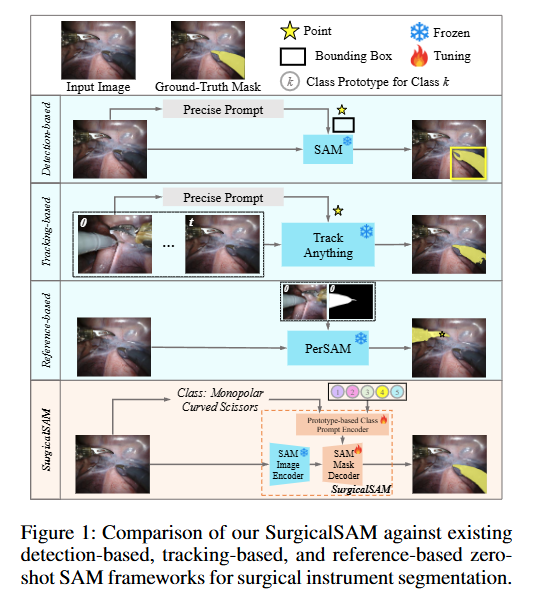
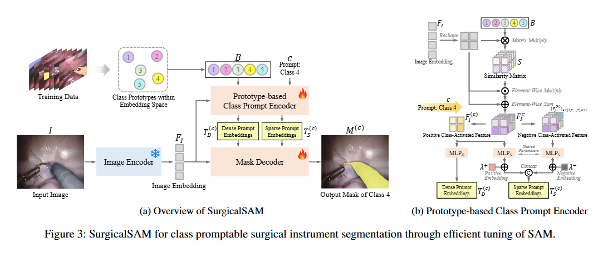

# SurgicalSAM: Efficient Class Promptable Surgical Instrument Segmentation

> Title: SurgicalSAM: Efficient Class Promptable Surgical Instrument Segmentation  
> KEYWORDS：SurgicalSAM；Segment Anything Model；手术器械分割；类别提示；类别原型；对比学习；参数高效调优；医学图像分割  
> 作者：Wenxi Yue，Jing Zhang，Kun Hu，Yong Xia，Jiebo Luo，Zhiyong Wang  
> 机构：The University of Sydney；Northwestern Polytechnical University；University of Rochester  
> Google Scholar 被引次数：未记录  
> 发表：2024  
> Venue > Conference: AAAI 2024  
> Year: 2024  
> Link: [arXiv:2308.08746](https://arxiv.org/abs/2308.08746)

## 1. 背景与问题

### 1.1 研究背景

手术器械分割是手术视觉中的重要任务，可以为外科医生提供辅助，并支持计算机辅助手术系统、手术导航、手术技能评估和机器人手术等应用。

传统的手术器械分割方法通常针对具体任务设计专用网络，并对整个模型进行训练。这类方法虽然能够取得较好的性能，但存在以下问题：

- 需要训练大量模型参数；
- 手术器械数据集规模较小，容易出现过拟合；
- 模型泛化能力有限；
- 通常不支持根据用户意图进行交互式分割。

Segment Anything Model（SAM）提供了一种新的提示式分割框架。用户可以通过点、边界框、掩码或文本等提示指定需要分割的目标。但是，SAM 主要在自然图像上预训练，直接应用于手术场景时存在明显问题。

### 1.2 SAM 直接用于手术器械分割的两个问题

#### 问题一：自然图像与手术图像之间存在领域差距

手术器械与自然图像中的普通物体存在明显差异：

- 手术器械具有特殊的外观；
- 手术场景包含复杂的人体组织背景；
- 不同器械类别之间的外观相似；
- 同一类器械可能存在较大的姿态、尺度和遮挡变化。

因此，SAM 的自然图像预训练知识无法直接保证其在手术器械分割上的效果。

#### 问题二：SAM 依赖精确的点或边界框提示

SAM 对输入提示的位置比较敏感。论文通过对边界框进行尺度和位置扰动，发现即使提示框只发生较小偏移，分割性能也会明显下降。

在手术视频中，如果每一帧都需要人工点击目标或绘制边界框，使用成本较高；如果由外部检测器生成边界框，则需要构建：

检测器 → 边界框提示 → SAM → 分割掩码

这样的多阶段流程。

### 1.3 论文的研究目标

论文希望解决以下问题：

> 能否只输入手术图像和目标器械类别，让模型自动生成 SAM 所需的内部提示，并直接输出该类别器械的分割掩码？

SurgicalSAM 将任务定义为：

$$
M^{(c)}=\mathrm{SurgicalSAM}(I,c)
$$

其中：

- $I$ 表示输入手术图像；
- $c$ 表示目标器械类别；
- $M^{(c)}$ 表示类别 $c$ 对应的预测掩码。

---

## 2. 核心方法

## 2.1 方法整体思路

SurgicalSAM 保留了 SAM 的基本框架，但改变了提示生成方式。

原始 SAM 主要使用：

- 前景点；
- 背景点；
- 边界框；
- 掩码；
- 文本。

SurgicalSAM 则使用：

- 手术器械类别；
- 该类别对应的可学习类别原型。

整体过程如下：

1. 输入一张手术图像；
2. 使用图像编码器提取图像特征；
3. 将图像特征与各个器械类别原型进行相似度计算；
4. 生成与目标类别相关的类别激活特征；
5. 将类别激活特征转换为稠密提示和稀疏提示；
6. 将图像特征和提示嵌入输入掩码解码器；
7. 输出目标器械类别的分割掩码。

## 2.2 SurgicalSAM 的模型结构

SurgicalSAM 包含三个核心部分：

1. 图像编码器；
2. 基于原型的类别提示编码器；
3. 掩码解码器。

### 原文 Figure 3：SurgicalSAM 整体框架与类别提示编码器

原文 Figure 3 展示了 SurgicalSAM 的整体结构。模型首先由图像编码器提取图像嵌入，然后通过类别原型与图像嵌入之间的相似度生成类别激活特征，最后将这些特征转换为稠密提示和稀疏提示，并输入掩码解码器。

原文 Figure 3(b) 进一步展示了类别提示编码器如何同时利用：

- 目标类别的正向信息；
- 其他类别的负向信息。

这使模型能够区分外观相似的手术器械类别。

## 2.3 类别原型

对于每一个器械类别，模型都设置一个可学习的类别原型：

$$
B^{(1)},B^{(2)},\ldots,B^{(C)}
$$

其中，$B^{(k)}$ 表示第 $k$ 个器械类别的类别原型。

类别原型不是预先具备手术器械知识的基座模型，也不是一张具体的器械图片，而是一个高维特征向量。它表示某个类别在模型特征空间中的代表性位置。

论文中类别原型从标准正态分布中随机初始化，然后在训练过程中通过损失函数逐渐更新。经过大量训练样本后，某个类别的原型会逐渐学习到该类别器械的视觉特征。

需要注意：

- 基座 SAM 主要提供自然图像上的通用视觉特征和分割能力；
- 手术器械类别知识是通过 SurgicalSAM 的下游训练学习得到的；
- 类别原型并不是 SAM 原本就已经具备的手术领域知识。

## 2.4 图像特征与类别原型的相似度计算

输入图像经过图像编码器后得到图像嵌入：

$$
F_I=E_I(I)
$$

然后，模型分别计算图像嵌入与每个类别原型之间的空间相似度：

$$
S^{(k)}=F_I \times B^{(k)}
$$

其中，$S^{(k)}$ 表示图像中各个空间位置与类别 $k$ 原型之间的相似程度。

相似度高的位置更可能属于该器械类别，因此可以形成类别激活区域。

## 2.5 稠密提示和稀疏提示

### 稠密提示

目标类别的类别激活特征用于生成稠密提示：

$$
T_D^{(c)}=g_D\left(\mathrm{ReLU}(f_D(F_I^{(c)}))\right)
$$

稠密提示与图像空间中的多个位置相对应，因此包含较丰富的空间信息。

它可以理解为：

> 图像中的哪些区域更像目标器械类别。

论文的提示嵌入消融实验表明，去除稠密提示后，Challenge IoU 从 80.33 降低到 23.61，说明稠密提示承担了主要的空间定位作用。

### 稀疏提示

模型利用所有类别的激活特征生成稀疏提示：

- 目标类别对应正向信息；
- 其他类别对应负向信息。

模型还引入了正向嵌入 $\lambda^+$ 和负向嵌入 $\lambda^-$，使提示嵌入能够区分目标类别和非目标类别。

因此，当目标类别是某种剪刀时：

- 剪刀原型提供“这是目标”的信息；
- 镊子、持针器等其他类别原型提供“这不是目标”的信息。

## 2.6 对比原型学习

### 2.6.1 对比原型学习的目的

手术器械类别之间的外观比较相似。如果简单地对每个类别的特征求平均，不同类别的原型可能仍然比较接近。

因此，论文提出 Prototype Contrastive Learning，即对比原型学习，使类别原型具有更强的判别能力。

它希望实现：

$$
B^{(k)}\text{ 接近 }v^{(k)}
$$

同时：

$$
B^{(k)}\text{ 远离 }v^{(q)},\quad q\neq k
$$

其中：

- $B^{(k)}$ 是类别 $k$ 的类别原型；
- $v^{(k)}$ 是当前图像中类别 $k$ 的真实器械特征；
- $v^{(q)}$ 是其他类别的真实器械特征。

需要注意，这篇论文主要是每个类别设置一个类别原型，因此它不是让“同一类别的多个原型”彼此接近，而是让：

> 某类别的原型接近该类别样本，远离其他类别样本。

### 2.6.2 真实类别特征的提取

训练图像经过图像编码器后得到特征图 $F_I$。利用类别 $c$ 的真实掩码 $G^{(c)}$，模型只提取属于该类别器械区域的图像特征：

$$
v^{(c)}=\frac{\sum_i(F_I\circ G^{(c)})_i}{\sum_iG_i^{(c)}}
$$

其中：

- $G^{(c)}$ 是类别 $c$ 的真实分割掩码；
- $v^{(c)}$ 是该类别在当前图像中的平均视觉特征。

这相当于从图像特征中“抠出”真实器械区域，再对该区域的特征进行汇总。

### 2.6.3 对比原型损失

论文使用类似 InfoNCE 的对比损失：

$$
\mathcal{L}_{PCL}=-\frac{1}{C}\sum_{k=1}^{C}\log\frac{\exp(B^{(k)}\cdot v^{(k)}/\tau)}{\sum_{q=1}^{C}\exp(B^{(k)}\cdot v^{(q)}/\tau)
}
$$

对于类别 $k$：

- $B^{(k)}$ 与 $v^{(k)}$ 构成正样本对；
- $B^{(k)}$ 与 $v^{(q)}$，其中 $q\neq k$，构成负样本对。

最小化该损失会使：

- 类别原型与同类别特征的相似度增大；
- 类别原型与其他类别特征的相似度减小。

因此，对比原型学习的作用是：

> 让类别原型不仅能够代表本类别，还能够主动区别其他容易混淆的器械类别。

### 2.6.4 分割损失与对比损失

SurgicalSAM 的总损失由两部分组成：

$$
\mathcal{L}
=
\mathcal{L}_{DICE}
+
\mathcal{L}_{PCL}
$$

其中：

- $\mathcal{L}_{DICE}$：约束预测掩码和真实掩码之间的差异；
- $\mathcal{L}_{PCL}$：约束类别原型和不同类别图像特征之间的关系。

可以简单理解为：

- Dice loss 负责“掩码分得准不准”；
- Prototype Contrastive Loss 负责“类别分得清不清”。

## 2.7 参数高效调优

SurgicalSAM 使用 SAM 的 ViT-H 图像编码器，但在训练时冻结图像编码器，只更新：

- 类别提示编码器；
- 掩码解码器。

论文报告：

- 模型总参数量：641.68M；
- 冻结的 ViT-H 图像编码器参数：637.03M；
- 实际调优参数：4.65M。

因此，SurgicalSAM 的“高效”主要指：

- 可训练参数较少；
- 训练显存占用较低；
- 训练速度较快；
- 可以使用预计算图像嵌入；
- 不需要额外训练检测器或跟踪器。

它不是总参数量很小的轻量化模型。

---

## 3. 创新点

- 提出面向手术器械分割的 SurgicalSAM 框架。
- 将 SAM 的点、框等显式提示改为器械类别提示。
- 提出基于原型的类别提示编码器。
- 利用图像特征与类别原型的相似度生成类别激活区域。
- 同时使用目标类别的正向信息和其他类别的负向信息。
- 提出对比原型学习，增强不同器械类别之间的区分能力。
- 冻结 SAM 的大型图像编码器，仅调优类别提示编码器和掩码解码器。
- 在保持基础模型通用视觉特征的同时，注入手术领域知识。
- 通过跨数据集实验验证一定的泛化能力。
- 通过参数量、训练速度、显存占用和推理速度验证方法效率。

---

## 4. 实验 & 结果

## 4.1 数据来源

论文使用两个手术器械分割数据集：

### EndoVis2018

- 包含 11 个训练视频；
- 包含 4 个验证视频；
- 每个视频包含 149 帧；
- 包含 7 类手术器械。

### EndoVis2017

- 包含 8 个视频；
- 每个视频包含 255 帧；
- 使用 4 折交叉验证；
- 包含 7 类手术器械。

评价指标包括：

- Challenge IoU；
- IoU；
- mean class IoU（mc IoU）。

其中：

- Challenge IoU 主要计算图像中实际出现类别的交并比；
- IoU 在所有类别上进行计算；
- mc IoU 是各类别 IoU 的平均值。

## 4.2 训练设置

论文使用 SAM 的 ViT-H 版本作为图像编码器，并进行以下设置：

- 图像编码器冻结；
- 正向和负向嵌入冻结；
- 类别提示编码器可训练；
- 掩码解码器可训练；
- 使用 Adam 优化器；
- 使用预计算图像嵌入减少计算量；
- 在 Nvidia Tesla V100 16GB GPU 上进行训练；
- EndoVis2018 的 token 数量设置为 2；
- EndoVis2017 的 token 数量设置为 4；
- 对比学习温度参数 $\tau=0.07$。

## 4.3 主实验结果

### 原文 Table 1：EndoVis2018 数据集上的比较结果

下表选取原文 Table 1 中的主要指标。原表还报告了不同器械类别的 IoU。

| 方法 | 方法类别 | Challenge IoU | IoU | mc IoU | 可调参数量 |
|---|---|---:|---:|---:|---:|
| TernausNet | Specialist Model | 46.22 | 39.87 | 14.19 | 32.20M |
| ISINet | Specialist Model | 73.03 | 70.94 | 40.21 | 162.52M |
| MATIS Frame | Specialist Model | 82.37 | 77.01 | 48.65 | 68.72M |
| MaskTrack-RCNN + SAM | SAM-based Model | 78.49 | 78.49 | 56.07 | 57.67M |
| Mask2Former + SAM | SAM-based Model | 78.72 | 78.72 | 52.50 | 68.72M |
| TrackAnything，1 Point | SAM-based Model | 40.36 | 38.38 | 20.62 | 未报告 |
| TrackAnything，5 Points | SAM-based Model | 65.72 | 60.88 | 38.60 | 未报告 |
| PerSAM | SAM-based Model | 49.21 | 49.21 | 34.55 | 未报告 |
| SurgicalSAM | SAM-based Model | 80.33 | 80.33 | 58.87 | 4.65M |
| GT Centroid + SAM | Oracle Prompt | 60.26 | 60.26 | 63.34 | 未报告 |
| GT Bbox + SAM | Oracle Prompt | 88.04 | 88.04 | 84.23 | 未报告 |

SurgicalSAM 在 EndoVis2018 上取得：

- Challenge IoU：80.33；
- IoU：80.33；
- mc IoU：58.87；
- 可调参数量：4.65M。

主要结论：

- SurgicalSAM 明显优于三种零样本 SAM 基线；
- Challenge IoU 接近强专用模型；
- mc IoU 高于表中大多数专用模型；
- 可调参数量显著少于 MaskTrack-RCNN + SAM 和 MATIS Frame；
- 使用真实边界框的 GT Bbox + SAM 属于 oracle 设置，性能仍然高于 SurgicalSAM，但它需要真实边界框提示。

## 4.4 EndoVis2017 结果

SurgicalSAM 在 EndoVis2017 上的结果为：

- Challenge IoU：69.94；
- IoU：69.94；
- mc IoU：60.80。

与主要 SAM 基线比较：

| 方法 | Challenge IoU | mc IoU |
|---|---:|---:|
| Mask2Former + SAM | 66.21 | 45.34 |
| TrackAnything，5 Points | 67.41 | 65.17 |
| PerSAM | 42.47 | 38.16 |
| SurgicalSAM | 69.94 | 60.80 |

SurgicalSAM 在 Challenge IoU 上超过了表中的 SAM 基线，并且在不使用逐帧点提示和边界框的情况下完成类别分割。

## 4.5 原文 Table 3：对比原型学习消融

| 是否使用 $\mathcal{L}_{PCL}$ | 每类 token 数量 $n$ | Challenge IoU | mc IoU |
|---|---:|---:|---:|
| 否 | 2 | 76.38 | 53.95 |
| 是 | 2 | 80.33 | 58.87 |
| 否 | 4 | 78.26 | 56.54 |
| 是 | 4 | 79.46 | 58.40 |

实验说明：

- 使用对比原型学习后，$n=2$ 时 Challenge IoU 从 76.38 提升到 80.33；
- mc IoU 从 53.95 提升到 58.87；
- 对比学习对类别原型的判别能力有明显帮助；
- token 数量的改变不是性能提升的主要来源。

## 4.6 原文 Table 4：跨数据集泛化

| 训练集 | 测试集 | 方法 | BF | PF | LND | MCS | Mean IoU |
|---|---|---|---:|---:|---:|---:|---:|
| EndoVis2018 | EndoVis2017 | MATIS Frame | 45.57 | 32.62 | 44.98 | 58.84 | 45.50 |
| EndoVis2018 | EndoVis2017 | SurgicalSAM | 70.95 | 35.21 | 45.46 | 76.08 | 56.93 |
| EndoVis2017 | EndoVis2018 | MATIS Frame | 65.55 | 13.89 | 38.25 | 65.58 | 45.81 |
| EndoVis2017 | EndoVis2018 | SurgicalSAM | 44.50 | 27.17 | 50.76 | 62.94 | 46.34 |

当在 EndoVis2018 上训练、在 EndoVis2017 上测试时：

- MATIS Frame 的平均 IoU 为 45.50；
- SurgicalSAM 的平均 IoU 为 56.93；
- SurgicalSAM 提升 11.43 个百分点。

该实验说明，SAM 的通用视觉先验和类别原型学习可能有助于跨数据集泛化。

## 4.7 原文 Table 5：复杂度分析

| 方法 | 训练速度，batch size=2 | 训练速度，batch size=16 | 训练速度，batch size=32 | GPU 使用量，batch size=2 | GPU 使用量，batch size=16 | GPU 使用量，batch size=32 |
|---|---:|---:|---:|---:|---:|---:|
| MATIS Frame | 3.1 fps | 未报告 | 未报告 | 13.11 GB | 未报告 | 未报告 |
| MaskTrack-RCNN + SAM | 8.2 fps | 12.8 fps | 未报告 | 3.21 GB | 13.94 GB | 未报告 |
| SurgicalSAM | 40.1 fps | 57.4 fps | 59.8 fps | 1.92 GB | 5.90 GB | 9.56 GB |

| 方法 | 在线特征提取推理速度 | 离线特征提取推理速度 |
|---|---:|---:|
| MaskTrack-RCNN + SAM | 1.6 fps | 14.3 fps |
| SurgicalSAM | 1.7 fps | 91.7 fps |

效率方面的主要结论：

- SurgicalSAM 的训练速度明显高于对比方法；
- 使用相同 batch size 时，GPU 占用量较低；
- 离线图像特征提取条件下，SurgicalSAM 的推理速度明显高于 MaskTrack-RCNN + SAM；
- SurgicalSAM 通过冻结图像编码器、使用预计算特征和消除外部检测器来降低计算成本。

需要注意：

- 91.7 fps 是离线提取图像特征条件下的推理速度；
- 在线特征提取时，SurgicalSAM 的速度为 1.7 fps；
- 因此，不能简单地把 91.7 fps 理解为完整端到端推理速度。

## 4.8 原文 Table 6：提示嵌入消融

| 方法 | Challenge IoU | mc IoU |
|---|---:|---:|
| SurgicalSAM | 80.33 | 58.87 |
| 去除稠密提示 | 23.61 | 14.13 |
| 去除稀疏提示 | 78.58 | 58.24 |
| 去除正负嵌入 | 77.69 | 57.47 |

实验说明：

- 稠密提示是 SurgicalSAM 空间定位能力的核心；
- 去除稠密提示会导致性能大幅下降；
- 稀疏提示和正负嵌入的贡献相对较小，但仍然有帮助；
- SurgicalSAM 同时使用稠密提示和稀疏提示，可以获得较好的分割效果。

## 4.9 文本提示基线

论文使用 CLIP 的类别名称文本嵌入作为类别原型，构建了一个文本提示基线。

结果为：

- Challenge IoU：75.94%；
- mc IoU：51.76%。

SurgicalSAM 的结果更高，说明在当前手术器械分割任务中，使用从手术图像中学习到的视觉类别原型，比直接使用类别名称的文本嵌入更有效。

---

## 5. 个人思考

## 5.1 对训练标注问题的理解

SurgicalSAM 并没有消除训练阶段的像素级标注需求。

训练数据需要提供：

- 输入图像；
- 器械类别；
- 器械的真实分割掩码。

真实掩码用于：

1. 计算 Dice 分割损失；
2. 从图像特征中提取类别特征 $v^{(c)}$；
3. 训练类别原型；
4. 监督最终的预测掩码。

因此，SurgicalSAM 的优势主要体现在推理和部署阶段，而不是训练数据制作阶段。

### 点、框和掩码标注的区别

| 标注形式 | 提供的信息 | 是否精确描述目标边界 |
|---|---|---|
| 点标注 | 目标中某个位置属于目标 | 否 |
| 框标注 | 目标大致位于某个矩形区域 | 否 |
| 掩码标注 | 每个像素是否属于目标 | 是 |

点标注告诉模型：

> 这个位置属于目标。

框标注告诉模型：

> 目标大致位于这个矩形范围内。

掩码标注告诉模型：

> 哪些像素属于目标，哪些像素属于背景。

掩码包含的信息最多，但人工制作成本通常也更高。

因此，需要准确区分：

- 训练阶段：SurgicalSAM 需要真实掩码；
- 推理阶段：SurgicalSAM 不需要真实掩码、点或边界框，只需要图像和预定义类别。

论文解决的是：

> 推理阶段不再需要逐帧人工点选或画框。

它没有直接解决：

> 如何低成本制作像素级训练掩码。

## 5.2 为什么冻结图像编码器？

冻结图像编码器并不只是为了减少调参数量，主要有以下原因：

### 保留 SAM 的通用视觉知识

SAM 的图像编码器已经通过大规模自然图像预训练，学习了边缘、纹理、形状、空间结构和前景背景关系等通用视觉信息。

这些能力虽然不是专门针对手术器械的，但仍然可以作为下游任务的基础。

### 减少小数据集上的过拟合

EndoVis2017 和 EndoVis2018 的数据规模有限。如果让大型 ViT-H 图像编码器全部参与训练，模型可能会过度适应训练视频的外观。

冻结图像编码器可以减少模型对有限训练数据的过度拟合。

### 降低训练计算量和显存占用

冻结图像编码器后：

- 不需要保存其反向传播梯度；
- 优化器状态更少；
- 可训练参数更少；
- 可以预计算图像嵌入；
- 训练速度更快；
- 显存占用更低。

### 将领域适配集中在提示和解码部分

论文的基本假设是：

> SAM 的图像特征仍然有用，真正需要适配的是如何表达手术器械类别，以及如何根据类别提示生成分割掩码。

因此，模型重点训练：

- 类别原型；
- 类别提示编码器；
- 掩码解码器。

不过，这种设计也有局限。如果自然图像和手术图像之间的差异非常大，完全冻结图像编码器可能限制模型的领域适应能力。

进一步可以尝试：

- 只解冻图像编码器的最后几层；
- 使用 LoRA；
- 使用 Adapter；
- 使用分阶段微调；
- 对图像编码器进行轻量领域适配。

## 5.3 SAM 模型是什么？

SAM，即 Segment Anything Model，是一个可提示的图像分割基础模型。

它的基本任务不是：

> 输入图片，固定输出所有类别。

而是：

> 输入图片和一个提示，根据提示分割用户想要的目标。

SAM 的提示可以是：

- 前景点；
- 背景点；
- 边界框；
- 粗略掩码；
- 文本。

SAM 的基本流程为：

$$
\text{图像}
\rightarrow
\text{Image Encoder}
\rightarrow
\text{图像嵌入}
$$

$$
\text{点/框/掩码/文本}
\rightarrow
\text{Prompt Encoder}
\rightarrow
\text{提示嵌入}
$$

$$
\text{图像嵌入}+\text{提示嵌入}
\rightarrow
\text{Mask Decoder}
\rightarrow
\text{目标掩码}
$$

## 5.4 SAM 的三个主要组成部分

### Image Encoder

Image Encoder 负责理解整张图像，输出包含空间信息的高维图像嵌入。

原始 SAM 使用：

- MAE 预训练的 Vision Transformer；
- 具体为 ViT-H/16；
- 针对高分辨率输入进行了适配。

它可以学习：

- 边缘；
- 纹理；
- 形状；
- 空间结构；
- 前景和背景关系。

它负责“看图”，但不负责决定用户想分割哪个目标。

### Prompt Encoder

Prompt Encoder 负责将用户提供的提示转换为模型可以处理的提示嵌入。

原始 SAM 的 Prompt Encoder 支持两类提示：

#### 稀疏提示

包括：

- 点；
- 边界框；
- 文本。

点提示使用：

- 点的位置编码；
- 前景或背景类型嵌入。

边界框使用：

- 左上角的位置编码；
- 右下角的位置编码；
- 对应的角点类型嵌入。

文本提示使用 CLIP 的文本编码器生成文本嵌入。

#### 稠密提示

主要是掩码提示。

掩码通过卷积层转换为与图像嵌入空间对应的特征，然后与图像嵌入逐位置相加。

### Mask Decoder

Mask Decoder 负责融合：

- 图像嵌入；
- 提示嵌入；
- 输出 token。

原始 SAM 的 Mask Decoder 是一个轻量级的修改版 Transformer Decoder，后面连接动态掩码预测头。

它主要进行：

1. 提示 token 之间的 self-attention；
2. 提示 token 查询图像嵌入；
3. 对提示 token 进行 MLP 更新；
4. 图像嵌入反过来查询提示 token；
5. 上采样图像特征；
6. 根据输出 token 生成动态掩码分类器；
7. 对图像各空间位置进行预测。

Mask Decoder 的作用可以概括为：

> 根据图像内容和用户提示，决定哪些像素属于目标。

## 5.5 原始 SAM 和 SurgicalSAM 的区别

| 模块 | 原始 SAM | SurgicalSAM |
|---|---|---|
| Image Encoder | MAE 预训练 ViT-H | 基本保留并冻结 |
| Prompt Encoder | 编码点、框、掩码和文本 | 根据类别原型和图像特征生成提示 |
| Mask Decoder | 修改版 Transformer Decoder | 保留并进行任务适配 |
| 输入提示 | 点、框、掩码、文本 | 器械类别 |
| 类别知识 | 主要是自然图像通用视觉知识 | 通过手术数据学习类别原型 |
| 是否需要外部检测器 | 可能需要 | 不需要 |
| 是否需要逐帧点框 | 可能需要 | 不需要 |
| 输出 | 提示对应的目标掩码 | 指定器械类别的掩码 |

SurgicalSAM 并不是简单地把类别名称输入原始 SAM，而是通过类别原型和图像特征生成原始 Mask Decoder 可以使用的提示嵌入。

## 5.6 对论文核心流程的完整理解

### 训练阶段

1. 输入一张手术图像；
2. Image Encoder 提取图像特征；
3. 使用真实类别掩码，从图像特征中提取该类别的视觉特征；
4. 通过对比原型学习更新类别原型；
5. 根据类别原型和图像特征生成类别激活区域；
6. 类别激活区域被转换为稠密提示和稀疏提示；
7. Mask Decoder 输出预测掩码；
8. 使用 Dice loss 和 Prototype Contrastive Loss 共同训练。

训练阶段可以表示为：

$$
\text{图像}+\text{真实类别掩码}
\rightarrow
\text{学习类别原型}
\rightarrow
\text{学习提示和掩码预测}
$$

### 推理阶段

1. 输入新的手术图像；
2. 输入一个预定义的器械类别；
3. Image Encoder 提取新图像的特征；
4. 取出训练阶段已经学习好的类别原型；
5. 计算图像特征与类别原型之间的空间相似度；
6. 生成类别激活特征；
7. 将类别激活特征转换为内部提示；
8. Mask Decoder 输出目标类别的预测掩码。

推理阶段可以表示为：

$$
\text{新图像}+\text{类别}
\rightarrow
\text{已学习类别原型}
\rightarrow
\text{内部提示}
\rightarrow
\text{预测掩码}
$$

需要特别注意：

> 推理时不是根据当前图片重新建立类别原型，而是直接使用训练阶段已经学好的类别原型。

此外，本文的类别提示主要对应数据集中预先定义的类别，并不等同于开放式自然语言理解。用户输入的类别名称实际上需要能够对应到模型已经建立的类别原型。

## 5.7 论文不足与可改进方向

### 类别集合需要提前定义

模型依赖预先建立的类别原型库，因此对完全未见过的新器械类别的处理能力有限。

### 一个类别一个原型可能不足

同一类别器械在不同角度、尺度、遮挡、光照和手术阶段下可能呈现较大差异。一个静态原型可能无法完整表示这些变化。

可以考虑：

- 每个类别使用多个原型；
- 使用动态类别原型；
- 根据视频上下文更新类别原型；
- 为器械不同部位学习局部原型。

### 对视频时序信息利用不足

论文主要以单帧图像为单位进行分割，没有充分利用：

- 相邻帧之间的运动信息；
- 器械轨迹；
- 光流；
- 时序一致性；
- 视频记忆。

可以加入时序 Transformer、光流或记忆模块。

### 跨域实验范围有限

论文主要在 EndoVis2017 和 EndoVis2018 上进行实验，还可以进一步验证：

- 不同医院；
- 不同手术类型；
- 不同摄像设备；
- 不同光照条件；
- 不同分辨率；
- 完全未见过的器械类别。

### 模型总参数量较大

虽然实际只调优 4.65M 参数，但总参数量达到 641.68M。它属于参数高效调优方法，而不是严格意义上的小模型。

### 端到端效率需要进一步分析

论文报告了在线和离线两种推理速度，但离线特征提取速度不能完全代表实际端到端部署速度。未来还可以报告：

- 不使用缓存时的端到端速度；
- 不同输入分辨率下的速度；
- CPU 和边缘设备上的速度；
- 多器械同时出现时的推理成本。

## 5.8 总结性认识

SurgicalSAM 的核心贡献不是简单增加一个新的分割网络模块，而是改变了 SAM 的提示方式：

> 从依赖点、边界框和参考实例的空间提示，转变为依赖可学习类别原型的类别提示。

它的完整逻辑可以概括为：

$$
\boxed{
\text{训练时：真实掩码帮助学习类别原型}
}
$$

$$
\boxed{
\text{推理时：类别原型帮助生成内部提示并预测掩码}
}
$$

因此，SurgicalSAM 的主要价值在于：

- 保留 SAM 的通用视觉知识；
- 学习手术器械类别相关的视觉表示；
- 不需要推理阶段逐帧提供点或框；
- 通过对比学习减少类别混淆；
- 通过冻结图像编码器降低调优成本；
- 在两个手术器械数据集上取得具有竞争力的结果。

