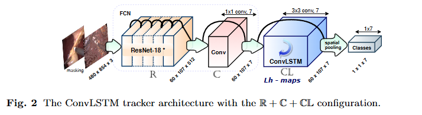
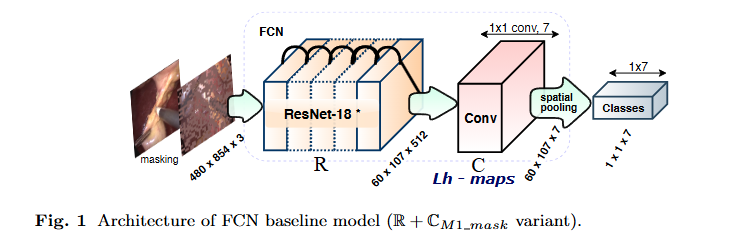
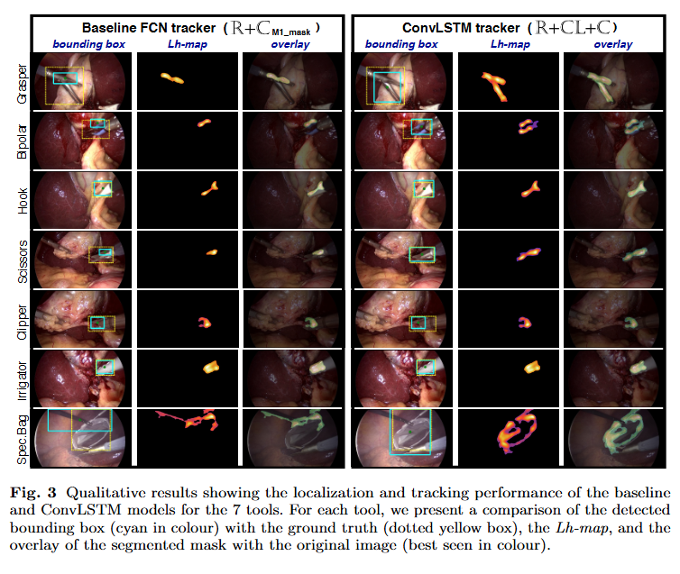

# Weakly Supervised Convolutional LSTM Approach for Tool Tracking in Laparoscopic Videos

> Title: Weakly Supervised Convolutional LSTM Approach for Tool Tracking in Laparoscopic Videos  
> 作者: Chinedu Innocent Nwoye, Didier Mutter, Jacques Marescaux, Nicolas Padoy  
> 机构: ICube, University of Strasbourg, CNRS, IHU Strasbourg；University Hospital of Strasbourg, IRCAD, IHU Strasbourg  
> 被引次数: 未记录  
> 发表: 2019 年 2 月 15 日，arXiv:1812.01366v2  
> Venue: arXiv preprint  
> Year: 2019  
> Link: [arXiv:1812.01366](https://arxiv.org/abs/1812.01366)

## 1. 背景与问题

手术视频的自动分析可以用于手术流程识别、临床决策支持、手术报告生成和视频数据标注。手术器械跟踪是其中的重要任务，因为器械的运动轨迹可以帮助分析器械与组织之间的交互。

传统的手术器械跟踪方法通常需要边界框、中心点或像素级掩码等空间标注。这些标注需要人工逐帧完成，成本较高。腹腔镜视频还存在血液污染、烟雾、运动模糊、器械遮挡以及内窥镜移除和重新插入等问题。

因此，论文研究的问题是：

> 能否只使用“工具是否出现”的二值标签，而不使用训练阶段的边界框或其他空间标注，完成手术器械的检测、定位和跟踪？

论文的核心目标是利用较容易获得的图像级标签，学习出工具的空间位置和视频中的运动轨迹。

### 三种标注方式

- **图像级标签**：只标注图像中是否存在某种工具。
- **中心点标注**：标注工具或工具尖端的中心位置。
- **边界框标注**：用矩形框标出工具所在区域。
- **像素级掩码**：逐个像素标注哪些区域属于工具。

本文训练阶段只使用图像级工具存在标签：

```text
Grasper = 1
Bipolar = 0
Hook = 1
Scissor = 0
...
```

标签只说明工具是否出现，不说明工具具体位于图像中的什么位置。

## 2. 核心方法

论文提出一个由 ResNet-18、卷积层和 ConvLSTM 组成的弱监督时空模型。

整体流程如下：

```text
腹腔镜视频帧
    ↓
ResNet-18
    ↓
空间特征图
    ↓
ConvLSTM
    ↓
时空特征图
    ↓
1×1 卷积
    ↓
7 类工具定位热图
    ↓
Wildcat pooling
    ↓
7 类工具存在概率
    ↓
热图后处理
    ↓
工具位置与运动轨迹
```

### 2.1 FCN 基线模型

作者首先建立了一个基于 ResNet-18 的全卷积网络作为基线。

ResNet-18 输出大小约为：

```text
60 × 107 × 512
```

其中：

- `60 × 107` 表示空间位置；
- `512` 表示每个空间位置上的特征通道数。

ResNet-18 后接一个输出通道数为 7 的 `1×1` 卷积层：

```text
60 × 107 × 512
        ↓
1×1 卷积，7 个输出通道
        ↓
60 × 107 × 7
```

这里的 `1×1` 表示卷积核的空间大小，7 个输出通道表示使用 7 个不同的卷积核。每个输出通道对应一种工具：

```text
通道 1：Grasper
通道 2：Bipolar
通道 3：Hook
通道 4：Scissor
通道 5：Clipper
通道 6：Irrigator
通道 7：Specimen Bag
```

对于输入特征图中每一个空间位置，`1×1` 卷积会将该位置上的 512 维特征加权组合成一个数。

对于第 $k$ 个工具类别，计算过程可以表示为：

$$
z_{i,j,k}
=
\sum_{c=1}^{512}
w_{k,c}x_{i,j,c}+b_k
$$

其中：

- $(i,j)$ 表示空间位置；
- $c$ 表示输入通道；
- $k$ 表示工具类别；
- $x_{i,j,c}$ 表示该位置的输入特征；
- $z_{i,j,k}$ 表示第 $k$ 类工具在该位置上的响应。

因此，7 个输出通道分别产生 7 张二维热图：

```text
Grasper 热图
Bipolar 热图
Hook 热图
Scissor 热图
Clipper 热图
Irrigator 热图
Specimen Bag 热图
```

### 2.2 什么是定位热图？

定位热图是一个二维响应矩阵，用于表示网络认为不同空间位置属于某一类工具的可能性。

```text
低响应：不太像目标区域
高响应：更可能是目标区域
```

例如，一张 Grasper 热图中的高响应区域可能集中在 Grasper 工具尖端附近。

热图不是人工标注的精确轮廓，而是网络根据分类任务自动学习到的空间响应。因此，它可能：

- 只覆盖工具的一部分；
- 只覆盖工具尖端；
- 包含部分背景；
- 在同一类别存在多个实例时只突出其中一个。

### 2.3 如何同时完成分类和定位？

模型先生成 7 张工具热图，再通过 Wildcat pooling 将每张热图压缩为一个工具存在概率：

```text
Grasper 热图 → Grasper 是否出现的概率
Hook 热图    → Hook 是否出现的概率
Scissor 热图 → Scissor 是否出现的概率
```

因此：

- 热图保留空间信息，用于定位；
- 池化结果用于判断工具是否出现。

训练时，模型只需要让最终的工具存在概率与二值标签一致。模型没有直接获得工具位置标注，但为了完成分类任务，会逐渐在工具相关区域产生较高响应。

### 2.4 ConvLSTM 的作用

FCN 基线主要根据单帧图像生成工具热图，然后使用相邻帧边界框之间的 IoU 进行轨迹关联。这种方法依赖固定的 IoU 阈值，在工具快速移动、遮挡或运动不规则时容易失败。

ConvLSTM 按时间顺序接收连续帧的空间特征：

```text
第 t-2 帧特征 → ConvLSTM → 隐藏状态
第 t-1 帧特征 → ConvLSTM → 隐藏状态
第 t 帧特征   → ConvLSTM → 当前输出
```

ConvLSTM 通过隐藏状态和记忆状态保存历史信息，同时使用卷积操作保留二维空间结构。

可以将其理解为：

```text
当前帧信息 + 历史帧信息
              ↓
      时空特征与定位热图
```

它不是显式计算光流，也不直接计算工具的速度和加速度，而是从连续帧中隐式学习：

- 工具响应区域如何随时间移动；
- 哪些位置变化是连续合理的；
- 工具短暂遮挡后可能出现的位置；
- 如何减少热图的突然跳动；
- 如何保持工具轨迹连续。

ConvLSTM 的主要作用包括：

1. 平滑相邻帧中的定位热图；
2. 利用历史信息缓解短时间遮挡；
3. 改善工具空间区域的定位；
4. 减少轨迹中断；
5. 替代基于固定 IoU 阈值的部分轨迹关联。

### 2.5 三种网络结构

论文比较了三种 ConvLSTM 结构：

```text
R + C + CL：ResNet → 卷积层 → ConvLSTM
R + CL + C：ResNet → ConvLSTM → 卷积层
R + CL：    ResNet → ConvLSTM
```

其中：

- `R` 表示 ResNet；
- `C` 表示卷积层；
- `CL` 表示 ConvLSTM。

`R+CL+C` 在空间定位和运动跟踪任务中表现最好。其基本思路是先使用 ConvLSTM 融合连续帧的时空信息，再由卷积层生成最终工具定位热图。

### 模型结构图



*图 1：论文 Figure 2，ConvLSTM tracker 的网络结构。*

### 2.6 工具位置如何从热图中得到？

模型输出热图后，论文使用以下步骤获得工具位置：

```text
原始定位热图
    ↓
双线性插值放大到原图大小
    ↓
形态学闭运算
    ↓
Otsu 自动阈值分割
    ↓
提取最大响应点附近的连通区域
    ↓
生成预测边界框
```

需要区分两种边界框：

- **人工边界框**：训练前由人工标注，用于空间监督；
- **预测边界框**：模型根据热图和后处理自行生成。

本文训练时没有使用人工边界框，但推理时可以根据热图生成预测边界框。

## 3. 创新点

- 仅使用工具是否出现的二值标签训练模型，不使用训练阶段的边界框标注。
- 将弱监督定位方法与 ConvLSTM 的时空建模结合。
- 使用全卷积结构保留工具的空间位置信息。
- 利用连续视频帧的信息改善工具热图和轨迹。
- 用学习到的时空状态替代基于固定 IoU 阈值的部分跟踪关联。
- 同时评价工具存在检测、空间定位和运动跟踪。
- 比较了三种 ConvLSTM 插入位置，并发现 `R+CL+C` 在定位和跟踪任务中表现最好。

## 4. 数据来源与实验设置

### 4.1 数据集

实验使用 Cholec80 数据集，包括：

- 80 段腹腔镜胆囊切除术视频；
- 7 类手术工具；
- 原始视频帧率为 25 fps；
- 工具存在标签按照 1 fps 生成；
- 大部分视频分辨率为 $854\times480$；
- 所有帧统一调整为 $854\times480$。

数据划分如下：

```text
训练集：40 段视频
验证集：10 段视频
测试集：30 段视频
```

其中，30 段测试视频并不都具有边界框标注。论文说明，只有测试集中的 5 段视频具有工具中心点和边界框标注。

因此：

```text
30 段测试视频：
├── 用于工具存在检测：使用二值存在标签
└── 其中 5 段：
    └── 额外用于空间定位和运动跟踪评价
```

### 4.2 为什么只有 5 段测试视频有边界框？

边界框、中心点和像素级掩码属于空间标注，逐帧制作成本较高。论文的研究目标正是减少对这类空间标注的依赖。

因此，数据集可以拥有：

- 较多带有工具存在标签的视频；
- 少量带有边界框的测试视频。

5 段带空间标注的视频主要用于计算：

- 预测框与真实框之间的 IoU；
- 空间定位准确率；
- MOTP；
- MOTA。

如果测试视频没有真实边界框，模型仍然可以输出预测位置，但无法计算预测位置是否准确。

### 4.3 评价指标

#### 工具存在检测：mAP

mAP 用于评价模型判断工具是否出现的能力。

#### 空间定位：IoU

IoU 衡量预测边界框和真实边界框之间的重叠程度：

$$
IoU=
\frac{|B_{\text{pred}}\cap B_{\text{gt}}|}
{|B_{\text{pred}}\cup B_{\text{gt}}|}
$$

当 IoU 大于等于设定阈值时，认为预测框定位正确。

论文在定位任务中使用 IoU $\geq0.5$ 作为正确定位标准。

#### 运动跟踪：MOTP 和 MOTA

MOTP 主要评价成功匹配的预测框与真实框之间的重叠精度，可以近似理解为成功匹配框的平均 IoU：

```text
MOTP：跟踪到了以后，框得准不准？
```

MOTA 综合考虑：

- FP：误检；
- FN：漏检；
- IDSW：身份切换。

其计算公式为：

$$
MOTA=
1-
\frac{
\sum_t(FP_t+FN_t+IDSW_t)
}{
\sum_tGT_t
}
$$

可以理解为：

```text
MOTA：整个视频跟踪过程中错误多不多？
```

IoU、MOTP 和 MOTA 的关系如下：

```text
IoU：单个预测框与真实框的重叠程度
MOTP：所有成功匹配框的平均定位精度
MOTA：考虑误检、漏检和身份切换后的整体跟踪质量
```

在多目标跟踪中，IoU 还可以用于判断预测框和真实框是否匹配：

```text
预测框 + 真实框
        ↓
计算 IoU
        ↓
IoU ≥ Θ：认为匹配
IoU < Θ：认为不匹配
        ↓
计算 MOTP 和 MOTA
```

需要注意，论文中 IoU 有两种用途：

1. 基线跟踪器中，用相邻帧预测框之间的 IoU 关联轨迹；
2. 测试评价中，用预测框和真实框之间的 IoU 评价定位效果。

### Cholec80 数据集与评价任务



*图 2：论文 Figure 1，FCN baseline 的输入、特征图和工具定位热图流程。*

## 5. 实验结果

### 5.1 工具存在检测

工具存在检测使用平均精度 mAP 进行评价。

论文中：

- 最好的 FCN baseline：mAP 为 $87.7$；
- 最好的 ConvLSTM 模型 `R+C+CL`：mAP 为 $92.9$；
- 相比最佳 baseline 提升约 $5.2$ 个百分点。

这说明 ConvLSTM 可以利用视频中的时间信息，帮助模型处理工具遮挡、烟雾和图像噪声。

但是，三个 ConvLSTM 结构的效果并不完全相同。`R+C+CL` 在工具存在检测上取得最高 mAP，而 `R+CL+C` 主要在定位和跟踪任务上表现最好。

### 5.2 空间定位

空间定位使用 IoU $\geq0.5$ 时的定位准确率进行评价。

结果如下：

```text
最好 baseline：平均定位准确率 24.3
R+CL+C：平均定位准确率 38.2
```

ConvLSTM 在 7 类工具中的 5 类上改善了定位效果：

- Grasper；
- Bipolar；
- Hook；
- Scissor；
- Specimen Bag。

论文报告平均空间定位准确率提升约 $13.9$ 个百分点。

### 5.3 运动跟踪

在 IoU 阈值 $\Theta=0.5$ 下，结果如下：

| 模型 | MOTP | MOTA |
|---|---:|---:|
| 最好 baseline：$R+C_{M1}^{mask}$ | 61.2 | 21.2 |
| 最好 ConvLSTM：$R+CL+C$ | 65.9 | 41.0 |

`R+CL+C` 的 MOTA 从 $21.2$ 提升到 $41.0$，说明 ConvLSTM 在整体轨迹质量方面有明显改善。

MOTA 的提升说明模型可能减少了：

- 工具漏检；
- 错误检测；
- 轨迹中断；
- 身份关联错误。

论文在不同 IoU 阈值下报告的 MOTA 提升约为：

```text
Θ = 0.3：提升 11.7%
Θ = 0.5：提升 19.8%
Θ = 0.7：提升 3.7%
```

MOTP 的提升相对较小，而 MOTA 的提升更明显，说明 ConvLSTM 的主要优势不只是把单个边界框画得更准，也在于提高了轨迹的连续性和整体稳定性。

### 5.4 定性结果

论文通过可视化结果比较 baseline 和 ConvLSTM 模型的：

- 工具预测边界框；
- 定位热图；
- 分割区域；
- 工具轨迹。

ConvLSTM 的热图通常更加平滑，预测框更接近真实工具尖端，工具轨迹也更加连续。

论文还观察到，在 $1$ fps 标签上训练的模型可以推广到未标注的 $25$ fps 视频，说明模型在一定程度上能够适应不同帧率的视频。



*图 3：论文 Figure 3，FCN baseline 与 ConvLSTM tracker 的工具定位、热图和轨迹对比。*

### 5.5 结果总结

| 评价任务 | 指标 | 主要结果 |
|---|---|---|
| 工具存在检测 | mAP | ConvLSTM 提升约 $5.0\%$ |
| 空间定位 | IoU $\geq0.5$ 的定位准确率 | 提升约 $13.9\%$ |
| 运动跟踪 | MOTA | 提升约 $12.6\%$ |

总体而言，ConvLSTM 能够利用视频帧之间的时间联系，改善工具的检测、空间定位和轨迹连续性。

## 6. 论文局限

### 6.1 同类多实例容易漏检

每个工具类别主要对应一张定位热图。当同一类别同时出现多个工具时，模型可能只突出其中一个实例，从而漏掉其他工具。

### 6.2 严重遮挡时容易失败

当工具尖端的可见区域过少时，模型可能无法获得足够的判别性信息，从而发生漏检。

### 6.3 难以完整定位工具杆

模型主要响应工具尖端，而不是完整工具杆，原因包括：

- 训练标签只说明工具是否出现；
- 没有完整轮廓或工具杆的空间监督；
- 工具尖端具有更明显的类别特征；
- 不同工具的杆部外观相似；
- 工具杆可能被组织、烟雾或其他器械遮挡。

因此，模型更容易学习：

```text
工具尖端在哪里？
```

而不是：

```text
整根工具从哪里延伸到哪里？
```

ConvLSTM 能改善时间上的热图连续性，但不会自动获得工具杆的完整几何结构。它主要解决的是：

```text
热图是否连续
轨迹是否稳定
遮挡后能否保持响应
```

而不是：

```text
工具完整轮廓是否准确
工具杆的每个像素是否被覆盖
```

### 6.4 定位和跟踪评价规模有限

工具存在检测使用了 30 段测试视频，而空间定位和运动跟踪只使用其中 5 段具有边界框标注的视频。因此，三类任务的评价数据规模并不完全相同。

## 7. 个人思考与待读问题

### 7.1 对论文方法的理解

这篇论文最重要的思想不是简单地加入 ConvLSTM，而是利用弱监督分类网络中的空间响应来间接获得工具位置。

论文的逻辑可以概括为：

```text
工具存在标签
    ↓
弱监督分类训练
    ↓
类别定位热图
    ↓
ConvLSTM 融合连续帧
    ↓
更加稳定的工具位置与运动轨迹
```

图像级标签虽然没有提供工具坐标，但网络为了完成分类任务，会逐渐在工具相关区域产生较高响应。ConvLSTM 再利用连续帧之间的时空关系，使这些响应更加平滑和连续。

### 7.2 如果继续改进，可以考虑的问题

#### 增加时序消融实验

可以比较：

- 不使用 ConvLSTM；
- 使用普通 LSTM；
- 打乱视频帧顺序；
- 不传递 batch 之间的隐藏状态；
- 不同时间窗口长度；
- 简单时间平均与 ConvLSTM 的差异。

#### 解决多实例问题

可以考虑：

- 为每个工具类别生成多个热图；
- 从一张热图中提取多个局部峰值；
- 使用实例分割方法区分同类工具；
- 增加实例分离损失；
- 为不同器械实例设计独立的跟踪状态。

#### 改善完整工具定位

可以加入：

- 少量边界框标注；
- 工具尖端和杆部中心线标注；
- 伪分割标签；
- 工具方向和长度预测；
- 工具的几何结构约束。

#### 扩大空间评价规模

可以增加具有边界框标注的视频数量，并分别评估：

- 正常无遮挡场景；
- 烟雾场景；
- 工具快速运动场景；
- 工具部分遮挡场景；
- 同类多实例场景；
- 内窥镜重新插入场景。

## 8. 一句话总结

本文提出了一种仅使用工具存在二值标签训练的弱监督 ConvLSTM 方法，通过 FCN 产生工具定位热图，再利用 ConvLSTM 建模连续视频帧之间的时空关系，实现了腹腔镜视频中的工具检测、空间定位和运动跟踪；该方法能够减少对昂贵空间标注的依赖，但在同类多实例、严重遮挡和完整工具杆定位方面仍存在局限。

## 知识点 记录
## 1. 手术器械的三类空间标注

> 本文中，边界框、中心点、像素级掩码**仅在测试阶段使用**，用于评估模型的定位和跟踪效果；**训练阶段不使用任何空间标注**。

| 标注类型 | 标注内容 | 信息量 | 标注成本 | 典型用途 |
|---|---|---|---|---|
| 边界框 Bbox | 矩形框 $(x_{\min}, y_{\min}, x_{\max}, y_{\max})$，包围目标器械 | 中等 | 中等 | 目标检测；计算 IoU |
| 中心点标注 | 工具尖端或几何中心坐标 $p=(x_c, y_c)$ | 较少 | 较低 | 关键点检测；生成高斯热图 |
| 像素级掩码 mask | 逐像素区分工具/背景，记录器械精确轮廓 | 最多 | 最高 | 语义分割 / 实例分割 |

### 1.1 边界框标注

- 用一个矩形框把目标包围起来，记录左上角和右下角坐标：

$$B=(x_{\min}, y_{\min}, x_{\max}, y_{\max})$$

- 不要求精确贴合工具轮廓，只要能包住目标即可；对于细长、弯曲的手术器械，矩形框中可能包含一部分背景。
- 通常用于训练目标检测器，模型输出工具类别和位置（x, y, 宽度, 高度）。
- **本文**：测试视频包含工具边界框，用于计算预测框和真实框的 IoU；训练阶段不使用。

### 1.2 中心点标注

- 只记录工具的一个位置，例如工具尖端中心或几何中心：

$$p=(x_c, y_c)$$

- 比边界框简单（标注者只需点击一个点），但提供的信息更少：只知道工具大概在哪里，不知道工具有多大。
- 可用于训练关键点检测器、预测中心热图、以中心点为监督生成高斯分布。
- **本文**：空间标注主要围绕**工具尖端**，而不是完整工具杆；论文也观察到模型通常只能定位工具尖端，难以定位完整器械杆部。

### 1.3 像素级掩码

- 也叫 segmentation mask，对图像中每个像素进行分类（0=背景，1=工具；多类时用不同编号）。
- 提供信息最丰富：工具在哪里、精确形状、面积、边界、是否与组织接触。
- 最耗时：标注者需沿工具轮廓逐像素描边；细长、模糊、被遮挡的器械标注尤其困难。
- 可训练语义分割（只区分工具/背景）或实例分割（区分同类不同实例）。
- **本文**：训练不使用像素级掩码；模型的定位热图可产生工具尖端的弱分割效果。

---

## 2. 图像级标签（本文训练标签）

- **标签形式**：多标签二值标签 $y=[y_1, y_2, \ldots, y_7]$，其中 $y_k \in \{0, 1\}$。
  - $1$：图像中存在该类器械
  - $0$：图像中不存在该类器械
- 一张图像可同时有多个工具，因此是**多标签分类问题**。

$$y=[1, 0, 1, 0, 0, 1, 0]$$

- **只告诉模型"器械是否出现"，不提供任何空间信息**：无坐标、无大小、无轮廓、无实例数量。
- 标签成本极低，适合大规模腹腔镜视频。

---

## 3. 1×1 卷积生成多通道定位热图原理

### 3.1 输入与输出

ResNet-18 最后输出的特征图大小约为：

$$60 \times 107 \times 512$$

- 图像被压缩成 $60 \times 107$ 个空间位置
- 每个位置有一个长度为 512 的特征向量（颜色、边缘、纹理、器械形状等）

在此基础上使用一个 **$1 \times 1$、输出通道数为 7** 的卷积层，得到：

$$60 \times 107 \times 7$$

7 个通道分别对应 7 类手术工具。

### 3.2 关键概念区分

- **"$1 \times 1$"**：描述卷积核的**空间大小**，不改变特征图宽高，只做通道维度加权；不混合邻域空间像素。
- **"7 个通道"**：描述卷积核的**数量**（输出通道数），即设置了 7 个独立的 $1 \times 1 \times 512$ 卷积核。

两者是独立设置，不是一回事。

### 3.3 单个 $1 \times 1$ 卷积核的计算

假设 ResNet 在某个空间位置的特征为 $\mathbf{x}_{i,j} \in \mathbb{R}^{512}$，一个输出通道对应的卷积核实际是 $1 \times 1 \times 512$，可看成权重向量 $\mathbf{w}_k \in \mathbb{R}^{512}$。在位置 $(i,j)$ 上：

$$z_{i,j,k} = \sum_{c=1}^{512} w_{k,c} x_{i,j,c} + b_k$$

- $(i,j)$：空间位置
- $c$：输入通道
- $k$：输出通道
- $x_{i,j,c}$：该位置第 $c$ 个输入特征
- $w_{k,c}$：该输出通道对输入特征的权重
- $z_{i,j,k}$：输出热图在位置 $(i,j)$ 的响应值

> **本质**：在每一个空间位置上，把 512 维特征向量加权组合成一个数；不做邻域空间计算，不扩大感受野，主要完成通道间信息组合。

### 3.4 为什么得到 7 个通道

因为设置了 7 个不同的 $1 \times 1 \times 512$ 卷积核，每个卷积核在整张特征图的每个位置上计算一次响应，最终产生一张二维图：

- 卷积核 1 → Grasper 热图（$60 \times 107$）
- 卷积核 2 → Bipolar 热图（$60 \times 107$）
- 卷积核 3 → Hook 热图（$60 \times 107$）
- ...
- 卷积核 7 → Specimen Bag 热图（$60 \times 107$）

合起来就是 $60 \times 107 \times 7$。

### 3.5 参数量

输入通道 512，输出通道 7，卷积核空间大小 $1 \times 1$：

- 权重参数：$1 \times 1 \times 512 \times 7 = 3584$
- 加上偏置：$3584 + 7 = 3591$

该层参数量很小，主要负责把 ResNet 的 512 维特征重新组合成 7 个工具类别的响应，而非学习复杂空间结构。

### 3.6 是否改变图像大小

卷积步长和 padding 设置使空间尺寸保持不变：

$$60 \times 107 \times 512 \longrightarrow 60 \times 107 \times 7$$

- 空间尺寸：不变
- 通道数量：512 → 7

后续如需原图尺寸的定位区域，通过双线性插值放大热图，再进行形态学处理和阈值分割。

### 3.7 一句话总结

> 在 ResNet-18 输出的每一个空间位置上，用 7 组不同的权重分别判断该位置像不像 7 类手术工具；每一组权重在所有位置上的判断结果组成一张该工具的定位热图。

---

## 4. FCN 全卷积网络的作用

- **普通图像分类网络**：卷积层 + 全连接层，最终只输出一个类别结果，丢失全部空间信息（知道"有工具"，但不知道"工具在哪里"）。
- **FCN（Fully Convolutional Network）**：把最后的全连接层替换成卷积层，使网络能够输出一张空间特征图，每个位置都有响应。
- FCN 可以同时保留：
  - 目标是否出现（分类信息）
  - 目标大概位于图像的哪个区域（空间信息）

**本文**：ResNet-18 后面接一个 $1 \times 1$ 卷积层，生成 7 个通道的定位热图，每个通道对应一种工具，构成 FCN 基线。

> 可把 FCN 理解为：一边做分类，一边保留分类依据在图像中的空间位置。

---

## 5. 定位热图 Localization Heat Map

- 论文中记作 $L_h$，尺寸为：

$$L_h \in \mathbb{R}^{60 \times 107 \times 7}$$

- 每一类工具对应一张二维热图；热图上每个像素的数值表示网络认为该位置与该工具相关的程度。
  - 数值低（蓝色）：不像工具
  - 数值中等（黄色/绿色）：中等响应
  - 数值高（红色）：最可能是工具

### 5.1 热图不是人工标注掩码

- 热图是网络推理输出的响应区域，**不是人工提供的精确工具轮廓**。
- 它可能：只覆盖工具尖端、覆盖工具的一部分、包含一些背景、在多个同类工具出现时只突出其中一个。

### 5.2 从热图得到工具框的后处理流程

```
输入图像
    ↓
FCN / ConvLSTM
    ↓
工具定位热图
    ↓
双线性插值放大到原图尺寸
    ↓
形态学闭运算
    ↓
Otsu 阈值分割
    ↓
提取高响应连通区域
    ↓
转换成预测边界框
```

### 5.3 关键区分

- **人工边界框**：人提前画好，作为训练监督
- **预测边界框**：模型根据热图自己生成（后处理得到）

这是本文"弱监督"的关键：训练时没有使用人工边界框，但模型推理后可以从热图中生成预测边界框。

---

## 6. Wildcat Pooling 的作用

将二维热图压缩为单值分类概率：

$$H_k \in \mathbb{R}^{60 \times 107} \quad \xrightarrow{\text{Wildcat pooling}} \quad \hat{y}_k \in \mathbb{R}$$

- 输入：某一类工具的整张定位热图
- 输出：该工具在图像中是否存在的概率

### 6.1 分类与定位的统一

- 空间热图 $H_k$ 提供**定位信息**
- 池化结果 $\hat{y}_k$ 提供**分类信息**

训练时，只要求最终的 $\hat{y}_k$ 与工具存在标签一致（多标签交叉熵损失）。网络没有直接收到"工具在哪里"的监督，但为了提高分类结果，某些空间位置通常会产生更高响应——作者再把这些高响应区域当作工具位置的近似。

### 6.2 内在机制

```
图像级标签：Grasper = 1
训练目标：让 Grasper 热图中有较高响应
结果：网络逐渐学会在 Grasper 所在区域产生高响应
```

---

## 7. 弱监督学习（本文语境）

### 7.1 定义

**弱监督学习（weakly supervised learning）**：训练模型时使用的标签信息不完整、不精确或含有噪声，但仍希望模型学习更细粒度任务。

> 弱监督 ≠ 无监督；有标签，但标签粒度比任务目标粗糙。

### 7.2 本文中的弱监督

- **训练监督**：仅图像级"工具是否出现"的二值标签
- **目标任务**：工具检测 + 空间定位 + 视频多目标跟踪
- 训练时**没有使用**：边界框、工具中心点、像素级分割掩码、人工标注的跨帧轨迹

### 7.3 "弱"体现在三个方面

1. **标签粒度较粗**：只知道工具是否存在，不知道具体位置
2. **标签缺少空间信息**：没有坐标、大小、形状、实例数量
3. **目标任务比训练标签更复杂**：训练是分类标签，测试还要求定位和跟踪

### 7.4 与其他学习范式的区分

| 学习方式 | 是否有标签 | 标签特点 |
|---|---|---|
| 全监督学习 | 有标签 | 完整、精确（如框/mask） |
| 弱监督学习 | 有标签 | 粗略、不完整或有噪声（本文） |
| 半监督学习 | 部分有标签 | 一部分数据有标签，另一部分无标签 |
| 无监督学习 | 无人工标签 | 从数据本身发现结构 |

### 7.5 弱监督的优点与局限

**优点**：
- 标注成本低，可使用更多未进行空间标注的视频
- 适合医学视频等难以逐帧标注的场景
- 能够自动生成初始边界框或分割标注

**局限**：
- 定位结果通常不如全监督方法精确
- 模型可能只关注最显著的工具局部（如尖端）
- 同一类别出现多个实例时容易漏掉部分实例
- 严重遮挡时容易产生错误热图
- 热图不一定等于真实工具轮廓

### 7.6 直观类比

> 训练模型比作教学生找物体：
> - 全监督：给学生图片并画框说"工具在这个框里"
> - 中心点监督：只在工具中间点一下说"工具大概在这里"
> - 弱监督：只告诉学生"这张图里有一把抓钳"，让学生自己观察猜测最可能的区域

---

## 8. ConvLSTM 原理与时空优化

### 8.1 核心思想

ConvLSTM **不是直接计算光流**，而是通过"卷积操作保留空间位置 + LSTM 隐状态记忆历史帧"来学习工具热图随时间变化的规律。

### 8.2 为什么单帧 FCN 热图不稳定

单帧 FCN 只看当前帧，不知道前一帧工具在哪里。当当前帧有烟雾、运动模糊或局部遮挡时，热图可能突然消失或跳到错误位置，导致定位跳动和轨迹中断。

### 8.3 ConvLSTM 的输入与状态

连续输入帧 $X_{t-2}, X_{t-1}, X_t$ 先经 ResNet 得到空间特征 $F_{t-2}, F_{t-1}, F_t$，然后 ConvLSTM 按时间顺序处理：

```
F(t-2) → ConvLSTM → h(t-2)
    ↓
F(t-1) → ConvLSTM → h(t-1)
    ↓
F(t)   → ConvLSTM → h(t)
```

$h_t$ 是隐藏状态，可理解为 ConvLSTM 到当前时刻为止对工具位置、外观和运动趋势的记忆。

### 8.4 与普通 LSTM 的区别

- 普通 LSTM：使用矩阵乘法，输入输出为一维向量，丢失空间结构
- ConvLSTM：把矩阵乘法替换成卷积运算，状态仍是二维特征图，保留空间位置关系

### 8.5 门控公式

$$
\begin{align*}
i_t &= \sigma(W_{xi} * X_t + W_{hi} * h_{t-1} + b_i) \\
f_t &= \sigma(W_{xf} * X_t + W_{hf} * h_{t-1} + b_f) \\
\tilde{c}_t &= \tanh(W_{xc} * X_t + W_{hc} * h_{t-1} + b_c) \\
c_t &= f_t \odot c_{t-1} + i_t \odot \tilde{c}_t \\
o_t &= \sigma(W_{xo} * X_t + W_{ho} * h_{t-1} + b_o) \\
h_t &= o_t \odot \tanh(c_t)
\end{align*}
$$

- $*$：卷积运算
- $\sigma$：Sigmoid 函数
- $\odot$：逐元素相乘
- $i_t$：输入门（当前帧新信息是否写入）
- $f_t$：遗忘门（过去信息是否保留）
- $o_t$：输出门（当前输出多少历史信息）
- $c_t$：记忆单元（长期历史信息）
- $h_t$：隐藏状态（当前时刻输出的时空特征）

### 8.6 如何利用前一帧修正当前热图

假设第 $t$ 帧有烟雾导致工具特征很弱，但前面几帧已显示工具一直在从左向右移动。ConvLSTM 可以：
1. 保留过去状态中关于工具位置的信息
2. 结合当前帧的新特征
3. 根据历史运动趋势推断当前工具可能出现的位置
4. 输出比单帧 FCN 更连续的空间特征

> 由门控机制学习两者如何组合，不是简单地把两张热图取平均。

### 8.7 "时空优化"的三个具体方面

1. **平滑工具定位热图**：利用历史状态抑制不合理的突然跳变，使响应区域在时间上更连续。
2. **改善工具空间区域**：对特征图进行时序 refinement，使热图更接近工具尖端的空间区域。
3. **保持轨迹连续**：将历史信息保存在状态中，不完全依赖当前框与上一帧框的 IoU；工具短暂遮挡或运动较快时仍可能维持工具响应，处理轨迹的产生、传播和消失。

### 8.8 是否显式计算运动规律

**不是**。本文没有显式计算光流、工具速度、加速度、运动方向或卡尔曼滤波状态。ConvLSTM 从连续特征图中**隐式学习**运动规律。

### 8.9 训练设置

- ConvLSTM 按视频顺序展开多个时间步，最多使用 16 个时间步
- 在 batch 之间传递 ConvLSTM 状态
- 测试时也继续传播状态，以保持视频中的时间连续性
- 训练标签仍然只是每帧的工具存在标签（分类损失）

### 8.10 一句话总结

> ConvLSTM 通过门控记忆保存过去帧的空间特征，再用卷积方式结合当前帧特征，从连续视频中学习工具响应区域应如何随时间变化。它不是直接计算光流，而是利用历史状态抑制热图随机跳动、补充短暂缺失信息，并使工具定位和轨迹更连续。

---

## 9. 论文三种网络结构对比

| 结构 | 流程 | 最优任务 |
|---|---|---|
| R + C + CL | ResNet → 1×1卷积生成热图 → ConvLSTM | 工具存在检测 mAP 最高（92.9） |
| **R + CL + C** | ResNet → ConvLSTM 时序建模 → 1×1卷积生成热图 | **定位、跟踪效果最佳** |
| R + CL | ResNet → ConvLSTM | 效果较差 |

### 9.1 为什么 R + CL + C 定位跟踪最好

- 先让 ConvLSTM 判断"哪些空间特征在时间上是合理的"
- 再让最后的卷积层把这些时空特征转换成各类工具热图
- 若 ConvLSTM 直接放在最后对热图进行处理，可能会稀释原有的定位语义

> **注意**：不要笼统地写"R+CL+C 在所有任务中表现最好"——检测 mAP 最高的是 R+C+CL，定位和跟踪最佳的才是 R+CL+C。

---

## 10. 数据集划分与标注分布（Cholec80）

### 10.1 总体划分

Cholec80 共 80 段视频：

- 训练集：40 段
- 验证集：10 段
- 测试集：30 段

### 10.2 标注分布

- **全部 80 段**：具备工具存在二值标签
- **仅测试集中 5 段**：额外拥有边界框、中心点等空间标注

```
30 段测试视频
├── 全部 30 段：用于工具存在检测（二值标签）
└── 其中 5 段：额外有边界框/中心点标注
    └── 用于空间定位和运动跟踪评价
```

### 10.3 为什么只有 5 段有边界框

- 边界框标注成本很高（需逐帧找到器械、画框、处理遮挡和模糊）
- 本文正是研究如何减少空间标注需求
- 图像级标签只需回答"有没有某类工具"，成本极低
- 只需给测试集中一部分视频补充昂贵的边界框标注，即可验证定位和跟踪能力

### 10.4 三类实验使用的数据

| 实验任务 | 使用的视频 | 所需标签 |
|---|---|---|
| 工具存在检测 | 训练 40、验证 10、测试 30 | 工具是否出现的二值标签 |
| 空间定位 | 测试集中的 5 段 | 工具中心点、边界框 |
| 运动跟踪 | 测试集中的 5 段 | 连续帧中的边界框和轨迹信息 |

### 10.5 对结果解读的影响

- 检测结果（Table 1）使用 30 段测试视频
- 空间定位结果（Table 2）只使用 5 段视频
- 跟踪结果（Table 3，MOTP/MOTA）也只使用这 5 段视频

> **实验限制**：检测评价覆盖的测试视频更多，定位和跟踪评价基于较小的 5 段视频子集；论文未说明这 5 段如何挑选，不能简单视为完整测试集的全部代表。

---

## 11. 评价指标：IoU / MOTP / MOTA

论文使用 CLEAR MOT 指标进行评价。三者都和"预测框与真实框是否重合"有关，但处在不同层次。

### 11.1 IoU（Intersection over Union，交并比）

$$IoU = \frac{|B_{\text{pred}} \cap B_{\text{gt}}|}{|B_{\text{pred}} \cup B_{\text{gt}}|}$$

- **层次**：单个时刻、单个目标的重叠程度
- 两个用途：
  1. 衡量两个框的重叠程度（数值 0~1）
  2. 根据阈值 $\Theta$ 判断两个框是否匹配（$IoU \geq \Theta$ 视为匹配）

### 11.2 本文中 IoU 的两种用法（不要混淆）

| 用途 | 比较对象 | 作用 |
|---|---|---|
| 基线跟踪中的 IoU | 预测框 ↔ 预测框（相邻帧） | 把不同帧连接成轨迹 |
| 测试评价中的 IoU | 预测框 ↔ 真实标注框 | 评价模型定位效果，计算 MOTP/MOTA |

### 11.3 MOTP（Multiple Object Tracking Precision，多目标跟踪精度）

$$MOTP = \frac{\sum_{t,i} D_{t,i}}{\sum_t C_t}$$

- $D_{t,i}$：第 $t$ 帧中第 $i$ 个成功匹配目标的框重叠程度（IoU）
- $C_t$：第 $t$ 帧中成功匹配的目标数量
- **含义**：所有成功匹配的预测框，其 IoU 的平均值
- **评价**："跟踪到了以后，框得准不准"——只看定位精度，不惩罚漏检、误检、身份切换

### 11.4 MOTA（Multiple Object Tracking Accuracy，多目标跟踪准确率）

$$MOTA = 1 - \frac{\sum_t (FP_t + FN_t + IDSW_t)}{\sum_t GT_t}$$

- $FP$（False Positive，误检）：图像中没有工具，模型预测有工具
- $FN$（False Negative，漏检）：图像中有工具，模型没有检测到
- $IDSW$（Identity Switch，身份切换）：同一目标的轨迹 ID 发生错乱
- $GT_t$：第 $t$ 帧真实目标数量
- **含义**：综合考虑误检、漏检、身份切换三类错误的整体跟踪质量
- **评价**："整条跟踪过程是否稳定、连续、少出错"

### 11.5 MOTP 与 MOTA 的区别

| 指标 | 全称 | 主要评价 | 关注的问题 |
|---|---|---|---|
| MOTP | Multiple Object Tracking Precision | 定位精度 | 跟踪框和真实框重叠得准不准 |
| MOTA | Multiple Object Tracking Accuracy | 跟踪整体准确性 | 误检、漏检、身份切换多不多 |

### 11.6 为什么 MOTP 高但 MOTA 不一定高

- 模型只在少数容易识别的帧中检测工具，且每次框得很准 → MOTP 高，但大量漏检 → MOTA 低
- 模型大多数帧都检测到了，但框的位置不特别精确 → MOTA 较高，MOTP 一般

> MOTA 和 MOTP 需要结合起来看，不能只看其中一个。

### 11.7 本文实验结果（$\Theta = 0.5$）

| 模型 | MOTP | MOTA |
|---|---|---|
| 最好基线 $R + C_{M1}^{mask}$ | 61.2 | 21.2 |
| 最好 ConvLSTM（R + CL + C） | 65.9 | 41.0 |

- MOTP 从 61.2 → 65.9：预测框位置精度有所提高
- MOTA 从 21.2 → 41.0：整体跟踪质量提升更明显（减少了漏检、误检、轨迹中断、身份关联错误）

### 11.8 三者关系总结

```
预测框 + 真实框
    ↓
计算 IoU
    ↓
根据 Θ 判断是否匹配
    ├── 统计成功匹配框的重叠程度 → MOTP
    └── 统计 FP、FN、IDSW → MOTA
```

> **一句话**：IoU 是一次比较，MOTP 是成功比较后的平均重叠精度，MOTA 是把漏检、误检和身份切换都算进去后的整体跟踪准确率。

---

## 12. 模型固有局限（论文报告）

### 12.1 训练监督较弱

- 仅使用工具是否出现的二值标签
- 定位由分类热图间接产生，空间精度有限
- 天然弱于具有边界框/掩码监督的全监督方法

### 12.2 难以完整定位工具杆

**核心原因**：训练标签只告诉模型"某种工具是否出现"，没有要求学习完整轮廓；为完成分类，模型只需找到最有辨识度的局部（通常是工具尖端）。

具体原因：
1. **分类任务不要求找到完整工具**：只要看到尖端的特殊形状就能判断类别，分类损失已降低，模型没有动力继续寻找整根杆。
2. **工具尖端比工具杆更容易区分**：尖端有类别特异性形状（钳口、剪刃、弯钩），杆部都是细长金属结构，不同工具间容易混淆。
3. **热图只需突出"证据"**：Wildcat pooling 只需找到较强响应即可判断存在，不要求覆盖工具每个像素。
4. **没有完整轮廓监督**：模型不知道尖端和远处的杆部属于同一个目标，尤其当杆很长、很细或中间有遮挡时。
5. **工具杆易受遮挡和视觉干扰**：被组织遮挡、与背景颜色接近、运动模糊、与其他工具杆交叉。

**ConvLSTM 也不能自动补全工具杆**：
- ConvLSTM 改善的是"时间上的连续性"，不是"空间轮廓上的完整性"
- 它能做到"前一帧尖端在左边 → 当前帧尖端应在左中"，但不能做到"从尖端沿正确方向完整恢复整根杆"

**最后的边界框也不完整**：
- 边界框是热图后处理得到的，不是人工直接监督学出来的
- 热图只覆盖尖端 → 生成的边界框自然只包住尖端
- 后处理可填补小孔、连接局部区域，但不能凭空知道杆应延伸到哪里

### 12.3 多实例与遮挡容易失败

- 同一类别同时出现多个工具时，容易漏掉部分实例
- 工具尖端严重遮挡、可见区域过少时，容易漏检
- 难以稳定区分不同实例，可能发生错误关联

### 12.4 定位与跟踪评价规模有限

- 空间定位和运动跟踪仅在测试集中的 5 段带边界框标注的视频上评价
- 结果的泛化能力仍需更大规模数据验证

### 12.5 如果想完整定位工具杆，可如何改进

- 使用少量边界框或像素掩码进行辅助训练
- 标注工具尖端和杆部中心线
- 设计工具完整区域的分割损失
- 利用器械的几何结构先验
- 使用从工具尖端向杆部延伸的关键点或骨架模型
- 采用实例分割方法区分同类工具
- 在热图之外增加工具长度、方向和中心线预测分支

---