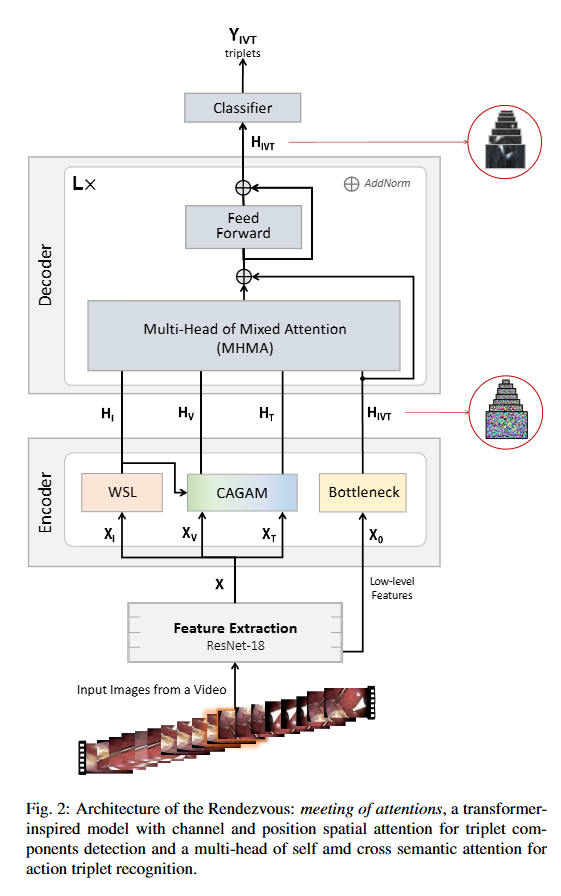

# Rendezvous：用于内窥镜视频中外科动作三元组识别的注意力机制

> **Title:** Rendezvous: Attention Mechanisms for the Recognition of Surgical Action Triplets in Endoscopic Videos  
> **KEYWORDS：** 外科工作流分析；手术动作识别；工具—组织交互；CholecT50；注意力机制；Transformer；腹腔镜手术；深度学习  
> **作者：** Chinedu Innocent Nwoye，Tong Yu，Cristians Gonzalez，Barbara Seeliger，Pietro Mascagni，Didier Mutter，Jacques Marescaux，Nicolas Padoy  
> **机构：** University of Strasbourg；CNRS；IHU Strasbourg；University Hospital of Strasbourg；Fondazione Policlinico Universitario Agostino Gemelli IRCCS；IRCAD France  
> **Google Scholar 被引次数：** 未查询  
> **发表：** 2022 年 3 月更新版本，arXiv:2109.03223v2  
> **Venue：** 本文提供的信息未注明正式期刊或会议名称  
> **Conference：** 未注明  
> **Year：** 2022  
> **Link：** [arXiv: Rendezvous: Attention Mechanisms for the Recognition of Surgical Action Triplets in Endoscopic Videos](https://arxiv.org/abs/2109.03223)

## 1. 背景与问题

### 1.1 研究背景

手术视频分析的目标是理解手术场景中正在发生的活动。已有研究通常从不同粒度进行识别：

- 手术阶段识别：例如准备、切割、缝合等较粗粒度活动；
- 手术步骤识别：比手术阶段更加细致，但仍然可能包含多个具体动作；
- 工具识别：识别场景中出现的手术器械；
- 动作识别：识别切割、抓取、凝结等动作；
- 工具—组织交互识别：同时识别手术器械、动作以及被作用的组织。

作者认为，仅识别手术阶段或动作动词无法完整表达手术活动。例如，“切割阶段”可能同时包含抓持组织、牵拉胆囊、夹闭胆管和切断胆囊管等多个动作。因此，本文将手术动作表示为：

$$
\langle \text{instrument},\text{verb},\text{target}\rangle
$$

即：

$$
\langle \text{器械},\text{动作},\text{目标组织}\rangle
$$

例如：

- $\langle$ grasper, retract, gallbladder $\rangle$：抓钳牵拉胆囊；
- $\langle$ clipper, clip, cystic-duct $\rangle$：夹闭器夹闭胆囊管；
- $\langle$ scissors, cut, cystic-duct $\rangle$：剪刀切断胆囊管；
- $\langle$ irrigator, aspirate, fluid $\rangle$：冲洗吸引器吸引液体。

### 1.2 研究问题

本文主要解决以下问题：

1. 如何在内窥镜视频中同时识别器械、动作和目标组织？
2. 如何判断器械、动作和目标组织之间的正确组合关系？
3. 如何在没有目标检测框和动作实例框标注的情况下，学习具有一定空间定位能力的模型？
4. 如何区分外观相似但语义不同的动作，例如：
   - 抓钳抓取胆囊；
   - 抓钳牵拉胆囊；
   - 抓钳解剖胆囊。
5. 如何处理一帧图像中同时存在多个手术动作的问题？

这类任务的难点在于，目标组织并不是“出现在画面中”就一定构成动作目标。只有当器械正在对其进行操作时，该组织才应当被识别为目标。动作动词也依赖于器械及其与组织之间的关系。

### 1.3 论文的总体思路

作者提出了两个主要贡献：

1. **CholecT50 数据集**  
   包含 50 段腹腔镜胆囊切除术视频，每帧标注器械、动作和目标组织组成的动作三元组。

2. **Rendezvous（RDV）模型**  
   通过两类注意力机制处理不同问题：
   - CAGAM：Class Activation Guided Attention Mechanism，用于改善动作和目标组织的识别；
   - MHMA：Multi-Head of Mixed Attention，用于学习器械、动作和目标组织之间的语义关联。

## 2. 核心方法

### 2.1 动作三元组建模

CholecT50 中的每个动作由三部分组成：

| 组成部分 | 含义 | 类别数量 |
| --- | --- | ---: |
| Instrument | 手术器械 | 6 |
| Verb | 器械执行的动作 | 10 |
| Target | 被作用的组织或目标 | 15 |
| Triplet | 器械、动作和目标的完整组合 | 100 |

理论上，6 种器械、10 种动作和 15 种目标可以形成 900 种组合，但其中大量组合没有临床意义或几乎不会出现。因此，作者先进行类别合并，再根据临床相关性和出现次数筛选，最终保留 100 个动作三元组类别。

### 2.2 RDV 的整体结构

RDV 由四个主要部分组成：

1. 特征提取骨干网络；
2. 组件编码器；
3. 动作三元组解码器；
4. 分类器。

模型首先使用 ResNet-18 提取图像特征，然后将特征复制为三个分支，分别用于器械、动作和目标组织识别。编码器负责识别三元组的组成部分，解码器负责建立这些组成部分之间的对应关系。

原文 Fig. 2 展示了 RDV 的总体结构。模型通过 ResNet-18 提取特征，使用 WSL 和 CAGAM 识别动作三元组组件，再通过 MHMA 建立器械、动作、目标之间的关系，最终输出 100 类动作三元组。

### 2.3 特征提取模块

模型使用 ImageNet 预训练的 ResNet-18 作为骨干网络。为了提高空间定位能力，作者将 ResNet-18 最后两个模块的步长降低为 1，使输出特征图具有更高的空间分辨率。

输入图像被调整为 $256 \times 448$，经过特征提取后得到：

$$
X\in \mathbb{R}^{32\times56\times512}
$$

该特征被复制为三个分支：

$$
(X^I,X^V,X^T)
$$

分别对应：

- $X^I$：器械分支；
- $X^V$：动作分支；
- $X^T$：目标组织分支。

### 2.4 弱监督定位模块 WSL

论文没有使用手术器械的边界框标注，而是采用弱监督学习定位器械。

WSL 模块由以下部分组成：

- 一个 $3\times3$ 卷积层；
- 一个 $1\times1$ 卷积层；
- 全局最大池化。

该模块生成器械类别激活图 $H^I$。器械类别激活图不仅用于判断器械是否存在，也用于提供器械的空间位置信息。

器械检测分支包含 6 个器械类别：

- grasper；
- bipolar；
- hook；
- scissors；
- clipper；
- irrigator。

全局最大池化后的输出作为器械存在概率，同时保留的空间激活图会传递给 CAGAM，为动作和目标组织识别提供器械相关的空间线索。

### 2.5 CAGAM：类别激活引导注意力机制

CAGAM 的核心思想是：

> 使用已经识别出的器械激活信息，引导模型关注与该器械相关的动作和目标组织。

作者观察到，动作和目标组织受到器械的影响方式并不相同：

- 动作通常更依赖器械的类型；
- 目标组织通常更依赖器械在图像中的空间位置。

因此，CAGAM 包含两种注意力：

1. **通道注意力：用于动作识别**
2. **位置注意力：用于目标组织识别**

#### 2.5.1 动作识别中的通道注意力

对于动作识别，模型主要关注器械类别之间的通道关系。器械激活图经过变换后生成查询、键和值，并计算通道维度上的相关性。

通道注意力的输入维度为：

$$
C_I\times C_I
$$

其中 $C_I=6$，对应 6 类手术器械。

模型将器械激活产生的判别性亲和矩阵与动作特征产生的非判别性亲和矩阵相结合，得到注意力矩阵：

$$
A=\sigma\left(\frac{P_D\odot P_{\varnothing}}{\xi}\right)
$$

其中：

- $P_D$：来自器械类别激活图的判别性亲和矩阵；
- $P_{\varnothing}$：来自未筛选动作特征的非判别性亲和矩阵；
- $\xi$：缩放因子；
- $\sigma$：softmax 函数。

经过注意力增强后，模型生成动作类别激活图，并通过全局平均池化得到动作预测结果。

#### 2.5.2 目标组织识别中的位置注意力

目标组织的识别更加依赖器械所在的位置。例如，器械靠近胆囊的位置与器械远离胆囊的位置，对判断目标组织有重要影响。

因此，目标组织分支采用空间位置注意力，通过计算空间位置之间的相关性建立：

$$
HW\times HW
$$

规模的注意力矩阵。

目标组织注意力的作用是将器械所在的位置传播到其他相关空间位置，从而增强模型对器械—组织接触区域的关注。

### 2.6 MHMA：多头混合注意力

CAGAM 主要解决动作三元组组件的识别问题，而 MHMA 主要解决组件之间的关联问题。

如果模型分别识别出：

- 一个 grasper；
- 一个 retract；
- 一个 gallbladder；

仍然需要判断这三个预测是否属于同一个动作三元组。

MHMA 同时使用：

- 自注意力；
- 交叉注意力。

模型设置了 4 个注意力头：

1. 三元组自注意力；
2. 器械交叉注意力；
3. 动作交叉注意力；
4. 目标组织交叉注意力。

在交叉注意力中，器械、动作和目标组织的类别激活特征作为来源特征，三元组特征作为目标特征。模型通过查询三元组特征，并从各个组件特征中提取相关信息，学习三元组内部的关系。

缩放点积注意力可以表示为：

$$
A(Q,K,V)=V\cdot\operatorname{softmax}\left(\frac{KQ^T}{\sqrt{d_K}}\right)
$$

其中：

- $Q$：查询；
- $K$：键；
- $V$：值；
- $d_K$：键向量的维度。

最终，4 个注意力头的输出被拼接，并通过卷积进行融合：

$$
A^{1..N}=W\left(\mathop{\Vert}_{i=1}^{N}A^i\right)
$$

这样，模型可以同时考虑三元组自身的上下文关系，以及器械、动作和目标组织对三元组表示的影响。

### 2.7 分类与损失函数

器械、动作和目标组织都是多标签分类问题，因此作者使用加权 sigmoid 交叉熵。

组件损失为：

$$
L_{\mathrm{comp}}
=
\frac{1}{3}
\left(
\frac{1}{e^{w_I}}L_I+
\frac{1}{e^{w_V}}L_V+
\frac{1}{e^{w_T}}L_T+
w_I+w_V+w_T
\right)
$$

其中：

- $L_I$：器械分类损失；
- $L_V$：动作分类损失；
- $L_T$：目标组织分类损失；
- $w_I,w_V,w_T$：用于自动平衡不同任务的可学习参数。

最终总损失为：

$$
L_{\mathrm{total}}
=
L_{\mathrm{comp}}
+
\rho L_{\mathrm{assoc}}
+
\lambda L_2
$$

其中：

- $L_{\mathrm{assoc}}$：完整动作三元组关联损失；
- $\rho$：关联损失的预热系数；
- $\lambda=10^{-5}$：$L_2$ 正则化系数。

前 18 个训练轮次主要关注组件识别，之后逐步加入完整三元组关联学习。

### 2.8 与 Attention Tripnet 的关系

作者还构建了 Attention Tripnet 作为消融模型。

- Tripnet 使用 CAG 处理器械对动作和目标组织的引导；
- Attention Tripnet 将 Tripnet 中的 CAG 替换为 CAGAM；
- Rendezvous 在此基础上进一步使用 MHMA 替换原来的 3D interaction space。

因此，三个模型的差别可以概括为：

| 模型 | 组件识别机制 | 三元组关联机制 |
| --- | --- | --- |
| Tripnet | CAG | 3D interaction space |
| Attention Tripnet | CAGAM | 3D interaction space |
| Rendezvous | CAGAM | MHMA |

## 3. 创新点

### 3.1 提出 CAGAM

CAGAM 使用器械的类别激活信息引导动作和目标组织识别，避免仅依靠未筛选的视觉特征进行预测。

其主要特点是：

- 使用器械激活图作为注意力来源；
- 不需要额外的显著性网络；
- 对动作使用通道注意力；
- 对目标组织使用位置注意力；
- 通过交叉注意力让器械信息影响动作和目标识别。

### 3.2 提出 MHMA

MHMA 将自注意力和交叉注意力结合起来：

- 自注意力用于理解三元组整体上下文；
- 交叉注意力用于建立器械、动作和目标组织之间的关系；
- 多个注意力头分别关注三元组、器械、动作和目标组织。

这比简单拼接特征或投影到三维交互空间更加明确地建模了组件之间的语义关系。

### 3.3 建立 CholecT50 数据集

CholecT50 是一个面向腹腔镜胆囊切除术动作三元组识别的数据集。与只标注动作或器械的数据集相比，它同时提供：

- 器械类别；
- 动作类别；
- 目标组织类别；
- 器械—动作—目标组织三元组标签。

### 3.4 引入弱监督定位

模型不依赖人工边界框，而是通过类别激活图获得器械的大致空间位置。这降低了标注成本，并为后续动作区域定位和动作分割提供了基础。

### 3.5 对临床相关动作进行分析

作者特别关注：

- 夹闭胆囊管或胆囊动脉；
- 剪切胆囊管或胆囊动脉；
- 凝结血管；
- 器械与胆囊、肝脏之间的交互。

这些动作与手术安全监测和关键视野识别具有潜在联系。

## 4. 实验 & 结果

### 4.1 数据来源

CholecT50 共包含 50 段腹腔镜胆囊切除术视频：

- 45 段来自 Cholec80 数据集；
- 5 段来自作者所在团队的内部数据集；
- 由两名外科医生进行时间区间和动作标签标注；
- 由三名临床专家进行类别相关性评分和标签协调；
- 视频采样为 1 fps；
- 共得到 100,863 帧和 161,005 个动作三元组实例。

#### 原文 Table 3：数据集划分

| 数据划分 | 视频数量 | 帧数量 | 标签数量 |
| --- | ---: | ---: | ---: |
| Training | 35 | 72,815 | 113,884 |
| Validation | 5 | 6,797 | 10,267 |
| Testing | 10 | 21,251 | 36,854 |
| Total | 50 | 100,863 | 161,005 |

数据划分按视频进行，而不是随机划分帧，以避免同一视频相邻帧同时出现在训练集和测试集中。

#### 原文 Table 1：组件类别统计

| 器械 | 数量 | 动作 | 数量 | 目标组织 | 数量 |
| --- | ---: | --- | ---: | --- | ---: |
| bipolar | 6,697 | aspirate | 3,122 | abdominal-wall/cavity | 847 |
| clipper | 3,379 | clip | 3,070 | adhesion | 228 |
| grasper | 90,969 | coagulate | 5,202 | blood-vessel | 416 |
| hook | 52,820 | cut | 1,897 | cystic-artery | 5,035 |
| irrigator | 5,005 | dissect | 49,247 | cystic-duct | 11,883 |
| scissors | 2,135 | grasp | 15,931 | cystic-pedicle | 299 |
|  |  | irrigate | 572 | cystic-plate | 4,920 |
|  |  | null-verb | 10,841 | fluid | 3,122 |
|  |  | pack | 328 | gallbladder | 87,808 |
|  |  | retract | 70,795 | gut | 719 |
|  |  |  |  | liver | 17,521 |
|  |  |  |  | null-target | 10,841 |
|  |  |  |  | omentum | 9,220 |
|  |  |  |  | peritoneum | 1,227 |
|  |  |  |  | specimen-bag | 6,919 |

数据具有明显的类别不均衡问题。例如：

- grasper 的出现次数远高于 scissors；
- retract 和 dissect 是最常见的动作；
- gallbladder 和 cystic-duct 是最常见的目标组织；
- 少数具有临床意义的动作出现频率较低。

### 4.2 实验设置

模型使用以下训练设置：

- 输入分辨率：$256\times448$；
- 特征提取网络：ImageNet 预训练 ResNet-18；
- 优化器：带动量的随机梯度下降；
- 动量：$\mu=0.95$；
- 初始学习率：$\eta=0.001$；
- 每 50 个 epoch 将学习率衰减为原来的 0.1；
- batch size：8；
- 训练轮数：200；
- 默认 RDV 解码器层数：8；
- 训练硬件包括 GTX 1080 Ti、Tesla P40、RTX6000 和 V100。

在单张 GTX 1080 Ti 上，完整训练大约需要 118 至 180 小时。8 层 RDV 的推理速度超过 25 FPS，作者认为其具备实时手术室辅助的潜力。

### 4.3 评价指标

论文使用以下指标：

- $AP_I$：器械识别平均精度；
- $AP_V$：动作识别平均精度；
- $AP_T$：目标组织识别平均精度；
- $AP_{IV}$：器械—动作关联平均精度；
- $AP_{IT}$：器械—目标组织关联平均精度；
- $AP_{IVT}$：完整器械—动作—目标组织三元组平均精度。

其中，$AP_{IVT}$ 是最重要的指标，因为它要求三个组件都正确，并且组件之间的组合关系也正确。

#### 原文 Table 7：整体性能比较

| 方法 | $AP_I$ | $AP_V$ | $AP_T$ | $AP_{IV}$ | $AP_{IT}$ | $AP_{IVT}$ |
| --- | ---: | ---: | ---: | ---: | ---: | ---: |
| Naive CNN | 57.7 | 39.2 | 28.3 | 21.7 | 18.0 | 13.6 |
| TCN | 48.9 | 29.4 | 21.4 | 17.7 | 15.5 | 12.4 |
| MTL | 84.5 | 48.4 | 28.2 | 26.6 | 21.2 | 17.6 |
| Tripnet | 92.1 | 54.5 | 33.2 | 29.7 | 26.4 | 20.0 |
| Attention Tripnet | 92.0 | 60.2 | 38.5 | 31.1 | 29.8 | 23.4 |
| Rendezvous | 92.0 | 60.7 | 38.3 | 39.4 | 36.9 | 29.9 |

主要结果：

- RDV 的器械识别 $AP_I$ 为 92.0%，与 Tripnet 基本相同；
- RDV 的动作识别 $AP_V$ 为 60.7%，略高于 Attention Tripnet 的 60.2%；
- RDV 的目标组织识别 $AP_T$ 为 38.3%，与 Attention Tripnet 的 38.5% 接近；
- RDV 的器械—动作关联 $AP_{IV}$ 为 39.4%；
- RDV 的器械—目标组织关联 $AP_{IT}$ 为 36.9%；
- RDV 的完整三元组识别 $AP_{IVT}$ 为 29.9%，高于 Tripnet 的 20.0%。

相较 Tripnet，RDV 的完整三元组识别提升为：

$$
29.9\%-20.0\%=9.9\%
$$

这说明 RDV 的主要优势不在于单独识别器械，而在于学习动作三元组内部的关联关系。

### 4.4 Top-N 预测结果

#### 原文 Table 8：Top-N 三元组识别准确率

| 方法 | Top-5 | Top-10 | Top-20 |
| --- | ---: | ---: | ---: |
| Naive CNN | 67.0 | 80.0 | 90.2 |
| TCN | 54.5 | 69.4 | 84.3 |
| MTL | 70.2 | 80.2 | 89.5 |
| Tripnet | 70.5 | 81.9 | 91.4 |
| Attention Tripnet | 75.3 | 86.0 | 93.8 |
| Rendezvous | 76.3 | 88.7 | 95.9 |

RDV 在 Top-5、Top-10 和 Top-20 预测中都取得了最高结果。Top-20 准确率达到 95.9%，说明即使模型没有将最高概率类别排在第一位，正确三元组通常也会出现在候选结果中。

### 4.5 消融实验

#### 原文 Table B.18：注意力序列建模方式消融

| 模型 | 层数 | $AP_{IV}$ | $AP_{IT}$ | $AP_{IVT}$ |
| --- | ---: | ---: | ---: | ---: |
| Patch-based sequence | 6 | 33.4 | 29.3 | 24.1 |
| Class-wise mapping | 2 | 36.0 | 34.1 | 27.0 |
| Class-wise mapping | 8 | 39.4 | 36.9 | 29.9 |

结果表明：

- 使用类别级特征序列比直接使用图像 patch 序列更有效；
- 类别级映射能够更好地保留器械、动作和目标组织之间的语义结构；
- 增加 RDV 层数可以提高关联性能；
- 8 层 RDV 在 $AP_{IVT}$ 上达到 29.9%。

#### 原文 Table B.19：辅助损失消融

| 模型 | $AP_{IV}$ | $AP_{IT}$ | $AP_{IVT}$ |
| --- | ---: | ---: | ---: |
| Without auxiliary loss | 33.6 | 27.0 | 21.2 |
| With auxiliary loss | 36.0 | 34.1 | 29.9 |

加入器械、动作和目标组织的辅助分类损失后：

- $AP_{IV}$ 提升 2.4 个百分点；
- $AP_{IT}$ 提升 7.1 个百分点；
- $AP_{IVT}$ 提升 8.7 个百分点。

这说明先学习三元组组成部分，再学习完整三元组关联，有助于模型形成更加稳定的语义表示。

### 4.6 统计显著性分析

作者使用 Wilcoxon signed-rank test 比较 RDV、Attention Tripnet 与 Tripnet 的差异。

RDV 相较 Tripnet 的结果包括：

| 任务 | p 值 |
| --- | ---: |
| 器械识别 $AP_I$ | 约 0.374 |
| 动作识别 $AP_V$ | 约 0.003 |
| 目标组织识别 $AP_T$ | 小于 0.001 |
| 器械—动作关联 $AP_{IV}$ | 小于 0.001 |
| 器械—目标组织关联 $AP_{IT}$ | 约 0.005 |
| 完整三元组识别 $AP_{IVT}$ | 远小于 0.001 |

器械识别的提升不具有统计显著性，这是因为 Tripnet 本身的器械识别性能已经较高。RDV 的显著提升主要来自：

- 动作识别；
- 目标组织识别；
- 器械—动作关联；
- 器械—目标组织关联；
- 完整动作三元组识别。

### 4.7 临床相关性分析

作者分析了模型 Top-10 预测中的三元组，发现 RDV 能够较好地识别具有临床意义的动作，例如：

- $\langle$ clipper, clip, cystic-duct $\rangle$；
- $\langle$ clipper, clip, cystic-artery $\rangle$；
- $\langle$ scissors, cut, cystic-duct $\rangle$；
- $\langle$ scissors, cut, cystic-artery $\rangle$；
- $\langle$ bipolar, coagulate, blood-vessel $\rangle$。

原文 Table 9 中，RDV 的 Top-10 完整三元组平均 AP 为 64.70%，高于 Tripnet 的 56.05% 和 Attention Tripnet 的 61.41%。

RDV 的 Top-10 预测中所有三元组的 AP 都超过 50%，包括一些出现频率较低但具有临床意义的动作。这说明模型并非只依赖类别频率，也学习到了一定的器械使用语义。

### 4.8 模型局限性

论文指出了以下不足：

1. **目标组织尚未实现可靠的弱监督定位**  
   目标组织的可见性不等于目标组织正在被器械操作，因此仅使用目标类别激活图难以获得准确的目标定位。

2. **无法识别同一三元组的多个实例**  
   例如，当画面中同时存在两个 $\langle$ grasper, grasp, gallbladder $\rangle$ 实例时，二值存在标签无法提供实例数量信息。

3. **对未见过的三元组泛化能力有限**  
   数据集只包含 100 个预定义三元组类别，对于训练中没有出现过的新组合，模型还不能很好地进行零样本或少样本识别。

4. **计算成本较高**  
   增加 RDV 层数虽然可以提高性能，但也会增加计算量和训练时间。

5. **缺少时间建模**  
   当前模型主要基于单帧识别，而某些动作需要通过器械的连续运动过程才能更准确地区分。

## 5. 个人思考

### 5.1 对论文方法的理解

这篇论文的核心并不是简单地给 CNN 增加一个 Transformer 模块，而是将手术动作识别拆分为两个层次：

第一层是识别组成部分：

$$
\text{器械}\quad+\quad\text{动作}\quad+\quad\text{目标组织}
$$

第二层是建立组成部分之间的关联：

$$
\text{器械}\leftrightarrow\text{动作}\leftrightarrow\text{目标组织}
$$

这种分解比较符合手术场景的实际语义。仅仅预测 100 个三元组类别，会忽略类别之间的结构关系；而先预测器械、动作和目标组织，再通过注意力机制建立关联，能够让模型利用更细粒度的先验信息。

### 5.2 CAGAM 的合理性

CAGAM 的设计具有较强的任务针对性：

- 器械类型通常决定可能执行的动作；
- 器械位置通常决定其可能作用的目标组织；
- 动作识别偏向器械语义；
- 目标组织识别偏向空间关系。

因此，作者没有对动作和目标组织使用完全相同的注意力，而是分别采用通道注意力和位置注意力。这比统一使用一种注意力形式更加合理。

### 5.3 MHMA 的价值

MHMA 解决的是动作三元组中最关键的“配对问题”。

例如，一帧图像中可能出现：

- 一个 grasper；
- 一个 hook；
- 一个 gallbladder；
- 一个 cystic-duct；
- 多个动作。

即使模型正确识别出了所有器械、动作和目标，也必须进一步判断：

- 哪个器械对应哪个动作；
- 哪个动作作用于哪个目标；
- 多个动作是否同时存在。

因此，MHMA 的意义在于从“分类”进一步进入“关系建模”。从实验结果看，RDV 在完整三元组识别上的提升明显高于单独组件识别上的提升，也证明了关联建模是本文真正的性能增长来源。

### 5.4 数据集设计的优点

CholecT50 的主要价值在于它提供了比较完整的动作语义标注。相比单纯的手术阶段标签，动作三元组能够表达更具体的手术行为。

例如，以下动作虽然都发生在胆囊切除术中，但临床含义不同：

- 抓钳牵拉胆囊；
- 抓钳抓取胆囊；
- 钩刀解剖胆囊；
- 夹闭胆囊管；
- 剪刀切断胆囊管；
- 双极电凝处理血管。

这种标注形式为以下任务提供了基础：

- 手术安全监测；
- 手术技能评估；
- 手术报告生成；
- 工具—组织交互分析；
- 动作区域定位和分割；
- 手术流程理解。

### 5.5 实验设计中的问题

论文仍然存在一些可以进一步改进的地方：

1. **数据规模相对有限**  
   只有 50 段手术视频，虽然帧数较多，但相邻视频帧之间具有很强的相关性，实际独立样本数量并不等于帧数。

2. **数据来源相对集中**  
   数据主要来自胆囊切除术，且手术类型、器械类型和解剖结构较固定，模型能否迁移到其他手术仍然需要验证。

3. **评价指标没有充分反映实例级识别能力**  
   当前标签主要是类别存在标签，不能区分同一类别在一帧中出现多少个实例，也无法充分评价多个动作实例的定位质量。

4. **缺少跨中心测试**  
   不同医院、不同内窥镜设备和不同外科医生可能造成明显的域偏移。论文没有充分展示跨医院泛化实验。

5. **缺少时间模型**  
   许多手术动作不能仅凭单帧准确判断。例如“抓取”和“牵拉”可能需要观察一段时间内器械的运动方向和组织形变。

### 5.6 如果进一步改进模型

后续工作可以从以下方向展开：

- 引入时序 Transformer、时序卷积或循环网络；
- 使用视频片段而不是单帧进行三元组识别；
- 使用检测框、分割掩码或点标注提供更强的空间监督；
- 引入图神经网络显式表示器械、动作和目标组织之间的关系；
- 对未见过的三元组使用零样本或少样本学习；
- 使用对比学习增强相似动作之间的区分能力；
- 使用多中心、多手术类型数据进行域泛化；
- 将动作识别与手术阶段、步骤和安全事件联合建模；
- 改进多实例动作识别，使模型能够区分同一三元组的多个实例。

### 5.7 总结

本文提出了 RDV 模型和 CholecT50 数据集，用于解决内窥镜视频中的器械—动作—目标组织三元组识别问题。

方法上的主要贡献是：

- 使用 CAGAM 通过器械激活信息引导动作和目标识别；
- 使用通道注意力处理动作识别；
- 使用位置注意力处理目标组织识别；
- 使用 MHMA 建模器械、动作和目标组织之间的关联；
- 使用弱监督方式获得器械空间定位；
- 使用辅助组件损失帮助模型学习三元组结构。

实验显示，RDV 的完整三元组识别 AP 达到 29.9%，相比 Tripnet 的 20.0% 提升 9.9 个百分点。由此可以看出，手术动作识别的主要难点并不只是识别单个器械或动作，而是正确建立器械、动作和目标组织之间的对应关系。
