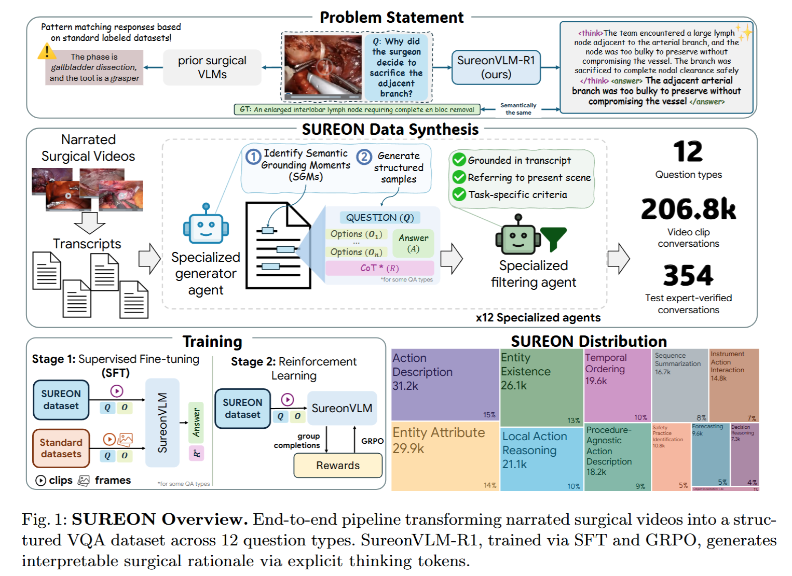
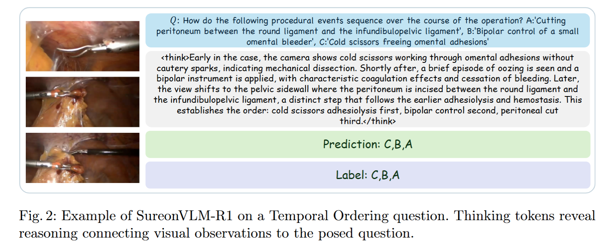

# SUREON: A Benchmark and Vision-Language-Model for Surgical Reasoning

> Title: SUREON: A Benchmark and Vision-Language-Model for Surgical Reasoning  
> KEYWORDS: 外科人工智能、视觉语言模型、手术视频问答、手术推理、视频理解、GRPO、强化学习、数据集、临床决策  
> 作者: Alejandra Perez、Anita Rau、Lee White、Busisiwe Mlambo、Chinedu Nwoye、Muhammad Abdullah Jamal、Omid Mohareri  
> 机构: Intuitive Surgical Inc.，Sunnyvale，美国  
> Google Scholar 被引次数: 未提供  
> 发表: 2026 年 3 月 6 日，arXiv 预印本  
> Venue: arXiv  
> Conference: 未发表至会议  
> Year: 2026  
> Link: [arXiv:2603.06570](https://arxiv.org/abs/2603.06570)  
> 项目主页: [SUREON Project Page](https://aperezr20.github.io/sureon/)

## 1. 背景与问题

### 1.1 研究背景

当前的手术人工智能系统主要集中于预先定义好的感知任务，例如：

- 手术阶段识别；
- 手术步骤识别；
- 手术动作识别；
- 器械检测与分割；
- 解剖结构识别与分割。

这类任务能够回答“画面中有什么”以及“当前正在进行什么操作”，但难以回答更高层次的临床问题：

- 外科医生为什么要执行这个动作？
- 当前操作有什么风险？
- 为什么要选择某种器械或手术策略？
- 接下来最有可能发生什么？
- 当前手术决策背后的临床依据是什么？

传统手术数据集通常依赖固定的类别标签和人工标注，因此难以表达开放词汇的手术意图、决策理由、安全判断和程序预测。

### 1.2 研究问题

论文试图回答以下问题：

> 能否从专家讲解的手术视频中自动提取包含手术意图、临床理由和安全信息的监督信号，并利用这些数据训练具有手术推理能力的视觉语言模型？

### 1.3 核心观点

外科教学视频中的专家旁白包含大量自然产生的临床知识。医生在讲解手术时，往往会说明：

- 当前画面中的器械和解剖结构；
- 正在执行的手术动作；
- 执行动作的原因；
- 某种操作可能造成的风险；
- 手术步骤之间的时间关系；
- 下一步可能采取的手术方案。

论文认为，虽然这些讲解内容具有噪声并且结构不规则，但它们包含了传统手术数据集中缺少的“临床推理监督”。

## 2. 摘要内容概括

论文提出了 SUREON，一个从专家讲解的手术视频中构建的大规模视频问答数据集和基准。

SUREON 覆盖：

- 134.7K 个视频片段；
- 170 种手术类型；
- 206.8K 个视频问答样本；
- 12 类手术理解和推理任务；
- 354 个经过外科专家验证的测试样本。

在此基础上，作者训练了两个模型：

1. **SureonVLM**：通过监督微调适配到手术领域的视觉语言模型；
2. **SureonVLM-R1**：在 SureonVLM 的基础上使用 GRPO 进行强化学习，鼓励模型生成显式的推理过程。

实验结果显示，SureonVLM 和 SureonVLM-R1 在 SUREON 基准上的多项选择平均准确率分别为 0.85 和 0.84，超过了 GPT-5.1、Gemini 3.1 Pro 和 Qwen3-VL 8B。

论文的核心结论是：

> 手术人工智能的主要瓶颈不一定是模型规模，而可能是训练数据是否包含手术意图、临床决策和安全推理等高层次信息。

## 3. 论文结构

论文主要包括以下部分：

1. 引言；
2. SUREON 数据集与基准；
3. 模型训练方法；
4. 实验；
5. 结论；
6. 参考文献。

主要内容安排如下：

- **引言**：介绍传统手术人工智能的任务范围及其局限性；
- **数据集部分**：介绍语义锚定时刻、问题分类、数据生成和专家验证流程；
- **模型部分**：介绍 SureonVLM 和 SureonVLM-R1 的训练方法；
- **实验部分**：比较不同模型，进行消融实验和标准手术任务测试；
- **结论部分**：总结方法价值，并讨论数据偏差、LLM 评估和推理幻觉等局限性。

## 4. 数据来源与数据集构建

### 4.1 数据来源

SUREON 的数据全部来源于公开的专家讲解手术视频。

这些视频包含手术画面和与画面同步的专家讲解文本。与单纯的视频字幕数据相比，专家讲解通常包含更多关于手术意图、风险和决策理由的信息。

论文还使用了 18 个公开的手术数据集，用于增强模型的视觉、空间和时序理解能力。这些数据集主要提供：

- 器械识别；
- 解剖结构识别；
- 器械定位；
- 图像分割；
- 手术阶段识别；
- 手术步骤识别；
- 视频动作识别；
- 关键安全视野评估。

这些公开数据集共提供约：

- 1.5M 个标注视频帧；
- 460K 个标注视频片段。

### 4.2 语义锚定时刻

论文定义了 Semantic Grounding Moments，简称 SGM，即“语义锚定时刻”。

SGM 是指视频中专家旁白明确对应到当前视觉内容的片段。例如：

- 旁白说明当前画面中存在某个器械；
- 旁白解释某个器械正在执行的动作；
- 旁白说明某个手术决策的原因；
- 旁白描述当前操作的安全风险；
- 旁白预测后续可能发生的操作。

### 4.3 数据生成流程

数据构建流程包括：

1. 获取专家讲解手术视频；
2. 获取视频对应的转录文本；
3. 根据转录文本识别语义锚定时刻；
4. 将语义锚定时刻转换成视频片段；
5. 针对不同问题类型生成视频问答样本；
6. 生成问题、答案、选项和可选的推理过程；
7. 由问题类型专属的验证代理筛选样本；
8. 由外科专家审核测试样本。

验证过程主要检查：

- 问题是否被旁白内容支持；
- 答案是否正确；
- 视频片段的时间窗口是否准确；
- 旁白是否描述了当前画面；
- 问题类型是否符合预设要求；
- 样本是否存在临床错误或明显噪声。

### 4.4 SUREON 的问题类型

SUREON 将任务划分为 12 类。

#### 感知类任务

1. **Entity Existence**：实体存在，判断器械或解剖结构是否出现；
2. **Entity Attribute**：实体属性，识别器械或组织的状态；
3. **Entity Localization**：实体定位，判断对象在画面中的位置；
4. **Instrument–Action Interaction**：器械—动作交互，判断某种器械正在执行什么动作；
5. **Procedure-Agnostic Action Description**：程序无关动作描述，描述分离、凝闭、缝合等低层次操作。

#### 推理与时序类任务

6. **Action Description**：动作描述，判断当前正在进行的手术任务；
7. **Local Action Reasoning**：局部动作推理，解释某个动作的临床原因；
8. **Decision Reasoning**：决策推理，解释手术决策及其依据；
9. **Sequence Summarization**：序列总结，总结一段手术过程；
10. **Temporal Ordering**：时间排序，判断多个事件的先后顺序；
11. **Forecasting**：未来预测，预测接下来最可能发生的操作；
12. **Safety Practice Identification**：安全实践识别，识别风险规避和安全操作。

### 4.5 原文 Figure 1：SUREON 总体流程



*图 1：SUREON Overview。原文展示了从专家讲解手术视频、转录文本、语义锚定时刻，到结构化视频问答数据和模型训练的完整流程。*

## 5. 模型结构与训练方法

### 5.1 基础模型

作者以 Qwen3-VL 为基础视觉语言模型，并将其适配到手术领域。

最终得到两个模型：

| 模型 | 训练方式 | 主要目标 |
|---|---|---|
| SureonVLM | 监督微调 | 学习手术视觉理解和视频问答 |
| SureonVLM-R1 | 监督微调 + GRPO | 在手术问答基础上增强显式推理能力 |

### 5.2 SureonVLM 的监督微调

作者采用渐进式的三阶段训练策略。

#### 第一步：训练视觉到语言的映射

只更新 MLP 投影层，使视觉特征能够更好地映射到语言模型空间。

#### 第二步：适配视觉编码器

同时更新视觉编码器和 MLP 投影层，使视觉模块适应手术视频中的：

- 手术器械；
- 解剖结构；
- 组织状态；
- 手术动作；
- 复杂视觉场景。

#### 第三步：训练语言模型

更新 MLP 和语言模型，同时固定视觉编码器，使语言模型学习：

- 手术领域词汇；
- 视频问答格式；
- 手术决策表达；
- 开放式回答；
- 推理过程表达。

训练数据比例为：

- 30% SUREON 视频片段；
- 50% 标准手术数据集图像；
- 20% 标准手术数据集视频。

在训练过程中，模型还会接收带有结构化推理过程的监督样本。

### 5.3 SureonVLM-R1 的 GRPO 训练

SureonVLM-R1 在监督微调之后使用 Group Relative Policy Optimization，简称 GRPO，进行强化学习。

训练过程如下：

1. 输入手术视频和问题；
2. 模型生成多条候选回答；
3. 根据答案正确性、格式和推理要求计算奖励；
4. 在同一组候选答案之间进行相对比较；
5. 使用组归一化优势更新模型；
6. 鼓励模型生成更正确、更规范的回答。

奖励函数可以表示为：

$$
r = r_{\text{correct}} + r_{\text{format}} + r_{\text{tags}} + r_{\text{CoT}}
$$

其中：

- $r_{\text{correct}}$：答案正确性奖励；
- $r_{\text{format}}$：是否遵守 `<think>` 和 `<answer>` 格式；
- $r_{\text{tags}}$：标签是否完整、正确且没有重复；
- $r_{\text{CoT}}$：针对时序排序和未来预测等任务设置的推理奖励。

### 5.4 原文 Figure 2：模型推理示例



*图 2：SureonVLM-R1 在 Temporal Ordering 任务上的推理示例。模型根据视频中冷剪刀、双极电凝和腹膜切开的视觉线索判断事件顺序。*

### 5.5 模型输出形式

模型被要求先生成推理过程，再生成最终答案：

```text
<think>
模型根据视频中的器械、组织状态和手术阶段进行分析。
</think>
<answer>
模型给出最终答案。
</answer>
```

论文中的示例是：模型根据淋巴结体积、血管分支和完整清扫要求，解释为什么外科医生牺牲了邻近的动脉分支。

## 6. 实验设计

### 6.1 SUREON 基准比较

作者比较了以下模型：

- GPT-5.1；
- Gemini 3.1 Pro；
- Qwen3-VL 8B；
- SureonVLM；
- SureonVLM-R1。

评测指标包括：

- 多项选择准确率；
- Exact Match；
- LLM-as-Judge 语义评价。

### 6.2 标准手术任务评测

为了检验模型是否过度拟合 SUREON，作者在标准手术任务上进行了测试：

- 手术动作识别；
- 手术阶段识别；
- 器械检测；
- Critical View of Safety，关键安全视野评估。

### 6.3 消融实验

作者分别研究了以下因素：

- 渐进式视觉适配；
- SUREON 监督微调；
- 标准手术数据集；
- 开放式问题训练；
- CoT 显式监督。

消融实验用于分析不同训练组件对模型性能的贡献。

## 7. 实验结果

### 7.1 SUREON 基准总体结果

| 模型 | 多项选择准确率 | Exact Match | LLM-as-Judge |
|---|---:|---:|---:|
| GPT-5.1 | 0.68 | 0.11 | 0.34 |
| Gemini 3.1 Pro | 0.60 | 0.12 | 0.31 |
| Qwen3-VL 8B | 0.66 | 0.06 | 0.23 |
| SureonVLM | **0.85** | **0.15** | 0.32 |
| SureonVLM-R1 | **0.84** | 0.10 | 0.24 |

SureonVLM 在 SUREON 基准上的多项选择平均准确率达到 0.85，高于 GPT-5.1、Gemini 3.1 Pro 和 Qwen3-VL 8B。

SureonVLM-R1 的多项选择平均准确率为 0.84，略低于 SureonVLM，但能够产生显式的 `<think>` 推理过程。

### 7.2 关键任务结果

| 任务 | GPT-5.1 | Gemini 3.1 Pro | Qwen3-VL 8B | SureonVLM | SureonVLM-R1 |
|---|---:|---:|---:|---:|---:|
| Decision Reasoning | 0.70 | 0.60 | 0.83 | 0.98 | **1.00** |
| Forecasting | 0.53 | 0.60 | 0.53 | **0.73** | 0.62 |
| Local Action Reasoning | 0.83 | 0.31 | 0.67 | 0.93 | **1.00** |
| Entity Attribute | 0.82 | 0.94 | 0.93 | 0.95 | **0.97** |
| Safety Practice Identification | 0.62 | 0.47 | 0.90 | 0.92 | **0.93** |
| Procedural Action Description | 0.90 | 0.73 | 0.63 | **0.97** | 0.93 |

SureonVLM 和 SureonVLM-R1 在安全实践识别和决策推理等临床相关任务上表现突出。

### 7.3 原文 Table 1：SUREON 基准评测结果

*表 1：原文表格。A 表示多项选择准确率，EM 表示 Exact Match，LLM-J 表示 LLM-as-Judge。*

| QA 类型 | GPT-5.1 A | Gemini 3.1 Pro A | Qwen3-VL A | SureonVLM A | SureonVLM-R1 A |
|---|---:|---:|---:|---:|---:|
| Action Description | 0.52 | 0.27 | 0.63 | 0.87 | 0.88 |
| Decision Reasoning | 0.70 | 0.60 | 0.83 | 0.98 | 1.00 |
| Forecasting | 0.53 | 0.60 | 0.53 | 0.73 | 0.62 |
| Instrument Action Interaction | 0.69 | 0.81 | 0.53 | 0.88 | 0.90 |
| Local Action Reasoning | 0.83 | 0.31 | 0.67 | 0.93 | 1.00 |
| Entity Attribute | 0.82 | 0.94 | 0.93 | 0.95 | 0.97 |
| Entity Existence | 0.68 | 0.75 | 0.57 | 0.70 | 0.70 |
| Entity Localization | 0.55 | 0.55 | 0.33 | 0.53 | 0.50 |
| Procedural Action Description | 0.90 | 0.73 | 0.63 | 0.97 | 0.93 |
| Safety Practice Identification | 0.62 | 0.47 | 0.90 | 0.92 | 0.93 |
| Sequence Summarization | — | — | — | — | — |
| Temporal Ordering | — | — | — | — | — |
| Average on SUREON | 0.68 | 0.60 | 0.66 | **0.85** | 0.84 |

### 7.4 标准手术任务结果

| 任务 | GPT-5.1 | Gemini 3.1 Pro | Qwen3-VL | SureonVLM |
|---|---:|---:|---:|---:|
| Action HeiChole F1 | 0.18 | 0.21 | 0.17 | 0.04 |
| CVS Endoscapes F1 | 0.08 | 0.14 | 0.02 | **0.32** |
| Phase Cholec80 F1 | 0.36 | 0.47 | 0.17 | **0.63** |
| Phase HeiChole F1 | 0.29 | 0.35 | 0.12 | **0.41** |
| Phase MultiBypass140 F1 | 0.13 | 0.22 | 0.08 | **0.40** |
| Tool Endoscapes mAP@0.5:0.95 | 0.00 | 0.61 | 0.00 | 0.22 |

SureonVLM 在多个手术阶段识别和安全视野评估任务上超过通用模型，但在 HeiChole 动作识别和器械检测任务上并未取得最高结果，说明领域适配并不意味着所有任务都全面领先。

### 7.5 消融实验结果

| 训练配置 | Accuracy | Exact Match | LLM-as-Judge |
|---|---:|---:|---:|
| 基础 Qwen3-VL | 0.66 | 0.06 | 0.23 |
| 渐进式适配 + SUREON 微调 | 0.83 | 0.09 | 0.25 |
| 加入标准数据集 | 0.84 | 0.09 | 0.26 |
| 加入开放式问题训练 | **0.85** | **0.15** | **0.32** |
| 加入 CoT 监督 | 0.84 | 0.07 | 0.25 |
| 完整配置 | 0.83 | **0.15** | **0.32** |

消融实验表明：

- 渐进式手术领域适配和 SUREON 监督微调带来了最大的准确率提升；
- 标准手术数据集只带来有限的增益；
- 开放式问题训练显著提升了 Exact Match 和 LLM-as-Judge；
- CoT 监督对最终准确率提升不明显，但有助于后续 GRPO 训练稳定生成 `<think>` 标签。

## 8. 主要创新点

### 8.1 将手术教学讲解转化为推理监督

传统数据集主要标注手术器械、阶段和动作。SUREON 进一步利用专家讲解中的语义信息构建：

- 手术意图；
- 决策原因；
- 时序关系；
- 安全措施；
- 后续步骤预测。

### 8.2 构建覆盖 12 类任务的手术推理基准

SUREON 不仅评估视觉感知，还评估决策推理、局部动作推理、时序排序和未来预测。

### 8.3 采用多智能体数据构建流程

论文使用不同的问题生成代理和验证代理处理不同任务，试图减少不符合问题类型要求的样本。

### 8.4 结合监督微调和强化学习

SureonVLM 通过监督微调学习手术领域知识，SureonVLM-R1 进一步通过 GRPO 生成显式推理过程。

### 8.5 领域数据能够弥补模型规模差距

实验显示，经过手术领域训练的 8B 模型在特定手术推理任务上可以超过更大的通用模型。

## 9. 局限性

### 9.1 手术讲座具有教学选择偏差

讲解者通常更关注具有教学价值的手术时刻，因此：

- 常规手术步骤代表不足；
- 重复性操作可能被忽略；
- 特殊病例可能被过度代表；
- 数据分布可能受到讲解者个人风格影响。

### 9.2 专家验证样本规模较小

SUREON 的专家验证基准只有 354 个样本，每类任务大约保留 30 个样本，Sequence Summarization 任务只有 24 个样本。

### 9.3 LLM 评估可能偏向语言流畅性

LLM-as-Judge 可能更偏好表达流畅、结构完整的回答，但不一定能准确判断临床内容是否安全、正确。

### 9.4 推理轨迹尚未经过外科医生逐步验证

模型生成的 `<think>` 内容看起来可能符合临床逻辑，但不一定代表模型真正依据了正确的视觉证据。

### 9.5 SureonVLM-R1 的开放式表现下降

SureonVLM-R1 的强化学习阶段主要使用多项选择问题，因此在开放式问答中可能出现能力下降。其 LLM-as-Judge 得分低于 SureonVLM。

### 9.6 泛化能力仍需进一步测试

论文还需要进一步验证模型在以下场景中的表现：

- 未见过的医院；
- 未见过的外科医生；
- 未见过的手术类型；
- 不同摄像设备；
- 不同画面质量；
- 非教学型常规手术视频。

## 10. 个人思考

这篇论文最重要的启发是：手术人工智能的关键瓶颈不一定只是模型结构和参数规模，也可能是训练数据没有表达真正需要学习的临床能力。

如果训练数据只包含：

- 器械类别；
- 手术阶段；
- 动作标签；
- 解剖结构分割；

模型主要会学习“识别”。

如果训练数据进一步包含：

- 为什么执行某个动作；
- 为什么选择某种器械；
- 某个动作可能带来的风险；
- 手术步骤之间的关系；
- 下一步应该进行什么；

模型才有机会学习更接近临床决策的“推理”。

不过，模型能够生成 `<think>` 过程，并不能直接证明模型具备真实、可靠的推理能力。后续研究需要进一步验证模型是否：

- 真正利用了视频中的视觉证据；
- 能够区分相关信息和无关信息；
- 在视觉内容发生变化时同步改变判断；
- 能够避免生成事后合理化解释；
- 能够在临床安全场景中保持稳定。

如果进一步开展研究，可以考虑：

1. 按原始视频、讲解者和手术类型划分训练集与测试集；
2. 增加跨医院、跨医生和跨设备测试；
3. 由多名外科医生独立评价答案和推理过程；
4. 对模型进行反事实视频测试；
5. 增加临床安全性和事实一致性奖励；
6. 统计“答案正确但推理错误”的样本比例；
7. 研究手术讲解中的错误、歧义和知识冲突。

## 11. 结论

SUREON 的主要贡献不是简单增加一个网络模块，而是改变了手术视觉语言模型的监督来源。

论文将专家讲解手术视频中的自然语言信息转化为结构化的视频问答和推理数据，使模型能够从传统的器械、动作和阶段识别，扩展到：

- 手术意图理解；
- 决策理由分析；
- 时序推理；
- 安全实践识别；
- 下一步操作预测。

实验结果表明，经过领域数据训练的 SureonVLM 在 SUREON 基准和多个标准手术任务上取得了较强性能，说明专家讲解中确实包含可用于训练手术推理模型的重要监督信号。

但论文目前仍不能证明模型已经具备临床可靠的推理能力。数据的教学选择偏差、评估集规模、LLM-as-Judge 的可靠性以及推理轨迹的临床真实性，都需要在后续工作中进一步研究。

## 12. 关键问题补充：SGM 如何构建，以及 RL 与 12 类任务的设计

### 12.1 SGM 是什么？

SGM（Semantic Grounding Moment，语义锚定时刻）是指专家讲解视频中，旁白内容能够与当前手术画面建立明确对应关系，并且能够支持某种手术理解或推理任务的关键时间片段。

SGM 不只是专家说话的时间段，而是同时满足以下条件的片段：

1. 旁白与视频在时间上对应；
2. 旁白描述了当前画面中的器械、解剖结构、动作、状态或手术决策；
3. 旁白内容能够转化为具体的视频问答样本；
4. 旁白描述的是当前画面，而不是已经发生或尚未发生的操作。

### 12.2 SGM 的构建流程

SGM 的构建流程如下：

```text
专家讲解手术视频
→ 获取时间对齐的转录文本
→ 从旁白中识别具有视觉对应关系的内容
→ 截取对应的视频时间窗口
→ 生成问题、答案、选项和可选推理
→ 使用问题类型专属验证代理筛选
→ 构建结构化视频问答样本
```

论文将候选样本表示为：

$$
\tilde{D}_{\ell}=(V_{\text{clip}},Q,A,R,O)
$$

其中：

- $V_{\text{clip}}$：对应的视频片段；
- $Q$：问题；
- $A$：答案；
- $R$：可选的推理过程；
- $O$：多项选择选项。

验证代理主要检查：

- 问题和答案是否得到旁白支持；
- 视频片段的时间范围是否准确；
- 旁白是否描述当前视觉场景；
- 样本是否符合对应的问题类型；
- 样本是否存在明显的临床错误或不一致。

### 12.3 为什么要使用专家讲解视频的关键时段？

传统手术数据集通常只能提供“是什么”和“做了什么”：

- 画面中有什么器械；
- 当前属于哪个手术阶段；
- 当前动作属于哪一类；
- 某个器械位于什么位置。

但它们通常不能充分说明：

- 为什么医生要执行这个动作；
- 为什么选择某种器械；
- 为什么要牺牲或保留某个结构；
- 当前操作存在什么风险；
- 下一步可能采取什么操作。

专家讲解视频能够提供这些高层次信息。医生在教学时往往会解释当前手术动作的原因、临床意图、安全要求和后续步骤。因此，专家旁白虽然具有噪声和选择性，但包含了传统固定标签中缺少的临床推理信息。

使用关键时段还有三个重要作用：

1. **提高数据的语义密度**：避免平均采样大量没有明显临床事件的视频帧；
2. **降低人工标注成本**：利用已有的专家讲解自动生成大规模问答样本；
3. **实现跨模态对齐**：将视频画面、专家语言和临床问答绑定在一起。

### 12.4 SGM 的具体例子

假设视频中显示一个较大的淋巴结及其邻近血管分支，专家旁白说明：

> 由于淋巴结体积较大，如果保留邻近血管分支，就无法完成完整清扫，因此医生决定牺牲该分支。

这段视频可以被判定为 SGM，因为它：

- 描述了画面中的淋巴结和血管；
- 解释了正在进行的手术动作；
- 说明了牺牲血管分支的原因；
- 包含明确的临床决策信息。

随后可以生成如下问题：

```text
问题：为什么外科医生决定牺牲邻近的血管分支？

答案：因为淋巴结过大，保留该分支会妨碍完整清扫。
```

### 12.5 SGM 方法的局限

SGM 依赖专家讲解，因此存在以下问题：

- 专家更倾向于讲解具有教学价值的片段，常规步骤可能被忽略；
- 旁白可能提前解释下一步或回顾上一步，导致时间对齐困难；
- 讲解可能存在临床歧义或信息不完整；
- 由旁白生成的推理样本不一定代表完整、真实的因果关系；
- 模型可能学习语言和手术模式的相关性，而不是真正依据视觉证据完成推理。

因此，SGM 能够提供高价值的弱监督，但不能自动保证所有生成的推理样本都具有临床可靠性。

## 13. RL 部分的设计

### 13.1 RL 的训练目标

作者首先通过监督微调得到 SureonVLM，然后在其基础上使用 GRPO（Group Relative Policy Optimization）训练 SureonVLM-R1。

RL 阶段的目标不是学习全新的手术知识，而是让模型：

- 在回答前生成显式推理；
- 遵守 `<think>` 和 `<answer>` 输出格式；
- 提高多项选择问题的答案正确率；
- 针对不同问题类型生成更符合任务要求的回答。

### 13.2 RL 的训练流程

```text
输入手术视频、问题和选项
→ 模型生成多条候选回答
→ 计算每条回答的奖励
→ 在同一问题的候选回答之间进行相对比较
→ 计算组归一化优势
→ 使用 GRPO 更新模型
```

每个输入生成 10 条候选回答。模型的输出形式为：

```text
<think>
根据视频中的器械、组织状态、空间关系和手术流程进行分析。
</think>
<answer>
最终选项或答案
</answer>
```

### 13.3 RL 的奖励函数

论文将总奖励设计为：

$$
r=r_{\text{correct}}+r_{\text{format}}+r_{\text{tags}}+r_{\text{CoT}}
$$

各部分含义如下：

- $r_{\text{correct}}$：最终答案是否正确；
- $r_{\text{format}}$：是否遵守 `<think>` 和 `<answer>` 格式；
- $r_{\text{tags}}$：标签是否完整、正确、没有重复或缺失；
- $r_{\text{CoT}}$：针对特定任务的推理奖励。

其中：

- 时间排序任务要求模型输出正确的事件顺序，例如 `C,B,A`；
- 未来预测任务奖励模型生成与即将发生事件相关的合理预测。

### 13.4 为什么 RL 阶段主要使用多项选择任务？

多项选择任务具有明确的标准答案，奖励容易自动计算：

```text
模型选择的选项是否等于正确选项？
```

相比之下，开放式回答存在：

- 同义表达；
- 部分正确；
- 答案正确但解释错误；
- 表达流畅但临床错误；
- 内容完整性不同。

因此，多项选择更适合用于 GRPO 的自动奖励和组内比较。

但这种设计也带来一个问题：RL 阶段主要优化多项选择能力，可能导致模型对开放式回答的优化不足。论文实验显示，SureonVLM-R1 在开放式 LLM-as-Judge 评价中低于 SureonVLM，作者认为这与 RL 阶段主要使用多项选择问题有关。

### 13.5 RL 设计的优点与局限

#### 优点

- 不需要为每个样本人工标注完整推理过程；
- 答案正确性容易验证；
- 可以生成多个候选推理并进行相对比较；
- 能够鼓励模型形成稳定的结构化输出；
- 可以针对时间排序和未来预测设置专门奖励。

#### 局限

- 多项选择奖励不能完全代表开放式临床回答能力；
- 格式正确不等于推理正确；
- 最终答案正确不等于推理过程真实；
- `<think>` 内容可能是事后生成的合理化解释；
- 自动奖励难以全面评价临床安全性和医学事实一致性。

## 14. 为什么设计 12 类任务？

作者设计 12 类任务，是为了覆盖从低层视觉感知到高层临床推理的完整能力链条，而不是只构建一个单一的“手术推理”任务。

整体能力链条可以概括为：

```text
识别实体
→ 判断实体属性
→ 理解空间位置
→ 识别器械与动作关系
→ 描述手术动作
→ 解释动作原因
→ 解释临床决策
→ 总结手术序列
→ 判断事件顺序
→ 预测下一步操作
→ 识别安全实践
```

### 14.1 感知类任务

1. **Entity Existence**：判断器械或解剖结构是否存在；
2. **Entity Attribute**：识别器械、组织或解剖结构的状态；
3. **Entity Localization**：判断实体在画面中的位置；
4. **Instrument–Action Interaction**：理解器械正在执行的动作；
5. **Procedure-Agnostic Action Description**：描述分离、电凝、缝合等基础动作。

这些任务主要回答：

> 画面中有什么？对象在哪里？它正在做什么？

### 14.2 推理和时序类任务

6. **Action Description**：结合手术上下文描述当前操作；
7. **Local Action Reasoning**：解释局部动作的临床原因；
8. **Decision Reasoning**：解释手术决策及其依据；
9. **Sequence Summarization**：总结一段连续的手术过程；
10. **Temporal Ordering**：判断多个手术事件的先后顺序；
11. **Forecasting**：预测下一步最可能发生的操作；
12. **Safety Practice Identification**：识别风险规避和安全操作。

这些任务主要回答：

> 为什么这样做？之前发生了什么？接下来会发生什么？当前操作是否安全？

### 14.3 为什么不能只设计一个“手术推理”任务？

将所有能力合并成一个宽泛的推理任务，会导致：

- 任务定义不清楚；
- 无法判断模型具体提升了哪项能力；
- 难以定位模型错误来自感知、空间、动作、时序还是临床判断；
- 不同类型的监督信号无法分别设计；
- 难以评价模型是否具有完整的手术理解能力。

12 类任务可以让研究者分别诊断模型的：

- 基础视觉识别；
- 空间理解；
- 器械和动作理解；
- 临床决策推理；
- 时间建模；
- 程序预测；
- 安全判断。

### 14.4 12 类任务与 RL 的关系

不同任务可以对应不同的自动奖励目标：

| 任务类型 | 主要检查内容 |
|---|---|
| Entity Existence | 是否识别正确的实体 |
| Entity Attribute | 是否识别正确的状态 |
| Entity Localization | 是否理解空间关系 |
| Instrument–Action Interaction | 是否正确联系器械和动作 |
| Local Action Reasoning | 是否理解局部操作原因 |
| Decision Reasoning | 是否理解临床决策理由 |
| Temporal Ordering | 是否输出正确的事件顺序 |
| Forecasting | 是否预测合理的下一步 |
| Safety Practice Identification | 是否识别正确的安全措施 |

其中，Temporal Ordering 和 Forecasting 具有更加专门的任务奖励。这说明作者不是把所有问题都使用完全相同的 RL 奖励，而是根据不同任务的输出形式和评价目标进行调整。

## 15. 两个问题的核心总结

### SGM 的核心

SGM 将专家讲解中的关键语义与具体手术视频时间段对齐，把：

```text
视频画面 + 专家旁白 + 临床意图
```

转换成：

```text
视频片段 + 问题 + 答案 + 选项 + 推理
```

它解决的是传统手术数据集只能描述“看到了什么”和“做了什么”，但难以描述“为什么这样做”的问题。

### RL 的核心

作者先通过监督微调让模型学习手术领域知识，再使用 GRPO 通过答案正确性、格式、标签和任务相关奖励，鼓励模型生成结构化推理。

RL 阶段主要使用多项选择任务，因为其答案明确、奖励容易自动计算，但这也限制了模型对开放式回答能力的提升。

### 12 类任务的核心

12 类任务用于覆盖手术理解的完整层次：

```text
感知
→ 动作
→ 空间关系
→ 临床原因
→ 决策推理
→ 时序理解
→ 未来预测
→ 安全判断
```

因此，SUREON 不只是一个手术视频问答数据集，而是一个试图同时评估手术视觉语言模型在感知、推理、时序和安全理解方面能力的综合基准。
