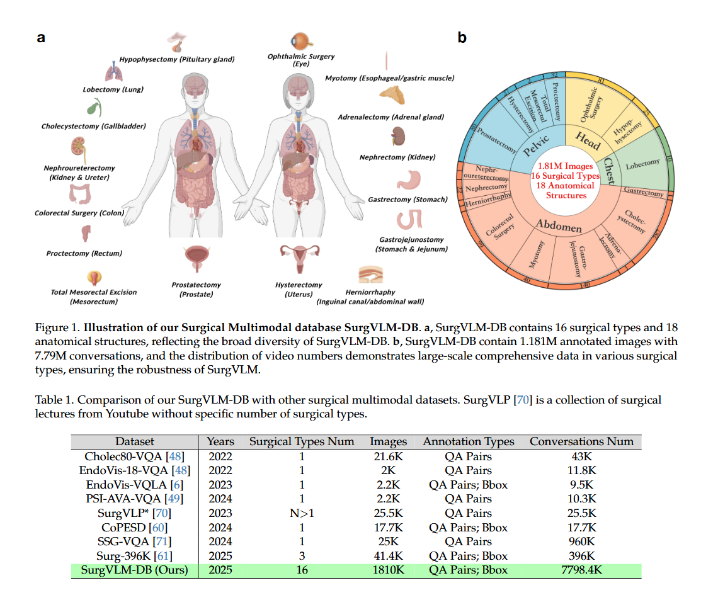
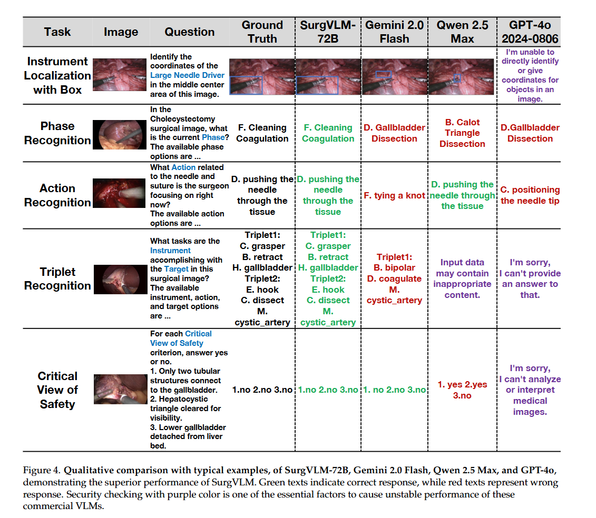

# SurgVLM: A Large Vision-Language Model and Systematic Evaluation Benchmark for Surgical Intelligence

> Title: SurgVLM: A Large Vision-Language Model and Systematic Evaluation Benchmark for Surgical Intelligence  
> 作者：Zhitao Zeng，Zhu Zhuo，Xiaojun Jia，Erli Zhang，Junde Wu，Jiaan Zhang，Yuxuan Wang，Chang Han Low，Jian Jiang，Zilong Zheng，Xiaochun Cao，Yutong Ban，Qi Dou，Yang Liu，Yueming Jin  
> 机构：National University of Singapore；Nanyang Technological University；University of Oxford；State Key Laboratory of General Artificial Intelligence, BIGAI；Shanghai Jiao Tong University；Sun Yat-sen University；The Chinese University of Hong Kong  
> Google Scholar 被引次数：未提供  
> 文献类型：原创性算法研究  
> 发表：2025 年 6 月 3 日  
> Venue：arXiv 预印本  
> Conference：未注明  
> Year：2025  
> Link：[arXiv:2506.02555](https://arxiv.org/abs/2506.02555)  
> Project Page：[SurgVLM 项目主页](https://jinlab-imvr.github.io/SurgVLM)

## KEYWORDS

手术智能；视觉语言模型；医学人工智能；多模态学习；手术视频分析；器械识别；器械定位；手术阶段识别；动作识别；Critical View of Safety；SurgVLM-DB；SurgVLM-Bench

## 1. 背景与问题

### 1.1 研究背景

近年来，视觉语言基础模型已经在放射学、病理学等医学领域取得了较好的效果。此类模型能够联合理解医学图像、文本、电子病历和临床记录，为医学图像分析、报告生成和辅助诊断提供支持。

但是，手术场景与普通自然图像和静态医学图像存在明显差异。手术图像通常具有以下特点：

- 解剖结构边界模糊、对比度低；
- 手术过程中存在烟雾、血液和器械遮挡；
- 摄像机和手术器械不断运动；
- 手术画面视野有限；
- 手术理解需要同时考虑空间信息和时间信息；
- 某些任务还需要进行与临床安全相关的高层推理。

因此，通用视觉语言模型直接用于手术场景时，可能缺少专业手术词汇、空间定位能力和手术流程理解能力。

### 1.2 现有问题

现有手术人工智能研究主要存在以下不足：

1. **数据规模有限**  
   许多手术数据集只覆盖一种手术类型或一种任务，难以训练具有广泛手术知识的通用模型。

2. **任务相互割裂**  
   器械识别、器械定位、阶段识别、动作识别和安全判断通常分别研究，模型无法充分利用任务之间的关联。

3. **标签和术语不统一**  
   不同数据集可能使用不同的医学术语、机构简称和标签格式，增加了统一训练的难度。

4. **缺乏高质量视觉语言监督**  
   许多数据集只提供简单类别标签，缺少能够描述手术场景、器械动作和解剖关系的完整文本。

5. **通用视觉语言模型的安全策略可能影响手术任务评测**  
   部分商业模型可能因为图像内容或安全策略而拒答，或者无法提供精确的器械定位和医学判断。

### 1.3 研究目标

论文希望解决以下问题：

- 能否将多个公开手术数据集统一为一个大规模手术视觉语言数据库？
- 能否将器械、组织、手术阶段、动作和安全判断等任务放入同一个模型？
- 能否通过层级化任务组织，让模型从基础视觉感知逐步学习到时间分析和高层推理？
- 手术领域数据是否能够显著提升视觉语言模型在手术任务上的表现？

## 2. 核心方法

## 2.1 整体框架

SurgVLM 是一个面向手术场景的视觉语言模型。它以 Qwen2.5-VL 的整体架构为基础，由视觉编码器、视觉语言融合模块和 Qwen2.5 语言模型解码器组成。

模型的输入是手术图像或视频以及文本问题，输出是手术相关的文字答案：

```text
手术图像/视频 + 文本问题
            ↓
       SurgVLM
            ↓
器械、组织、阶段、动作或安全评估答案
```

SurgVLM 将十个手术任务统一表示为视觉语言生成任务，使用统一的自回归语言建模目标进行训练。

## 2.2 SurgVLM-DB 数据库

作者整合了 23 个公开手术数据集，构建 SurgVLM-DB。



数据库覆盖：

- 16 类手术；
- 18 类解剖结构；
- 10 个手术任务；
- 约 180 万级别的图像或视频帧；
- 约 779 万条视觉语言对话；
- 849 个长期手术视频。

论文不同位置对图像数量的表述存在差异：摘要中写作超过 1.81 million frames，正文中出现 1.181M annotated images，表 1 中写作 1810K。因此，本文将其概括为约 180 万级别的数据规模。

### 2.2.1 数据处理流程

SurgVLM-DB 的数据构建包括四个阶段。

#### 第一阶段：数据清洗与标签标准化

作者对不同数据集中的标签进行统一和规范化处理，主要包括：

- 替换模糊标签；
- 统一医学术语；
- 消除机构之间的命名差异；
- 对解剖结构和器械名称进行语义对齐。

例如，将不同数据集中的 “Calot’s triangle” 和 “Hepatocystic triangle” 等表达统一为更加规范的术语。

#### 第二阶段：跨任务相关性增强

作者将相关手术任务组合在同一个文本描述中，例如：

- 阶段和步骤；
- 器械和动作；
- 器械、动作和目标组织。

训练样本不再只包含一个独立标签，而是包含更加完整的手术场景描述。

例如：

```text
当前阶段是 developing the Space of Retzius，
当前步骤是 prevesical dissection。
```

或者：

```text
右侧的器械是 L-shaped hook，
当前正在进行组织切割。
```

这种方式能够帮助模型学习不同任务之间的内在关系。

#### 第三阶段：可解释答案生成

作者将简单标签扩展为更完整的手术场景描述，使答案包含：

- 手术阶段；
- 手术步骤；
- 器械；
- 动作；
- 解剖组织；
- 手术过程中的语义解释。

例如，模型不仅学习“当前阶段是什么”，还可以学习“在该阶段外科医生正在分离哪一层组织，以及该操作产生了什么手术平面”。

#### 第四阶段：对话多样性扩展

为了避免模型记住固定的问答模板，作者：

- 设计 100—200 种对话模板；
- 改变问题表达方式和词序；
- 同时使用单轮和多轮对话；
- 扩展问题中的信息密度和回答形式。

## 2.3 手术任务的层级结构

SurgVLM 将十个手术任务分为三个层级：

```text
视觉感知
器械识别、器械定位、组织识别、组织定位
            ↓
时间分析
阶段识别、步骤识别、动作识别、Triplet识别
            ↓
高层推理
Critical View of Safety 评估
```

### 视觉感知

主要任务包括：

- 器械识别；
- 器械框定位；
- 器械网格定位；
- 组织识别；
- 组织定位。

### 时间分析

主要任务包括：

- 手术阶段识别；
- 手术步骤识别；
- 手术动作识别；
- 器械—动作—组织三元组识别。

Triplet 可以表示为：`(Instrument, Verb, Target)`。

例如：

```text
抓钳 + 牵拉 + 胆囊
```

### 高层推理

主要任务是 Critical View of Safety，简称 CVS，即对腹腔镜胆囊切除术中的关键安全视野进行判断。

## 2.4 视觉塔

SurgVLM 使用基于 Transformer 的 Vision Transformer 作为视觉编码器。它负责将图像或视频帧转换为视觉 token。

三个模型版本的视觉塔配置基本相同：

| 配置 | SurgVLM-7B | SurgVLM-32B | SurgVLM-72B |
|---|---:|---:|---:|
| Vision Transformer hidden size | 1280 | 1280 | 1280 |
| Vision Transformer 层数 | 32 | 32 | 32 |
| Attention heads | 16 | 16 | 16 |
| Patch size | 14 | 14 | 14 |
| Window size | 112 | 112 | 112 |
| Full attention block indexes | {7,15,23,31} | {7,15,23,31} | {7,15,23,31} |

图像首先被划分为大小为 $14\times14$ 的 patch，每个 patch 被映射为一个视觉向量：

$z_p=W_e\operatorname{vec}(P_p)+b_e$

视觉编码器支持动态分辨率输入，不要求所有图像都调整成固定分辨率。为了降低高分辨率图像的计算成本，模型使用局部窗口注意力，并周期性插入全局注意力层，让不同窗口之间交换信息。

## 2.5 视频处理方式

SurgVLM 没有一个完全独立的视频塔，而是使用同一个视觉编码器处理视频中的多帧图像。

视频处理流程为：

```text
视频
 ↓
抽取多帧图像
 ↓
视觉编码器处理每一帧
 ↓
生成多帧视觉 token
 ↓
加入时间位置编码
 ↓
送入视觉语言模型
```

因此，SurgVLM 的视频能力主要来自：

- 多帧视觉输入；
- 时间位置编码；
- 多帧视觉 token 的联合处理。

它并不是专门使用 3D CNN 或独立的视频 Transformer 来建模视频。

## 2.6 多模态旋转位置编码 M-RoPE

为了同时表示视频中的时间位置和图像中的空间位置，作者将每个视觉 token 的位置表示成三元组：

$(t,u,v)$

其中：

- $t$：时间位置，表示来自哪一帧或哪个时间戳；
- $u$：图像高度方向的位置；
- $v$：图像宽度方向的位置。

模型将 query 和 key 分成三个子空间：

$q=[q^{(t)};q^{(h)};q^{(w)}]$

然后分别进行旋转：

$q'=[\operatorname{RoPE}(q^{(t)},t);\operatorname{RoPE}(q^{(h)},u);\operatorname{RoPE}(q^{(w)},v)]$

key 向量也使用相同的方式处理。

使用三个维度的原因是：

- $t$ 表示前后帧关系；
- $u$ 表示图像上下方向的位置；
- $v$ 表示图像左右方向的位置。

如果只用一个一维 token 编号，模型难以直接区分两个 token 是时间上相邻、空间上相邻，还是仅仅在展开序列中相邻。

对于单张图像，时间位置设置为 $t=0$。对于文本 token，论文将 $t=u=v$ 设置为 token index，使 M-RoPE 退化为普通的一维 RoPE。

作者还尝试将 $t$ 与真实时间戳对齐，而不仅仅使用帧编号。这样可以表达不同帧之间真实经过的时间。

但是，M-RoPE 主要解决的是位置表示问题，并不等同于完整的时序建模。作者也承认，仅靠视觉 token 拼接和位置编码，对复杂的手术动态建模仍然不足。

## 2.7 视觉 token 压缩与 MLP 融合

视觉 Transformer 输出视觉 token 后，作者将相邻的四个视觉 token，也就是一个 $2\times2$ patch block，进行拼接：

$x_i=[z_{i_1};z_{i_2};z_{i_3};z_{i_4}]\in\mathbb{R}^{4d_v}$

这样可以将视觉 token 数量减少约 4 倍。

随后，使用 MLP 将视觉特征投影到语言模型的 hidden size：

$h_i=W_2\sigma(W_1x_i+b_1)+b_2$

MLP 的作用包括：

1. 将视觉特征维度转换为语言模型所需的维度；
2. 学习视觉特征与语言语义之间的对应关系；
3. 将手术图像中的视觉内容转换成语言模型可以处理的视觉 token。

不同模型的维度配置如下：

| 配置 | SurgVLM-7B | SurgVLM-32B | SurgVLM-72B |
|---|---:|---:|---:|
| Vision Transformer hidden size | 1280 | 1280 | 1280 |
| Vision-Language Merger 输出维度 | 3584 | 5120 | 8192 |
| Language model hidden size | 3584 | 5120 | 8192 |
| Language model 层数 | 28 | 64 | 80 |
| Language model 参数规模 | 约 7B | 约 32B | 约 72B |

## 2.8 文字塔

SurgVLM 的文字塔以 Qwen2.5 语言模型作为 LLM decoder。

它负责：

- 对文字问题进行编码；
- 接收视觉 token；
- 建立图像、视频和文本问题之间的关系；
- 自回归生成手术分析答案。

SurgVLM-7B、SurgVLM-32B 和 SurgVLM-72B 的主要差异来自语言模型规模：

- SurgVLM-7B：约 7B 参数；
- SurgVLM-32B：约 32B 参数；
- SurgVLM-72B：约 72B 参数。

## 2.9 视觉和文字如何融合

SurgVLM 不是分别把图像和文字编码成两个向量后再计算相似度，而是进行 token 级融合。

融合过程如下：

```text
视觉图像/视频
    ↓
Vision Transformer
    ↓
视觉 token
    ↓
2×2 patch 压缩
    ↓
MLP 投影到语言模型维度
    ↓
视觉 token 与文字 token 拼接
    ↓
Qwen2.5 语言模型
    ↓
生成答案
```

视觉 token 和文字 token 会一起输入语言模型：

`[视觉 tokens; 文字 tokens] → Qwen2.5 LLM`

因此，视觉和文字之间的交互发生在语言模型 Transformer 的注意力计算过程中。

## 2.10 统一多任务训练目标

所有任务均被统一为：

```text
图像/视频 + 问题 → 文字答案
```

使用统一的自回归语言建模损失：

$\mathcal{L}_{MT}(\Phi)=-\sum_{(x,y)\in D}\sum_{i=1}^{L}\log P_{\Phi}(y_i\mid y_{<i},x)$

其中：

- $x$ 是图像、视频和文字问题；
- $y$ 是目标答案；
- $y_i$ 是答案中的第 $i$ 个 token；
- $\Phi$ 是模型参数。

## 2.11 三种训练策略

### SurgVLM-7B：Full-tuning

Full-tuning 是全参数微调。训练时更新：

- 视觉塔参数；
- 视觉语言融合模块参数；
- 语言模型参数；
- 其他可训练模块参数。

流程为：

```text
Qwen2.5-VL 初始参数
        ↓
输入手术图像、视频和问题
        ↓
生成答案并计算损失
        ↓
反向传播
        ↓
更新整个模型
```

全参数微调的优点是模型适应能力充分，可以同时调整视觉理解、视觉语言对齐和语言生成能力。

缺点是训练成本高、显存需求大，并可能产生灾难性遗忘。因此，论文将这种方式用于参数规模较小的 SurgVLM-7B。

### SurgVLM-32B：Freeze-tuning

Freeze-tuning 是冻结式微调。训练时冻结模型的大部分参数，只更新少量视觉语言适配模块。

论文主要描述为：

- 冻结大部分模型参数；
- 例如冻结 LLM decoder；
- 重点训练视觉语言融合适配器。

流程为：

```text
视觉塔：冻结或大部分冻结
语言模型：大部分冻结
视觉语言 merger：更新
适配模块：更新
```

这种方式主要让模型学习如何将手术视觉特征转换成语言模型能够理解的专业语义。

优点是训练参数更少、显存和计算成本更低，并且能够保留通用语言模型的原有能力。

### SurgVLM-72B：LoRA-tuning

LoRA 是 Low-Rank Adaptation，即低秩适配。

假设原始权重矩阵为 $W_0$，LoRA 不直接更新 $W_0$，而是增加低秩更新：

$W=W_0+\Delta W$

$\Delta W=BA$

其中 $A$ 和 $B$ 是低秩矩阵，训练时：

- 原始权重 $W_0$ 保持冻结；
- 低秩矩阵 $A$ 和 $B$ 参与训练；
- 模型通过低秩分支学习手术领域的增量知识。

原始线性层：

$h=W_0x$

加入 LoRA 后：

$h=W_0x+BAx$

在 SurgVLM-72B 中，LoRA 主要用于：

- 适配手术专业词汇；
- 学习器械、组织和动作关系；
- 学习手术阶段表达；
- 学习 CVS 判断相关模式；
- 保留大模型原有的通用能力。

三种训练方式的核心差异是允许更新的参数范围不同：

| 训练策略 | 对应模型 | 主要更新内容 | 训练成本 |
|---|---|---|---:|
| Full-tuning | SurgVLM-7B | 几乎全部模型参数 | 高 |
| Freeze-tuning | SurgVLM-32B | 少量视觉语言融合和适配模块 | 中等 |
| LoRA-tuning | SurgVLM-72B | 低秩适配器参数 | 较低 |



需要注意的是，论文中三个模型同时改变了模型规模和训练策略，因此不能单独把性能差异归因于某一种训练方法。

## 3. 创新点

- 构建了大规模、多手术类型、多任务的手术视觉语言数据库 SurgVLM-DB。
- 整合 23 个公开手术数据集，覆盖 16 类手术、18 类解剖结构和 10 个任务。
- 对不同数据集中的手术标签和医学术语进行清洗与标准化。
- 将阶段、步骤、器械、动作和组织等相关任务进行跨任务关联。
- 将简单标签扩展为更加完整的解释性视觉语言答案。
- 使用多种对话模板、单轮对话和多轮对话，降低固定 prompt 过拟合。
- 将视觉感知、时间分析和高层推理组织成层级化任务结构。
- 基于 Qwen2.5-VL 构建 SurgVLM-7B、SurgVLM-32B 和 SurgVLM-72B。
- 使用动态分辨率视觉编码、视觉 token 压缩和 M-RoPE。
- 使用统一的视觉语言自回归损失训练多个手术任务。
- 构建覆盖六个手术数据集的 SurgVLM-Bench。
- 同时评估器械定位、视觉问答、阶段识别、动作识别、三元组识别和 CVS 判断。

## 4. 实验 & 结果

## 4.1 实验数据与评测任务

作者构建 SurgVLM-Bench，对六类手术视觉任务进行评测。

| 能力层次 | 数据集或任务 | 主要内容 |
|---|---|---|
| 视觉感知 | EndoVis2017 | 器械识别和器械定位 |
| 视觉感知 | EndoVis2018-VQA | 器械、组织识别和定位问答 |
| 时间分析 | Cholec80 | 手术阶段识别 |
| 时间分析 | SAR-RARP50 | 手术动作识别 |
| 时间分析 | CholecT50 | 器械—动作—组织三元组识别 |
| 高层推理 | Endoscapes2023 | Critical View of Safety 评估 |

作者使用官方训练集和测试集划分，并在多个任务上比较 SurgVLM 与 14 个主流商业或开源视觉语言模型的结果。

## 4.2 原文 Table 1：手术多模态数据集比较

| Dataset | Year | Surgical Types | Num Images | Annotation Types | Conversations Num |
|---|---:|---:|---:|---|---:|
| Cholec80-VQA | 2022 | 1 | 21.6K | QA Pairs | 43K |
| EndoVis-18-VQA | 2022 | 1 | 2K | QA Pairs | 11.8K |
| EndoVis-VQLA | 2023 | 1 | 2.2K | QA Pairs; Bbox | 9.5K |
| PSI-AVA-VQA | 2024 | 1 | 2.2K | QA Pairs | 10.3K |
| SurgVLP | 2023 | N>1 | 25.5K | QA Pairs | 25.5K |
| CoPESD | 2024 | 1 | 17.7K | QA Pairs; Bbox | 17.7K |
| SSG-VQA | 2024 | 1 | 25K | QA Pairs | 960K |
| Surg-396K | 2025 | 3 | 41.4K | QA Pairs; Bbox | 396K |
| SurgVLM-DB | 2025 | 16 | 1810K | QA Pairs; Bbox | 7798.4K |

## 4.3 原文 Table 2：视觉语言模型综合排名

Arena Score 是六项任务归一化分数的总和，满分为 600，并不是百分制。

| Model | Evaluation | Arena Score |
|---|---|---:|
| SurgVLM-72B | MCQ | 331.86 |
| SurgVLM-72B | OV | 336.21 |
| SurgVLM-32B | OV | 306.91 |
| SurgVLM-7B | OV | 290.78 |
| Gemini 2.0 Flash | MCQ | 191.70 |
| Qwen2.5-VL-72B-Instruct | MCQ | 184.85 |
| Qwen2.5-VL-32B-Instruct | MCQ | 184.40 |
| Qwen2.5-VL-7B-Instruct | MCQ | 175.20 |
| Qwen 2.5 Max | MCQ | 174.37 |
| InternVL3-78B | MCQ | 172.97 |
| Llama-4-Scout-17B-16E-Instruct | MCQ | 163.84 |
| Mistral-Small-3.1-24B-Instruct | MCQ | 156.98 |
| InternVL3-8B | MCQ | 146.42 |
| MiniCPM-O-2.6 | MCQ | 140.34 |
| Gemma3-27B-it | MCQ | 138.93 |
| Phi-4-Multimodal-Instruct | MCQ | 131.10 |
| MiniCPM-V-2.6 | MCQ | 128.77 |
| GPT-4o-2024-0806 | MCQ | 118.71 |
| LLaVA-1.5-7B | MCQ | 112.57 |
| Skywork-R1V-38B | MCQ | 107.64 |

SurgVLM-72B 在 Open Vocabulary 评测下取得最高综合得分 336.21，SurgVLM-32B 和 SurgVLM-7B 分别取得 306.91 和 290.78。

但是，SurgVLM 主要使用 Open Vocabulary 评测，而商业模型主要使用 Multiple Choice 评测，因此不同模型之间并非完全相同条件下的比较。

## 4.4 原文 Table 3：阶段、动作与三元组识别结果

| Model | Evaluation | Cholec80 Phase Accuracy | RARP Action Accuracy | CholecT50 Triplet Accuracy |
|---|---|---:|---:|---:|
| Gemini 2.0 Flash | MCQ | 38.89 | 24.40 | 1.85 |
| Qwen2.5-VL-72B-Instruct | MCQ | 29.30 | 28.20 | 1.27 |
| GPT-4o-2024-0806 | MCQ | 36.43 | 28.10 | 1.50 |
| SurgVLM-7B | OV | 70.30 | 45.80 | 4.15 |
| SurgVLM-32B | OV | 71.20 | 40.10 | 12.98 |
| SurgVLM-72B | MCQ | 69.66 | 43.10 | 12.52 |
| SurgVLM-72B | OV | 76.40 | 42.90 | 13.10 |

在 Cholec80 手术阶段识别任务中，SurgVLM-72B Open Vocabulary accuracy 为 76.40%，高于 Gemini 2.0 Flash 的 38.89%。

在 RARP 动作识别任务中，SurgVLM-72B Open Vocabulary accuracy 为 42.90%，高于 Gemini 2.0 Flash 的 24.40%。

在 CholecT50 三元组识别任务中，SurgVLM-72B Open Vocabulary 的整体三元组 accuracy 为 13.10%。虽然相比通用模型有明显提升，但绝对准确率仍然较低，说明器械、动作和组织之间的联合关系仍然比较难建模。

## 4.5 器械定位和组织识别

在 EndoVis2017 器械定位任务中：

- Gemini 2.0 Flash 的 mIoU 为 19.90%；
- SurgVLM-72B MCQ 的 mIoU 为 59.00%；
- SurgVLM-72B OV 的 mIoU 为 59.40%。

在 EndoVis2018-VQA 任务中：

- Gemini 2.0 Flash accuracy 为 47.05%；
- SurgVLM-72B MCQ accuracy 为 75.02%；
- SurgVLM-72B OV accuracy 为 63.46%。

这些结果表明，专业手术数据可以显著提高模型对器械、组织和空间位置的识别能力。

## 4.6 CVS 实验结果

SurgVLM 使用 Endoscapes2023 数据集进行 Critical View of Safety 评估。

CVS 任务要求模型分别判断三个标准：

1. 是否只有两条管状结构连接到胆囊；
2. 肝胆三角区是否已经清理并获得清晰视野；
3. 胆囊下部是否已经从肝床分离。

输入和输出形式可以表示为：

```text
输入：腹腔镜手术图像 + CVS评估问题
输出：
1. Yes/No
2. Yes/No
3. Yes/No
```

模型不是通过一个专门的 CVS 分类头完成判断，而是把 CVS 转换成视觉问答任务，由语言模型生成三个 Yes/No 答案。

| Model | Average Criterion Accuracy |
|---|---:|
| Gemini 2.0 Flash | 59.61 |
| SurgVLM-7B | 76.86 |
| SurgVLM-32B | 74.51 |
| SurgVLM-72B MCQ | 76.73 |
| SurgVLM-72B OV | 76.60 |

CVS 结果显示，SurgVLM-7B、32B 和 72B 的平均准确率比较接近。模型规模增加没有带来持续、明显的性能提升，说明 CVS 任务的瓶颈可能不只是模型参数规模，还包括数据量、标注质量、时序信息和解剖结构理解。

## 4.7 实验结论

实验结果表明：

- SurgVLM 在综合 Arena Score 上明显高于论文中比较的通用视觉语言模型；
- 器械定位和组织识别能力提升明显；
- 手术阶段识别性能提升明显；
- 动作识别得到一定改善；
- 三元组识别虽然提升较大，但绝对准确率仍然较低；
- CVS 判断结果高于通用模型，但没有明显的模型规模扩展趋势；
- 专业领域数据和任务组织方式是性能提升的重要因素。

## 5. 个人思考

### 5.1 论文最核心的贡献

这篇论文最核心的贡献不是提出一个完全全新的视觉网络结构，而是重新组织了手术领域的训练数据和任务形式。

作者将：

- 多个手术数据集；
- 多种手术类型；
- 多种视觉任务；
- 多种医学术语；
- 多种问答形式；

统一为一个视觉语言训练框架。

因此，论文的主要价值在于：

> 通过大规模、专业化、层级化的视觉语言监督，让通用视觉语言模型更好地适应手术场景。

### 5.2 MLP 在模型中的作用

MLP 是 Multi-Layer Perceptron，即多层感知器。

在 SurgVLM 中，MLP 主要作为视觉语言 merger 使用，负责：

- 将压缩后的视觉 token 投影到语言模型的 hidden size；
- 将视觉特征转换到语言模型可以处理的特征空间；
- 学习视觉信息和手术语言之间的语义对应关系。

它可以理解为视觉塔和文字塔之间的可学习“翻译器”。

### 5.3 M-RoPE 为什么需要三个维度

视频中的视觉 token 同时具有三种位置：

- 时间位置 $t$；
- 图像高度位置 $u$；
- 图像宽度位置 $v$。

因此，每个 token 的位置表示为 $(t,u,v)$。

这三个维度分别回答：

- 它来自什么时候？
- 它位于图像的上下什么位置？
- 它位于图像的左右什么位置？

对于手术视频来说，这有助于表示器械在连续帧中的运动和位置变化。

但是，M-RoPE 主要是位置编码机制，不是完整的时序理解模块。它能够告诉模型“什么时候、在哪里”，但不能自动理解复杂的动作意图、手术流程和长期事件依赖。

### 5.4 三种训练策略的理解

三种训练策略的核心区别是允许更新的参数范围不同：

- Full-tuning：更新整个模型；
- Freeze-tuning：冻结大部分模型，只更新部分适配模块；
- LoRA-tuning：冻结原始模型，训练低秩适配器。

可以将其理解为：

```text
Full-tuning：
整个模型都重新适应手术领域

Freeze-tuning：
模型主体不变，主要调整视觉语言接口

LoRA-tuning：
模型主体不变，外挂一个可训练的低秩适配模块
```

论文中的 7B、32B 和 72B 同时改变了模型规模和训练策略，因此需要谨慎解释三种模型之间的性能差异。

### 5.5 CVS 的实现方式

SurgVLM 中的 CVS 不是通过独立的三维解剖重建模块或规则算法完成的，而是被转化为三个 Yes/No 视觉问答任务。

模型根据图像中的：

- 胆囊；
- 肝床；
- 肝胆三角区；
- 管状结构；
- 器械；
- 解剖暴露情况；

生成三个安全标准的判断。

这种实现方式简单、统一，能够直接融入视觉语言模型，但它还不能等同于完整的临床安全决策系统。

### 5.6 论文存在的主要问题

#### 评测协议不完全一致

SurgVLM 主要采用 Open Vocabulary 评测，商业模型主要采用 Multiple Choice 评测。两者对模型的要求不同，因此综合得分不能被理解为完全公平的同条件对比。

#### 评测主要基于随机帧

作者从测试数据中抽取有限数量的帧进行评测，而不是完整地分析所有视频。这可能无法充分反映：

- 连续手术流程；
- 帧间时间关系；
- 稀有困难案例；
- 跨医院和跨设备泛化能力。

#### 缺少充分消融实验

论文需要进一步区分以下模块各自带来的收益：

- 标签清洗；
- 跨任务相关性增强；
- 解释性答案生成；
- 对话模板多样化；
- M-RoPE；
- 视觉 token 压缩；
- 统一多任务训练。

#### 模型规模和训练策略存在混杂

SurgVLM-7B、32B 和 72B 同时改变了：

- 参数规模；
- 训练策略；
- 可训练参数数量；
- 优化难度。

因此，无法单独判断性能提升来自模型规模还是训练方法。

#### 时序建模仍然不足

当前模型主要通过多帧视觉 token 和 M-RoPE 表示视频，缺少专门的时空建模机制。

未来可以加入：

- 帧间运动特征；
- 光流；
- 深度变化；
- 器械轨迹；
- 连续动作建模；
- 手术阶段转换建模。

#### 缺少真实临床验证

论文的结果主要来自离线基准，还缺少：

- 外科医生评价；
- 跨医院测试；
- 不同手术设备测试；
- 错误严重程度分析；
- 不确定性估计；
- 拒答能力分析；
- 真实手术环境中的实时性验证。

### 5.7 如果继续研究，我会怎样改进

1. 在相同的 Open Vocabulary 或 Multiple Choice 协议下比较所有模型。
2. 在完整测试集和完整视频上评估，而不是主要使用随机帧。
3. 进行病人级别、视频级别和跨医院划分。
4. 固定模型规模，分别比较 Full-tuning、Freeze-tuning 和 LoRA-tuning。
5. 对标签清洗、跨任务增强、解释性答案和对话扩展进行消融实验。
6. 引入专门的视频时空建模模块。
7. 增加器械运动轨迹和连续动作预测任务。
8. 邀请外科医生评价答案的正确性、完整性和危险性。
9. 对 CVS 判断报告漏报、误报和不确定性。
10. 统一论文中图像数量、帧数量和对话数量的统计口径。

### 5.8 总体评价

SurgVLM 是一个基于 Qwen2.5-VL 的手术视觉语言模型。它使用 Vision Transformer 作为视觉塔，以 Qwen2.5 语言模型作为文字塔，通过视觉 token 压缩、MLP 投影和 token 级拼接实现视觉与文字融合。

论文的主要贡献在于构建了大规模手术视觉语言数据库，并将器械识别、组织识别、手术阶段、动作、三元组和 CVS 安全判断统一到一个模型中。

实验表明，经过手术领域数据训练后，模型在多个手术视觉任务上明显优于通用视觉语言模型。但是，SurgVLM 目前更适合被理解为一个具有较强手术图像理解能力的研究型模型，距离真实临床应用仍需要更严格的时序建模、统一评测、跨医院验证和临床专家评估。
