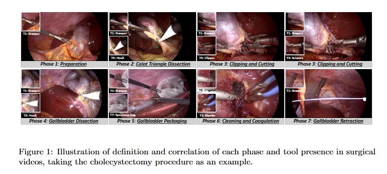
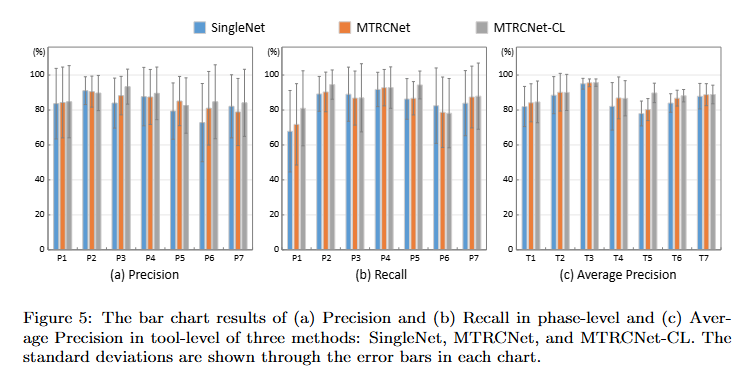

# Multi-Task Recurrent Convolutional Network with Correlation Loss for Surgical Video Analysis

> Title: Multi-Task Recurrent Convolutional Network with Correlation Loss for Surgical Video Analysis  
> KEYWORDS：外科视频分析；多任务学习；相关性损失；卷积神经网络；循环神经网络；手术阶段识别；手术器械检测  
> 作者：Yueming Jin，Huaxia Li，Qi Dou，Hao Chen，Jing Qin，Chi-Wing Fu，Pheng-Ann Heng  
> 机构：香港中文大学计算机科学与工程系；香港科技大学；香港理工大学  
> Google Scholar 被引次数：未记录  
> 发表：预印本发表于 2019 年，正式发表发表于 2020 年  
> Venue：Medical Image Analysis  
> Year：2020  
> Link：[arXiv:1907.06099](https://arxiv.org/abs/1907.06099)  
> Code：[MTRCNet-CL GitHub Repository](https://github.com/YuemingJin/MTRCNet-CL)

## 1. 背景与问题

### 1.1 研究背景

手术视频分析是计算机辅助医疗系统的重要组成部分。自动识别手术阶段和手术器械，可以用于：

- 术中流程监控；
- 异常情况报警；
- 手术决策支持；
- 手术时间估计；
- 手术室资源安排；
- 术后报告生成；
- 手术视频检索和索引；
- 外科医生培训与技能评估。

本文同时研究两个任务：

1. 手术器械存在检测：判断当前视频帧中出现了哪些器械；
2. 手术阶段识别：判断当前视频帧属于哪个手术阶段。

### 1.2 现有问题

已有方法通常将工具检测和手术阶段识别作为两个独立任务处理，没有充分利用两者之间的相关性。

在胆囊切除手术中，不同手术阶段通常会使用不同的器械组合。例如：

- 解剖阶段可能更多使用 Hook；
- 切割和夹闭阶段可能更多使用 Clipper 和 Scissors；
- 牵拉阶段可能更多使用 Grasper。

但这种关系不是简单的一一对应关系：

- 同一种工具可能出现在多个阶段；
- 一个阶段可能同时使用多个工具；
- 某些工具可能只在部分视频帧中出现；
- 视频中存在遮挡、模糊、镜头运动和血液污染等问题。

因此，论文提出的问题是：

> 能否通过多任务学习和相关性建模，让工具检测与阶段识别相互帮助，从而同时提升两个任务的性能？

## 2. 核心方法

本文提出多任务循环卷积网络 MTRCNet-CL。

MTRCNet-CL 包含四个关键组成部分：

1. 共享 CNN 骨干网络；
2. 工具检测分支；
3. LSTM 阶段识别分支；
4. 阶段特征到工具预测的映射矩阵和相关性损失。

### 2.1 模型整体结构


模型的基本流程如下：

```text
输入视频帧序列
        ↓
共享 CNN 骨干网络
        ├── 工具检测分支
        │       ↓
        │   工具预测
        │
        └── LSTM 阶段识别分支
                ↓
            阶段预测
                ↓
             映射矩阵
                ↓
      根据阶段特征推断工具概率
                ↓
       与工具分支预测计算相关性损失
                ↓
              联合优化
```

### 2.2 共享 CNN 骨干网络

作者使用 50 层 ResNet 作为共享骨干网络，从每一帧图像中提取视觉特征。

网络最后输出一个 2048 维特征向量：

```text
输入帧
  ↓
ResNet-50
  ↓
2048维视觉特征
```

共享 CNN 的作用是让两个任务共同学习底层视觉表示。工具检测可以帮助网络关注器械外观，阶段识别则可以帮助网络学习与手术流程相关的视觉特征。

### 2.3 工具检测分支

工具检测被定义为多标签分类问题。

一帧图像中可能同时出现多个工具，因此不能使用普通的单标签 Softmax 分类，而是为每种工具分别输出一个 Sigmoid 概率：

```text
当前帧
  ↓
工具检测分支
  ↓
[Grasper, Bipolar, Hook, Scissors, Clipper, Irrigator, Specimen bag]
  ↓
[0.9, 0.2, 0.7, 0.1, 0.8, 0.0, 0.1]
```

工具分支使用多标签逻辑损失：

$$
\mathcal{L}_{T}
=
-\sum_{c\in C}
\left(
y^{T}_{t,c}\log(\hat{p}_{t,c})
+
(1-y^{T}_{t,c})\log(1-\hat{p}_{t,c})
\right)
$$

其中：

- $t$ 表示第 $t$ 帧；
- $c$ 表示第 $c$ 类工具；
- $y^{T}_{t,c}$ 表示真实标签；
- $\hat{p}_{t,c}$ 表示工具分支预测出的工具存在概率。

### 2.4 LSTM 阶段识别分支

手术阶段识别不能只依赖当前帧，还需要观察之前的手术过程。例如，单帧画面可能同时符合多个阶段，但结合历史帧后就可以判断手术流程处于哪个阶段。

因此，作者在阶段分支中使用 LSTM：

```text
第1帧特征 ─┐
第2帧特征 ─┼→ LSTM → 阶段预测
第3帧特征 ─┘
```

LSTM 通过隐藏状态保存历史信息，学习手术视频中的时间依赖和阶段变化。

阶段识别是七分类任务，使用 Softmax 交叉熵损失：

$$
\mathcal{L}_{P}
=
-\log \hat{p}^{z=y^{P}_{t}}_{t}
$$

其中：

- $y^{P}_{t}$ 表示第 $t$ 帧的真实手术阶段；
- $\hat{p}^{z}_{t}$ 表示模型认为第 $t$ 帧属于阶段 $z$ 的概率。

### 2.5 映射矩阵

作者认为，阶段分支的 LSTM 特征中包含了与工具使用相关的信息。因此，可以利用阶段分支的特征推断工具存在概率。

设 LSTM 在第 $t$ 帧输出的特征为 $r_t$，通过映射矩阵得到工具先验：

$$
\tilde{p}_{t,c}
=
\operatorname{Sigmoid}(M(r_t;\theta_M))
$$

其中：

- $r_t$：阶段分支的时空特征；
- $M$：从阶段特征到工具标签的映射矩阵；
- $\tilde{p}_{t,c}$：由阶段分支推断出的第 $c$ 类工具存在概率。

这里不是直接把“阶段类别”映射成“工具类别”，而是将 LSTM 的高维时空特征映射到工具标签空间。

相比直接使用阶段标签，阶段特征包含更多信息：

- 当前阶段的视觉状态；
- 前面若干帧的历史信息；
- 手术阶段变化趋势；
- 当前操作的时空特征。

### 2.6 相关性损失

工具分支和阶段分支分别产生两组工具概率：

- 工具分支直接得到 $\hat{p}_{t,c}$；
- 阶段分支通过映射矩阵得到 $\tilde{p}_{t,c}$。

相关性损失要求这两组预测保持一致。

对于某一类工具，作者将“存在”和“不存在”构造成二元概率分布：

$$
\hat{p}'_{t,c}
=
[\hat{p}_{t,c},1-\hat{p}_{t,c}]
$$

$$
\tilde{p}'_{t,c}
=
[\tilde{p}_{t,c},1-\tilde{p}_{t,c}]
$$

然后计算两个分布之间的双向 KL 散度：

$$
\mathcal{L}_{co}
=
\sum_{c\in C}
\left[
\frac{1}{2}
D_{\mathrm{KL}}
\left(
\hat{p}'_{t,c}
\middle\|
\tilde{p}'_{t,c}
\right)
+
\frac{1}{2}
D_{\mathrm{KL}}
\left(
\tilde{p}'_{t,c}
\middle\|
\hat{p}'_{t,c}
\right)
\right]
$$

直观上：

```text
工具分支：根据当前图像判断工具
阶段分支：根据手术流程判断可能出现的工具
                ↓
        比较两者是否一致
                ↓
          计算相关性损失
```

如果工具分支认为 Clipper 的存在概率为 0.90，而阶段分支推断概率为 0.85，那么两个分布比较接近，相关性损失较小。

如果工具分支预测为 0.20，而阶段分支预测为 0.90，那么两个分布差异较大，相关性损失增大，模型会受到惩罚。

### 2.7 总体损失函数

论文的总体损失由三类任务损失和权重衰减组成：

$$
\mathcal{L}
=
\mathcal{L}_{T}
+
\lambda_1\mathcal{L}_{P}
+
\lambda_2\mathcal{L}_{co}
+
\lambda_3\|W\|_2^2
$$

其中：

- $\mathcal{L}_{T}$：工具检测损失；
- $\mathcal{L}_{P}$：阶段识别损失；
- $\mathcal{L}_{co}$：相关性损失；
- $\|W\|_2^2$：权重衰减；
- $\lambda_1,\lambda_2,\lambda_3$：不同损失的权重。

### 2.8 三阶段训练策略

作者没有直接从随机映射矩阵开始联合训练，而是采用三阶段训练：

1. 使用 ImageNet 预训练模型初始化共享 CNN，先训练工具分支和阶段分支；
2. 冻结主网络，只训练阶段特征到工具标签的映射矩阵；
3. 解冻全部网络，将工具损失、阶段损失和相关性损失联合优化。

这样可以避免随机映射矩阵在训练初期产生错误的工具先验，干扰两个主要任务的学习。

## 3. 创新点

### 3.1 将工具检测和手术阶段识别统一到一个多任务网络中

过去很多方法分别训练工具检测模型和阶段识别模型。本文通过共享 CNN，使两个任务共同学习视觉表示。

### 3.2 在阶段分支中使用 LSTM 建模时间信息

阶段识别不仅依赖当前帧，还依赖手术流程的历史信息。LSTM 能够对连续视频帧进行建模，并将时序信息端到端地纳入训练。

### 3.3 提出阶段特征到工具标签的映射矩阵

作者没有直接把阶段类别和工具类别硬性对应，而是从阶段分支的时空特征中推断工具概率，保留了更丰富的信息。

### 3.4 提出双向 KL 相关性损失

相关性损失显式约束：

```text
工具分支的工具预测
```

与：

```text
阶段分支推断的工具预测
```

保持一致。

这使得模型不仅共享底层特征，还在高层预测结果之间建立了联系。

### 3.5 设计三阶段训练策略

先训练两个任务，再训练映射矩阵，最后进行联合优化，使相关性损失在训练后期提供更可靠的约束。

## 4. 数据来源

### 4.1 Cholec80 数据集

本文使用 Cholec80 数据集进行实验。

数据集特点：

- 包含 80 段胆囊切除术视频；
- 视频原始帧率为 25 fps；
- 视频分辨率为 1920×1080 或 854×480；
- 每帧都有手术阶段标注；
- 工具标注按照 1 fps 进行重采样；
- 包含 7 个手术阶段；
- 包含 7 类手术器械。

7 个手术阶段为：

1. Preparation；
2. Calot Triangle Dissection；
3. Clipping and Cutting；
4. Gallbladder Dissection；
5. Gallbladder Packaging；
6. Cleaning and Coagulation；
7. Gallbladder Retraction。

7 类手术器械为：

1. Grasper；
2. Bipolar；
3. Hook；
4. Scissors；
5. Clipper；
6. Irrigator；
7. Specimen bag。

工具存在的标注依据单帧视觉信息确定：当至少一半工具尖端可见时，标记该工具在当前帧中存在。

### 4.2 数据划分

实验按照 EndoNet 的设置划分数据：

- 前 40 个视频用于训练；
- 后 40 个视频用于测试。

代码仓库中进一步将数据组织为：

- 32 个视频用于训练；
- 8 个视频用于验证；
- 40 个视频用于测试。

### 4.3 数据预处理

论文中的主要预处理包括：

- 将视频从 25 fps 下采样到 1 fps；
- 将图像缩放到 250×250；
- 训练时进行 224×224 随机裁剪；
- 使用水平翻转进行数据增强；
- 测试时使用中心裁剪或多裁剪；
- 使用 ImageNet 预训练的 ResNet-50 作为共享骨干网络。



## 5. 实验与结果

### 5.1 评价指标

阶段识别使用：

- Precision；
- Recall；
- Accuracy；
- F1 Score。

工具检测使用：

- Average Precision；
- mean Average Precision，mAP。

### 5.2 消融实验

论文比较了三种模型：

- SingleNet：工具检测和阶段识别分别训练；
- MTRCNet：共享 CNN 并联合训练，但不使用相关性损失；
- MTRCNet-CL：共享 CNN、LSTM 和相关性损失。

在 10 秒输入视频片段下，结果如下：

| 模型 | 阶段 Precision | 阶段 Recall | 阶段 Accuracy | 工具 mAP |
|---|---:|---:|---:|---:|
| SingleNet | 82.9% | 84.5% | 86.4% | 85.4% |
| MTRCNet | 85.0% | 85.1% | 87.3% | 87.5% |
| MTRCNet-CL | 86.9% | 88.0% | 89.2% | 89.1% |

结论：

1. MTRCNet 优于 SingleNet，说明多任务学习有效；
2. MTRCNet-CL 优于 MTRCNet，说明相关性损失能够带来额外收益；
3. 相关性损失同时提升了阶段识别和工具检测。



### 5.3 输入视频长度实验

作者比较了 4 秒、6 秒和 10 秒输入片段。

对于 SingleNet，阶段识别准确率从 4 秒输入的 85.3% 提升到 10 秒输入的 86.4%。

对于 MTRCNet，阶段识别准确率从 4 秒输入的 85.9% 提升到 10 秒输入的 87.3%。

这说明更长的时间上下文能够帮助 LSTM 更好地建模手术流程。

### 5.4 与已有工具检测方法比较

| 方法 | Grasper | Bipolar | Hook | Scissors | Clipper | Irrigator | Specimen bag | Mean AP |
|---|---:|---:|---:|---:|---:|---:|---:|---:|
| DPM | 82.3 | 60.6 | 93.4 | 23.4 | 68.4 | 40.5 | 40.0 | 58.4 |
| ToolNet | 84.7 | 85.9 | 95.5 | 60.9 | 79.8 | 73.0 | 86.3 | 80.9 |
| EndoNet | 84.8 | 86.9 | 95.6 | 58.6 | 80.1 | 74.4 | 86.8 | 81.0 |
| MTRCNet-CL | 84.7 | 90.1 | 95.6 | 86.7 | 89.8 | 88.2 | 88.9 | **89.1** |

MTRCNet-CL 的平均工具检测 mAP 为 89.1%，高于 EndoNet 的 81.0%。

其中，Scissors 的 AP 从 EndoNet 的 58.6% 提升到 86.7%，提升较为明显。

### 5.5 与已有阶段识别方法比较

| 方法 | Accuracy | Precision | Recall | F1 Score |
|---|---:|---:|---:|---:|
| Binary Tool | 47.5 | 54.4 | 60.2 | 57.2 |
| Handcrafted + CCA | 38.2 | 39.4 | 41.5 | 40.4 |
| PhaseNet | 78.8 | 71.3 | 76.6 | 73.8 |
| EndoNet | 81.7 | 73.7 | 79.6 | 76.5 |
| SV-RCNet | 85.3 | 80.7 | 83.5 | 82.1 |
| EndoNet + LSTM | 88.6 | 84.4 | 84.7 | 84.5 |
| MTRCNet-CL | **89.2** | **86.9** | **88.0** | **87.4** |

MTRCNet-CL 的阶段识别准确率为 89.2%，F1 Score 为 87.4%，超过了主要对比方法。

### 5.6 映射矩阵和训练策略实验

作者比较了不同的映射矩阵设计和训练策略。

主要结论：

- 先训练主网络，再训练映射矩阵，最后联合训练，效果最好；
- 从阶段特征映射到工具标签优于从阶段标签直接映射到工具标签；
- 只使用单向映射比工具和阶段之间使用互相映射更好；
- 工具分支和阶段分支直接输出平均后进行预测，并没有超过工具分支单独输出。

### 5.7 推理速度

论文报告模型在单 GPU 上的推理速度约为每帧 0.3 秒，作者认为该模型具有实时手术流程分析的应用潜力。

## 6. 相关工作与本文区别

### 6.1 工具检测相关工作

#### 独立 CNN

早期工作使用多个 CNN，分别提取不同工具的视觉特征。

问题是：

- 不同工具之间相互独立；
- 没有充分利用工具共现关系；
- 模型数量可能随着工具类别增加。

#### 多标签分类

后续工作将工具检测定义为多标签分类：

```text
一帧图像 → 多个工具同时存在或不存在
```

这种方式符合手术画面的实际情况，因为一帧中可能同时出现多个器械。

#### VGG 和 GoogLeNet 集成

Wang 等人结合 VGG 和 GoogLeNet，利用多个深度 CNN 提取不同的视觉特征，再进行模型集成。

VGG 结构规整，使用连续的 3×3 卷积，能够提取较强的图像特征。

GoogLeNet 使用 Inception 结构，在同一层使用不同尺度的卷积和池化，从而提取多尺度信息。

二者结合的目的是：

- 从不同网络获得互补特征；
- 提升器械外观识别能力；
- 处理工具大小变化、部分遮挡和复杂背景。

但这种方法主要利用的是多个 CNN 之间的特征互补，并没有同时建模手术阶段识别任务。

#### YOLO 实时检测

Choi 等人使用 YOLO 进行手术工具检测。

YOLO 是单阶段目标检测模型，将目标位置、类别和置信度一次性预测出来，优点是速度快，适合实时场景。

但 YOLO 主要关注：

```text
当前帧中有什么工具，以及工具在哪里
```

它通常不直接建模：

- 工具在时间上的变化；
- 手术阶段之间的转移；
- 工具检测与阶段识别之间的任务关系。

此外，本文工具任务是工具存在检测，而 YOLO 主要是工具定位与目标检测，两者任务定义并不完全相同。

### 6.2 手术阶段识别相关工作

#### 工具信号与 HMM、DTW

Padoy 等人使用工具使用信号，并结合动态时间规整和隐马尔可夫模型进行手术流程识别。

工具信号可以表示为：

```text
时间 t：
Grasper = 1
Hook = 0
Scissors = 1
...
```

这些信号随手术过程变化，可以作为阶段识别的输入。

#### 决策树与手术三元组

Forestier 等人使用工具、解剖结构和手术动作构成的手术三元组，并结合决策树、DTW 和聚类方法识别手术流程。

决策树通过一系列条件判断完成分类：

```text
是否出现某工具？
    ↓
是否存在某种动作？
    ↓
当前解剖结构是什么？
    ↓
判断手术阶段
```

这类方法具有一定可解释性，但依赖人工设计或标注的工具、动作和解剖结构特征。

#### 多视频方法

Padoy 等人同时使用：

- 手术室外部视频；
- 内窥镜视频；
- 工具使用信号。

不同视频提供互补信息：

- 外部视频：医生、护士和手术室整体活动；
- 内窥镜视频：体内组织、器械和具体操作；
- 工具信号：当前使用的器械类别。

整体流程为：

```text
手术室外部视频 → 外部场景特征 ─┐
                                ├→ 信息融合 → HMM → 阶段识别
内窥镜视频     → 体内视觉特征 ─┤
                                │
工具使用信号   → 工具特征 ─────┘
```

其缺点是：

- 需要多个摄像头；
- 视频之间需要时间同步；
- 数据采集和存储成本较高；
- 系统部署复杂；
- 依赖人工设计的特征和传统流程模型。

## 7. 个人思考

### 7.1 相关性损失的本质

相关性损失的关键不是增加一个普通的网络层，而是把领域知识转化成了训练约束：

```text
手术阶段与工具使用有关
        ↓
阶段特征可以推断工具先验
        ↓
工具先验应该与工具分支预测保持一致
        ↓
使用双向 KL 散度进行约束
```

普通多任务学习只是在底层共享特征：

```text
共享 CNN
  ├── 工具损失
  └── 阶段损失
```

本文进一步约束高层预测：

```text
共享 CNN
  ├── 工具预测 ──────┐
  │                  ├→ 相关性损失
  └── 阶段特征 → 工具先验 ┘
```

因此，本文的贡献可以概括为：

> 从“共享网络参数”推进到“显式约束不同任务的预测关系”。

### 7.2 KL 散度是什么

KL 散度，又称相对熵，用于衡量两个概率分布之间的差异：

$$
D_{\mathrm{KL}}(P\|Q)
=
\sum_i P_i\log\frac{P_i}{Q_i}
$$

在本文中：

- $P$ 可以是工具分支的预测分布；
- $Q$ 可以是阶段分支推断出的工具分布。

两个分布越接近，KL 散度越小；差异越大，KL 散度越大。

KL 散度通常不是对称的：

$$
D_{\mathrm{KL}}(P\|Q)
\neq
D_{\mathrm{KL}}(Q\|P)
$$

因此，论文对两个方向都进行计算：

$$
D_{\mathrm{KL}}(\hat{p}'_{t,c}\|\tilde{p}'_{t,c})
$$

和：

$$
D_{\mathrm{KL}}(\tilde{p}'_{t,c}\|\hat{p}'_{t,c})
$$

这样可以让两个分支被视为同等重要。

### 7.3 符号 $p_{t,c}$ 的含义

在本文中：

- $t$：第 $t$ 个视频帧；
- $c$：第 $c$ 类手术器械；
- $\hat{p}_{t,c}$：工具分支预测第 $t$ 帧中第 $c$ 类工具存在的概率；
- $\tilde{p}_{t,c}$：阶段分支根据 LSTM 特征推断第 $t$ 帧中第 $c$ 类工具存在的概率。

作者进一步构造：

$$
\hat{p}'_{t,c}
=
[\hat{p}_{t,c},1-\hat{p}_{t,c}]
$$

其中：

- 第一项表示工具存在的概率；
- 第二项表示工具不存在的概率。

### 7.4 端到端训练

端到端训练是指从输入视频帧到最终预测结果的整个网络，通过统一的损失函数进行联合优化。

在本文中，工具损失、阶段损失和相关性损失都会产生梯度，并通过反向传播更新：

- 共享 CNN；
- 工具检测分支；
- LSTM 阶段分支；
- 映射矩阵。

不过，本文采用了分阶段初始化策略：

1. 先训练工具和阶段分支；
2. 再训练映射矩阵；
3. 最后对整个网络进行联合优化。

因此，本文最终阶段是端到端联合训练，但整个训练过程并不是从随机参数开始一次性训练所有模块。

### 7.5 权重衰减的作用

权重衰减通过在损失函数中加入参数大小惩罚，限制模型参数过大：

$$
\lambda_3\|W\|_2^2
$$

它的主要作用是：

- 减少过拟合；
- 防止模型记住训练视频中的偶然噪声；
- 使模型学习更加平滑的表示；
- 提高测试视频上的泛化能力。

论文实现中使用 SGD 时设置了权重衰减参数，实验代码也保留了相应的优化器配置。

### 7.6 论文的不足

1. 主要在 Cholec80 数据集上验证，数据来源和手术类型较单一；
2. 训练集和测试集来自同一数据集，跨医院、跨设备和跨医生泛化能力仍需验证；
3. 相关性损失依赖阶段和工具之间存在稳定关系；
4. 如果阶段分支预测错误，映射矩阵可能产生错误的工具先验；
5. 工具标签按照单帧定义，而阶段识别依赖时间序列，两个任务的时间属性并不完全一致；
6. 论文主要报告平均指标，对失败案例和跨场景性能分析相对有限；
7. 模型使用较长的视频片段和较复杂的网络，实际手术系统部署还需要进一步评估延迟和计算资源。

### 7.7 如果重新设计实验

如果重新研究这个问题，可以进一步增加：

- 只使用共享 CNN 的消融实验；
- 只使用 LSTM 的消融实验；
- 只使用相关性损失的消融实验；
- 单向 KL 与双向 KL 的比较；
- 不同相关性损失权重的敏感性实验；
- 不同手术医生和不同设备的视频测试；
- 跨医院数据集测试；
- 遮挡、模糊和血液污染情况下的鲁棒性实验；
- 阶段预测错误时相关性损失的影响分析；
- 使用不确定性估计动态调整相关性损失权重。

## 8. 总结

这篇论文提出了一个用于手术视频分析的多任务网络 MTRCNet-CL，同时完成：

- 手术器械存在检测；
- 手术阶段识别。

其核心方法是：

```text
共享 ResNet-50
        +
LSTM 时间建模
        +
阶段特征到工具标签的映射矩阵
        +
双向 KL 相关性损失
        ↓
同时提升工具检测和阶段识别
```

论文最重要的思想是：

> 手术阶段和器械使用之间存在结构化关系，这种关系不应只作为背景知识，而应该被直接写入模型的训练目标中。

实验结果表明，MTRCNet-CL 在 Cholec80 数据集上取得了：

- 工具检测 mAP：89.1%；
- 阶段识别 Accuracy：89.2%；
- 阶段识别 F1 Score：87.4%。

相比独立训练模型和已有多任务方法，MTRCNet-CL 在两个任务上都获得了更好的结果。
