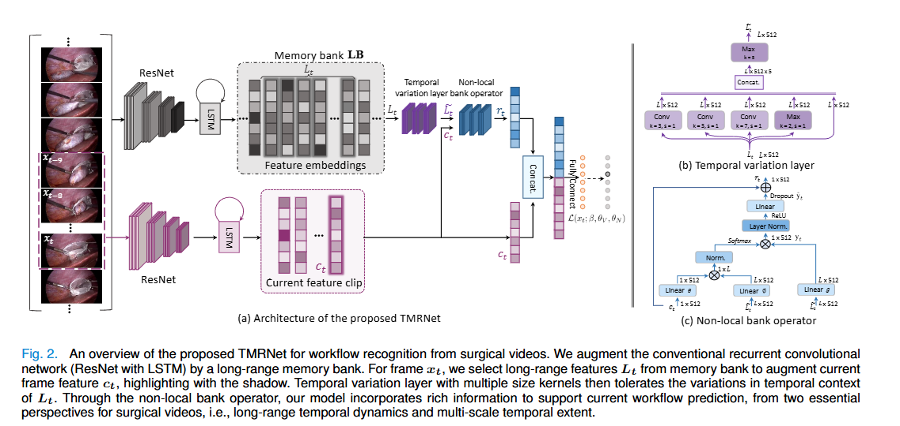

# Temporal Memory Relation Network for Workflow Recognition from Surgical Video

> Title: Temporal Memory Relation Network for Workflow Recognition from Surgical Video  
> KEYWORDS：手术工作流识别；手术阶段识别；手术视频分析；长程时间依赖；记忆库；多尺度时间卷积；非局部注意力  
> 作者：Yueming Jin，Yonghao Long，Cheng Chen，Zixu Zhao，Qi Dou，Pheng-Ann Heng  
> 机构：The Chinese University of Hong Kong；Guangdong-Hong Kong-Macao Joint Laboratory of Human-Machine Intelligence-Synergy Systems；Shenzhen Institutes of Advanced Technology, Chinese Academy of Sciences  
> Google Scholar 被引次数：未提供  
> 发表：2021  
> Venue：IEEE Transactions on Medical Imaging  
> Year：2021  
> Link：[arXiv:2103.16327](https://arxiv.org/abs/2103.16327)  
> Code：[TMRNet GitHub Repository](https://github.com/YuemingJin/TMRNet)

## 1. 背景与问题

手术工作流识别是计算机辅助手术系统的重要组成部分。通过分析手术视频，模型可以识别当前视频帧所处的手术阶段，为手术过程监控、上下文感知的手术辅助、异常检测、手术技能评价和自动生成手术记录提供基础。

手术视频具有以下特点：

- 视频持续时间长，完整手术过程可能持续 30 分钟至 2 小时；
- 单个手术阶段通常持续较长时间；
- 不同手术阶段之间的视觉差异可能较小；
- 同一手术阶段内部可能包含外观差异较大的动作；
- 手术器械运动、烟雾、血液、遮挡、镜头清洁和光照变化会造成视觉噪声；
- 一个阶段内部的动作可能具有不同的持续时间和时间尺度。

现有方法主要存在两个问题：

1. 端到端的 3D CNN、CNN-LSTM 或循环卷积网络通常只能处理较短时间范围的视频片段，受显存和计算量限制，难以利用完整手术过程中的长程信息。
2. 另一类方法先提取单帧或短视频片段的视觉特征，再通过 HMM 或 RNN 进行时序优化。虽然能够使用较长的视频信息，但视觉特征学习和时间建模通常是分离的，难以充分利用二者之间的互补关系。

因此，本文研究的问题是：

> 如何在保持端到端时空特征学习的同时，为当前视频帧引入长程历史信息，并适应手术动作在时间尺度上的变化？

## 2. 核心方法

本文提出 Temporal Memory Relation Network，简称 TMRNet，用于手术视频中的工作流和手术阶段识别。

TMRNet 主要由以下三个部分组成：

1. RCNet-based Long-range Memory Bank；
2. Multi-scale Temporal Variation Layer；
3. Non-local Bank Operator。

### 2.1 整体模型结构

TMRNet 以 ResNet-LSTM 结构作为基础网络。模型一方面从当前视频片段中提取当前特征，另一方面从长程记忆库中读取过去的视频特征，然后通过非局部关系建模将历史信息融合到当前特征中。



图注：原文 Fig. 2 展示了 TMRNet 的整体结构，包括当前特征提取、长程记忆库、时间变化层和非局部记忆库算子。

完整的处理流程如下：

```text
当前视频片段
      |
ResNet + LSTM
      |
当前特征 c_t -------------------------+
                                       |
整个手术视频的历史特征               |
      |                                |
长程记忆库 LB                         |
      |                                |
提取当前时刻之前的特征 L_t             |
      |                                |
多尺度时间变化层                      |
      |                                |
增强后的长程特征                      |
                                       |
      +------ 非局部记忆库算子 ---------+
                     |
             历史信息增强后的特征 r_t
                     |
              与当前特征拼接
                     |
                全连接层
                     |
               手术阶段预测
```

### 2.2 长程记忆库

作者首先使用 SV-RCNet 对视频中的各个时间点提取特征，并将这些特征按照时间顺序存储在记忆库中：

$$
LB=\{l_0,l_1,\ldots,l_{T-1}\}
$$

其中，$l_t$ 表示视频在时间点 $t$ 的特征，特征维度为 512。

对于当前时刻 $t$，模型从记忆库中获取当前时刻及其之前的一段历史特征：

$$
L_t=\{l_{t-L+1},\ldots,l_t\}
$$

在在线推理时，模型只访问当前帧和过去帧，不访问未来帧。因此，该记忆库适用于实时手术视频分析。

记忆库的主要作用是：

- 保存长时间范围内的历史信息；
- 避免让 LSTM 直接处理过长的视频序列；
- 减少对整个长程序列进行反向传播的计算成本；
- 为当前帧提供与手术流程相关的历史上下文。

### 2.3 多尺度时间变化层

手术阶段通常由多个持续时间不同的动作组成。为了适应这种时间尺度变化，作者设计了多尺度时间变化层。

该模块使用：

- 时间卷积核大小为 3 的卷积；
- 时间卷积核大小为 5 的卷积；
- 时间卷积核大小为 7 的卷积；
- 时间最大池化；
- 短连接。

不同大小的卷积核用于捕获不同时间范围内的动作变化：

- 小卷积核更适合捕获短时间局部动作；
- 中等大小的卷积核用于建模动作组合；
- 大卷积核用于捕获更长时间范围内的变化；
- 最大池化用于保留局部时间范围内的强响应；
- 短连接用于保留原始长程特征。

多尺度时间变化层的输出记为：

$$
\widetilde{L}_t
$$

其作用是对长程记忆特征进行时间维度上的增强。

### 2.4 非局部记忆库算子

当前视频片段经过 ResNet-LSTM 后得到当前特征：

$$
c_t\in\mathbb{R}^{1\times512}
$$

模型使用当前特征作为查询，从长程特征 $\widetilde{L}_t$ 中寻找与当前帧最相关的信息。

首先，将当前特征和长程特征映射到嵌入空间：

$$
\theta(c_t)=W_\theta c_t
$$

$$
\phi(\widetilde{L}_t)=W_\phi\widetilde{L}_t
$$

然后计算当前特征与历史特征之间的相似度：

$$
f(c_t,\widetilde{L}_t)
=
e^{\theta(c_t)^T\phi(\widetilde{L}_t)}
$$

经过 Softmax 后，模型获得不同历史时间点的注意力权重，并根据权重聚合长程特征：

$$
y_t=
\operatorname{Softmax}
\left(
\frac{1}{N}f(c_t,\widetilde{L}_t)
\right)
g(\widetilde{L}_t)
$$

最后使用残差连接将历史信息加入当前特征：

$$
r_t=\widetilde{y}_t+c_t
$$

模型将 $r_t$ 与原始当前特征 $c_t$ 拼接，再通过两个全连接层预测当前帧对应的手术阶段。

与简单平均所有历史特征相比，非局部记忆库算子能够根据当前画面的内容动态选择更相关的历史信息。

### 2.5 训练方法

由于整个手术视频的记忆库较长，直接对完整记忆库进行反向传播会产生较高的计算成本。因此，论文采用分阶段训练策略：

1. 训练 SV-RCNet；
2. 使用训练好的 SV-RCNet 为完整视频生成特征记忆库；
3. 使用记忆库训练 TMRNet；
4. 将部分验证数据重新加入训练集进行微调。

训练阶段的记忆库可以离线计算，推理阶段则按照视频时间顺序逐帧更新。

论文中的局部输入视频长度约为 10 秒，长程支持特征主要设置为 30 秒。视频从 25 fps 降采样到 1 fps，图像调整为 250×250，并使用随机裁剪、随机镜像和颜色扰动进行数据增强。

## 3. 数据来源

### 3.1 M2CAI 数据集

M2CAI 数据集来自 MICCAI 2016 Modeling and Monitoring of Computer Assisted Interventions Challenge，包含胆囊切除手术视频。

| 项目 | 信息 |
|---|---|
| 视频数量 | 41 个 |
| 手术类型 | 胆囊切除术 |
| 手术阶段 | 8 个 |
| 训练集 | 27 个视频 |
| 测试集 | 14 个视频 |
| 原始帧率 | 25 fps |
| 原始分辨率 | 1920×1080 |
| 论文中的处理 | 降采样到 1 fps |

### 3.2 Cholec80 数据集

Cholec80 是一个规模更大的胆囊切除手术视频数据集。

| 项目 | 信息 |
|---|---|
| 视频数量 | 80 个 |
| 手术类型 | 胆囊切除术 |
| 手术阶段 | 7 个 |
| 训练集 | 前 40 个视频 |
| 测试集 | 后 40 个视频 |
| 原始帧率 | 25 fps |
| 原始分辨率 | 1920×1080 或 854×480 |
| 额外标注 | 7 种手术器械的存在情况 |
| 论文中的处理 | 降采样到 1 fps |

Cholec80 提供手术器械标注，因此部分对比方法采用多任务学习，同时预测手术阶段和器械存在情况。TMRNet 的主要实验不依赖这些额外的工具标签。

### 3.3 评价指标

论文采用四个指标评价手术阶段识别结果：

- Accuracy；
- Precision；
- Recall；
- Jaccard。

其中，Jaccard 定义为：

$$
Jaccard=
\frac{|GT\cap P|}{|GT\cup P|}
$$

$GT$ 表示真实阶段标签集合，$P$ 表示预测阶段标签集合。

## 4. 实验与结果

### 4.1 M2CAI 数据集结果

原文 Table I 给出了不同方法在 M2CAI 数据集上的结果。

| Method | Accuracy (%) | Precision (%) | Recall (%) | Jaccard (%) |
|---|---:|---:|---:|---:|
| PhaseNet | 79.5 ± 12.1 | - | - | 64.1 ± 10.3 |
| SV-RCNet | 81.7 ± 8.1 | 81.0 ± 8.3 | 81.6 ± 7.2 | 65.4 ± 8.9 |
| OHFM | 85.2 ± 7.5 | - | - | 68.8 ± 10.5 |
| TMRNet（ResNet） | 86.3 ± 9.8 | 87.1 ± 7.4 | 87.8 ± 6.1 | 74.3 ± 7.1 |
| TMRNet（ResNeSt） | 87.0 ± 8.6 | 87.8 ± 6.9 | 88.4 ± 5.3 | 75.1 ± 6.9 |

表 1：原文 Table I，M2CAI 数据集上的手术阶段识别结果。

TMRNet 使用 ResNet 作为骨干网络时，Accuracy 达到 86.3%，Jaccard 达到 74.3%。使用 ResNeSt 后，Accuracy 提升到 87.0%，Jaccard 提升到 75.1%。

### 4.2 Cholec80 数据集结果

原文 Table II 给出了不同方法在 Cholec80 数据集上的结果。

| Method | Accuracy (%) | Precision (%) | Recall (%) | Jaccard (%) |
|---|---:|---:|---:|---:|
| PhaseNet | 78.8 ± 4.7 | 71.3 ± 15.6 | 76.6 ± 16.6 | - |
| SV-RCNet | 85.3 ± 7.3 | 80.7 ± 7.0 | 83.5 ± 7.5 | - |
| OHFM | 87.3 ± 5.7 | - | - | 67.0 ± 13.3 |
| EndoNet | 81.7 ± 4.2 | 73.7 ± 16.1 | 79.6 ± 7.9 | - |
| EndoNet+LSTM | 88.6 ± 9.6 | 84.4 ± 7.9 | 84.7 ± 7.9 | - |
| MTRCNet-CL | 89.2 ± 7.6 | 86.9 ± 4.3 | 88.0 ± 6.9 | - |
| TMRNet（ResNet） | 89.2 ± 9.4 | 89.7 ± 3.5 | 89.5 ± 4.8 | 78.9 ± 5.8 |
| TMRNet（ResNeSt） | 90.1 ± 7.6 | 90.3 ± 3.3 | 89.5 ± 5.0 | 79.1 ± 5.7 |

表 2：原文 Table II，Cholec80 数据集上的手术阶段识别结果。

TMRNet 使用 ResNet 时，Accuracy 为 89.2%，Jaccard 为 78.9%。使用 ResNeSt 时，Accuracy 达到 90.1%，Precision 达到 90.3%，Jaccard 达到 79.1%。

TMRNet 没有使用额外的手术器械标签，但仍然超过了部分依赖工具标签的多任务学习方法。

### 4.3 消融实验

原文 Table III 对 TMRNet 的主要组件进行了消融实验。

| Backbone | Method | Temporal Cue | Operator | Accuracy (%) | Precision (%) | Recall (%) | Jaccard (%) |
|---|---|---|---|---:|---:|---:|---:|
| ResNet | Baseline | SR | - | 85.3 ± 9.9 | 82.4 ± 5.4 | 85.5 ± 4.6 | 70.4 ± 7.2 |
| ResNet | TMRNet− | LR | NL | 88.6 ± 9.8 | 88.9 ± 3.1 | 89.1 ± 3.4 | 77.9 ± 5.4 |
| ResNet | TMRNet′ | LR+MS | WAve | 88.9 ± 8.8 | 89.6 ± 3.5 | 88.9 ± 5.4 | 78.2 ± 6.0 |
| ResNet | TMRNet | LR+MS | NL | 89.2 ± 9.4 | 89.7 ± 3.5 | 89.5 ± 4.8 | 78.9 ± 5.8 |
| ResNeSt | Baseline | SR | - | 86.9 ± 7.9 | 83.9 ± 5.1 | 86.2 ± 5.3 | 72.0 ± 8.2 |
| ResNeSt | TMRNet− | LR | NL | 89.3 ± 8.4 | 89.6 ± 3.6 | 89.4 ± 3.5 | 78.5 ± 5.2 |
| ResNeSt | TMRNet′ | LR+MS | WAve | 88.9 ± 8.4 | 88.8 ± 4.0 | 88.6 ± 5.8 | 76.6 ± 7.2 |
| ResNeSt | TMRNet | LR+MS | NL | 90.1 ± 7.6 | 90.3 ± 3.3 | 89.5 ± 5.0 | 79.1 ± 5.7 |

表 3：原文 Table III，TMRNet 不同组成部分的消融结果。

缩写说明：

- SR：Short-range，短程时间信息；
- LR：Long-range，长程时间信息；
- MS：Multi-scale，多尺度时间信息；
- NL：Non-local，非局部记忆库算子；
- WAve：Weighted Average，加权平均。

消融实验结果表明：

- 仅加入长程记忆信息后，ResNet 的 Accuracy 从 85.3% 提升到 88.6%；
- 长程记忆信息是性能提升的主要来源；
- 加入多尺度时间卷积后，性能进一步提升；
- 非局部记忆库算子优于简单的加权平均；
- ResNet 和 ResNeSt 两种骨干网络都能从 TMRNet 中获得稳定收益。

### 4.4 长程支持长度实验

作者在 Cholec80 数据集上测试了不同长程支持长度。

| 长程支持长度 | Accuracy (%) | Precision (%) | Recall (%) | Jaccard (%) |
|---:|---:|---:|---:|---:|
| 0 秒 | 85.3 ± 9.9 | 82.4 ± 5.4 | 85.5 ± 4.6 | 70.4 ± 7.2 |
| 10 秒 | 86.8 ± 9.7 | 86.2 ± 4.2 | 87.0 ± 4.7 | 74.2 ± 6.2 |
| 20 秒 | 88.3 ± 9.3 | 88.7 ± 3.6 | 88.0 ± 5.1 | 76.9 ± 6.2 |
| 30 秒 | 88.6 ± 9.8 | 88.9 ± 3.1 | 89.1 ± 3.4 | 77.9 ± 5.4 |
| 40 秒 | 88.6 ± 5.7 | 89.1 ± 4.0 | 88.9 ± 6.1 | 77.8 ± 6.1 |

表 4：原文 Table V，Cholec80 数据集上不同长程支持长度的结果。

实验显示，增加长程时间支持通常能够提升识别性能，但支持长度并不是越长越好。模型在 30 秒左右已经获得了大部分长程信息带来的收益，继续增加到 40 秒后性能基本不再提升。

过长的历史信息可能带来无关噪声，例如：

- 烟雾；
- 血液；
- 镜头清洁过程；
- 同一阶段内部的外观变化；
- 与当前帧无关的历史动作。

### 4.5 直接增加 LSTM 输入长度的实验

作者还比较了两种增加时间信息的方式：

1. 通过外部长程记忆库存储历史特征；
2. 直接增加输入到 LSTM 的视频片段长度。

实验结果表明，直接将 LSTM 输入片段从 10 秒增加到 20、30 或 40 秒，并不能获得与记忆库相同的效果。输入过长时，模型性能甚至出现下降。

这说明，外部记忆库和直接扩大 LSTM 输入窗口并不等价。记忆库可以显式保留不同历史时间点的特征，而 LSTM 需要将更长的历史信息压缩到隐状态中，容易造成信息丢失和训练困难。

### 4.6 在线推理结果

论文在推理阶段采用在线记忆库更新策略。模型按照视频播放顺序逐帧处理，并将之前帧的特征逐步存入记忆库。

作者报告，TMRNet 使用一张 GPU 时的推理速度约为 0.08 秒/帧。由于预测当前帧时不会访问未来帧，模型具备在线手术阶段识别的应用潜力。

## 5. 创新点

- 提出用于手术工作流识别的 TMRNet，将短程时空特征和长程历史特征结合起来。
- 建立外部长程记忆库，避免使用 LSTM 直接压缩整个手术视频。
- 设计多尺度时间变化层，以适应手术动作不同的持续时间。
- 设计非局部记忆库算子，根据当前视频帧动态检索相关历史特征。
- 在不使用额外手术器械标签的情况下，超过部分多任务学习方法。
- 采用在线记忆库更新方式，预测当前帧时不使用未来信息。
- 通过消融实验验证了长程信息、多尺度时间建模和非局部算子的作用。
- 记忆库具有扩展性，理论上可以加入工具使用信息和手术器械运动学信息。

## 6. 不足与局限

### 6.1 依赖预训练的 SV-RCNet

记忆库特征由 SV-RCNet 生成。如果第一阶段的 SV-RCNet 特征质量有限，错误或不完整的信息可能会进入记忆库，并影响 TMRNet 的后续学习。

### 6.2 记忆库带来额外存储开销

长程记忆库需要保存历史特征。随着视频长度、特征维度或视频数量增加，记忆库可能带来更高的显存和存储需求。

### 6.3 主要在胆囊切除手术上进行验证

M2CAI 和 Cholec80 都主要涉及胆囊切除术。不同类型的手术可能具有不同的阶段结构、动作速度和视觉特点，因此模型能否泛化到其他手术类型，还需要进一步验证。

### 6.4 长程信息可能引入噪声

历史时间范围过长时，记忆库可能包含与当前阶段无关的画面。论文虽然使用非局部算子选择相关信息，但在噪声严重或阶段内部差异较大的情况下，仍可能受到干扰。

### 6.5 对手术流程先验利用不足

手术阶段通常具有相对稳定的顺序。论文的主要结果由单个 TMRNet 直接预测得到，没有将复杂的阶段转移先验完全融入模型。作者使用 PKI 后处理后，结果进一步提升，说明手术流程先验仍有利用空间。

## 7. 个人思考

这篇论文的核心启发是：长程时间信息不一定要通过无限扩大 RNN 的输入窗口来获得。

直接扩大 LSTM 输入长度会造成：

- 计算量增加；
- 显存占用增加；
- 训练难度提高；
- 长程信息被压缩到隐状态后可能发生丢失；
- 更长的输入中可能包含与当前预测无关的噪声。

TMRNet 使用外部记忆库显式保存不同时间点的历史特征，再使用非局部算子根据当前帧检索相关信息。这种方法既保留了历史特征的时间位置，又避免了让 LSTM 独自承担长程记忆任务。

论文还说明，时间范围并不是越大越好。在 Cholec80 数据集上，30 秒左右的历史支持已经能够覆盖较完整的手术动作，而继续增加时间范围可能引入烟雾、血液、镜头清洁和其他无关动作。因此，长程建模的重点不仅是扩大时间感受野，还包括筛选有效历史信息。

从复现角度看，论文的主要流程包括：

1. 准备 M2CAI 或 Cholec80 数据集；
2. 按照论文设置视频降采样和训练测试划分；
3. 训练 SV-RCNet；
4. 使用 SV-RCNet 生成视频特征记忆库；
5. 加入多尺度时间变化层；
6. 使用非局部记忆库算子融合当前特征和历史特征；
7. 训练手术阶段分类器；
8. 对比不同长程支持长度和不同模块组合；
9. 使用 Accuracy、Precision、Recall 和 Jaccard 评价模型。

如果进一步改进该方法，可以尝试：

- 使用 Transformer 或轻量级注意力模块替代非局部算子；
- 设计可学习的记忆写入和记忆压缩机制；
- 根据阶段边界或预测不确定性动态保存特征；
- 引入烟雾、血液和镜头清洁检测模块；
- 融合手术阶段转移概率和流程图先验；
- 在白内障手术、机器人手术、心脏手术和超声视频上验证跨场景泛化能力；
- 报告记忆库大小、参数量、FLOPs 和不同视频长度下的计算开销。

## 8. 总结

TMRNet 针对手术视频中长程时间依赖和多尺度动作变化问题，提出了“长程记忆库 + 多尺度时间变化层 + 非局部记忆库算子”的解决方案。

其主要结论是：

- 长程历史信息能够显著提升手术阶段识别性能；
- 外部记忆库比直接延长 LSTM 输入更适合保存长程特征；
- 多尺度时间卷积能够增强对不同持续时间动作的建模能力；
- 非局部算子能够从历史信息中选择与当前帧相关的特征；
- TMRNet 在 M2CAI 和 Cholec80 数据集上均取得了较好的结果；
- 模型能够以在线方式进行预测，具有实时手术视频分析的应用潜力。
