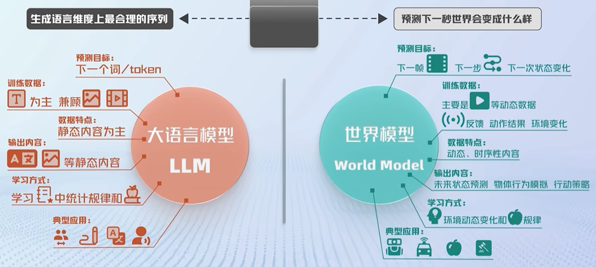

# World Model 基础

## 1. 世界模型概念

世界模型（World Model）是帮助 AI 理解和模拟现实世界的模型。它不仅要识别当前看到了什么，还要根据过去的观测和当前的行动，预测接下来可能发生什么，并据此制定行动方案。

世界模型对应了人类智能中的一套核心机制：

```text
想象 → 规划 → 行动
```

从功能上看，世界模型可以理解为一个能够模拟环境变化的系统，由以下三个部分协同组成：

```text
V（Visual Perception，视觉感知）
                ↓
M（Memory & Prediction，记忆与预测）
                ↓
C（Control，控制与行动）
```

- **视觉感知（V）**：观察环境，识别物体、空间关系、动作和当前状态；
- **记忆与预测（M）**：结合历史信息形成内部状态，并预测环境未来的变化；
- **控制与行动（C）**：根据目标和预测结果选择行动，并通过行动改变环境。

因此，世界模型不只是一个视频生成器，也不只是一个状态预测器，而是一个连接感知、记忆、预测和行动的模拟系统。

## 2. 世界模型与大语言模型

大语言模型（LLM）和世界模型关注的重点不同：



```text
大语言模型：Saying（表达和交流）
世界模型：Seeing + Doing（观察和行动）
```

| 对比维度 | 大语言模型 | 世界模型 |
|---|---|---|
| 主要数据 | 文本，以及部分图像和视频等静态数据 | 视频、传感器数据和其他动态数据 |
| 主要理解对象 | 文字、符号和语言的统计规律 | 空间关系、物理规律、动态变化和因果关系 |
| 主要输出 | 文本、代码和语言表达 | 未来状态预测、行为模拟和可执行方案 |
| 核心能力 | 理解与生成语言 | 观察、预测、规划和行动 |

大语言模型擅长处理人类语言，但语言本身并不等于对现实世界的直接理解。世界模型则试图从动态数据中学习环境的变化规律，建立关于空间、物体、动作和因果关系的内部表示。

世界模型并不是要取代大语言模型，而是为大语言模型补充现实世界的维度：

```text
LLM：理解“应该说什么”
World Model：理解“世界正在发生什么，以及下一步可能发生什么”
```

二者结合后，语言模型可以负责目标理解、任务分解和人机交流，世界模型则可以负责环境预测、行动模拟和结果评估。


## 3. 世界模型的技术路线

目前世界模型还没有形成一条已经成熟的统一技术路线，主要可以从“如何生成或表示世界”和“如何训练智能体”两个角度理解。

### 3.1 世界生成与表示

#### 视频生成路线

视频生成路线直接预测或生成未来的视频帧，属于像素级预测方法，以 Sora 等视频生成模型为代表。

```text
历史视频 / 当前状态 + 条件
              ↓
        未来视频生成
```

优点：

- 生成结果直观、可视化；
- 可以模拟较丰富的视觉场景和运动过程；
- 适合展示环境变化和未来结果。

局限：

- 生成视觉上合理的视频，不代表真正理解了世界运行的内部规律；
- 长时间生成容易出现误差累积；
- 生成结果可能缺乏稳定的物理一致性和因果一致性；
- 像素级预测通常需要较高的计算成本。

#### 3D 生成与空间建模路线

3D 路线关注物体的结构、空间关系和环境几何，试图建立更加明确的三维世界表示。

优点：

- 有利于表示物体结构、空间关系和视角变化；
- 更容易与机器人操作、导航和空间规划结合；
- 可以提供比二维视频更明确的几何信息。

局限：

- 高质量 3D 数据相对稀缺；
- 数据采集、标注和重建成本较高；
- 动态场景和可变形物体的建模更加困难；
- 训练和推理通常需要较高的算力。

### 3.2 世界模型的训练实践

#### SIMA 路线

SIMA 路线可以概括为“让 AI 在虚拟世界里学习”。模型将虚拟世界或游戏环境作为训练环境，让智能体在其中反复试错、探索和归纳，从而学习具有迁移能力的通用技能。

```text
虚拟环境
   ↓
观察与行动
   ↓
反复试错和探索
   ↓
学习通用策略
   ↓
迁移到真实环境
```

这种路线的关键在于：世界模型或虚拟环境能够提供低成本、可重复的交互过程，使智能体不必完全依赖真实世界中的数据采集和人工示范。

#### JEPA 路线

JEPA 路线不要求在像素空间中完整生成未来，而是将真实世界压缩为高维抽象表征，并在潜在空间中预测未来的结构性变化。

```text
观测数据
   ↓
抽象潜在表示
   ↓
预测未来潜在状态
   ↓
用于理解、决策或规划
```

与像素级预测相比，潜空间预测可以减少对视觉细节的依赖，更关注对决策有用的结构信息，例如物体状态、动作结果和场景变化。

### 3.3 当前发展阶段

目前还没有任何一条世界模型技术路线已经完全成熟，也尚无被广泛验证的成熟商业落地案例。视频生成、3D 空间建模、虚拟环境训练和潜空间预测仍在快速发展中。

后续需要重点解决：

- 如何学习稳定、可迁移的世界表示；
- 如何保证长期预测的准确性和一致性；
- 如何让预测结果真正服务于规划和行动；
- 如何评估模型是否学到了因果规律，而不只是视觉相关性；
- 如何降低训练数据、算力和真实环境交互成本。

## 4. 世界模型的潜在影响

当世界模型能够稳定地预测环境并支持行动决策后，最直接可能受益的领域包括：

- **具身智能与机器人**：通过模拟未来结果进行动作选择和任务规划；
- **自动驾驶**：预测道路环境、其他交通参与者和潜在风险；
- **可穿戴设备**：理解用户所处环境并提供主动辅助；
- **影视与游戏产业**：生成可交互的场景、角色和内容；
- **医疗与手术机器人**：预测手术流程、组织变化和器械动作结果。

对于手术视频领域，世界模型可以进一步连接以下任务：

```text
视频观测
  ↓
器械、组织和场景状态估计
  ↓
手术阶段、动作和流程预测
  ↓
组织变化与未来事件模拟
  ↓
手术规划与机器人辅助决策
```

但是，当世界模型成为系统的决策底座后，其潜在风险也会高于单纯的大语言模型。模型一旦错误地理解环境、预测未来或评估行动结果，可能直接导致现实世界中的错误行动。因此需要特别关注：

- 预测不确定性和分布外场景；
- 物理规律和因果关系的一致性；
- 行动安全边界和人工接管机制；
- 数据偏差、隐私和跨场景泛化；
- 医疗、自动驾驶和机器人系统中的责任与监管问题。

## 5. 总结

世界模型的核心目标，是让 AI 不仅能够处理语言，还能够观察世界、形成内部状态、预测未来，并主动采取行动。它可以被看作连接感知、预测、规划和控制的基础设施，是从“语言机器”走向智能体的重要路径之一。

```text
语言理解
   +
视觉感知
   +
记忆与预测
   +
规划与控制
   ↓
能够观察、预测并行动的智能体
```

对于手术视频研究而言，世界模型并不只是生成未来视频，更重要的是学习手术场景的状态变化和动作后果，从而为流程预测、手术规划和机器人辅助提供更加可靠的决策基础。
